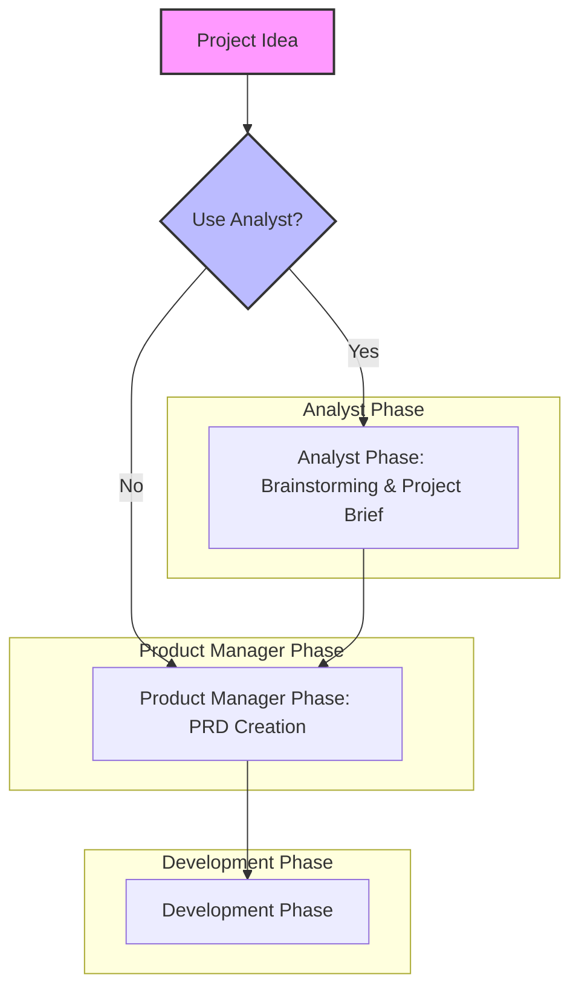
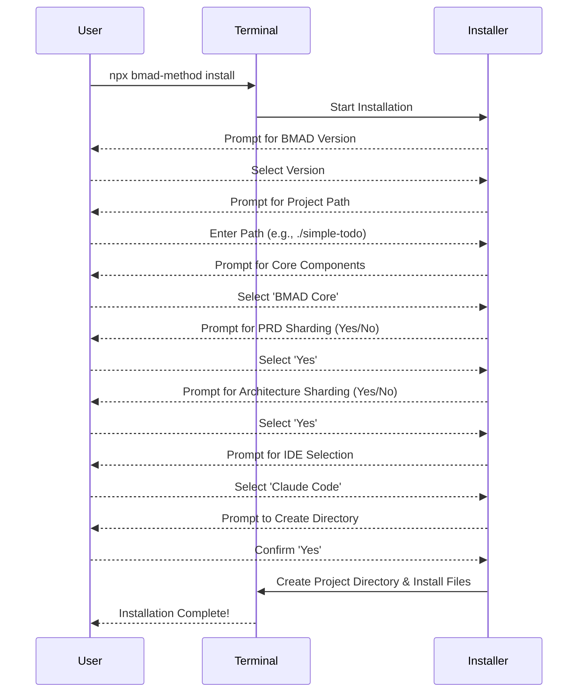
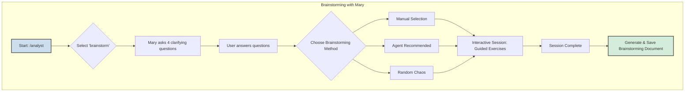
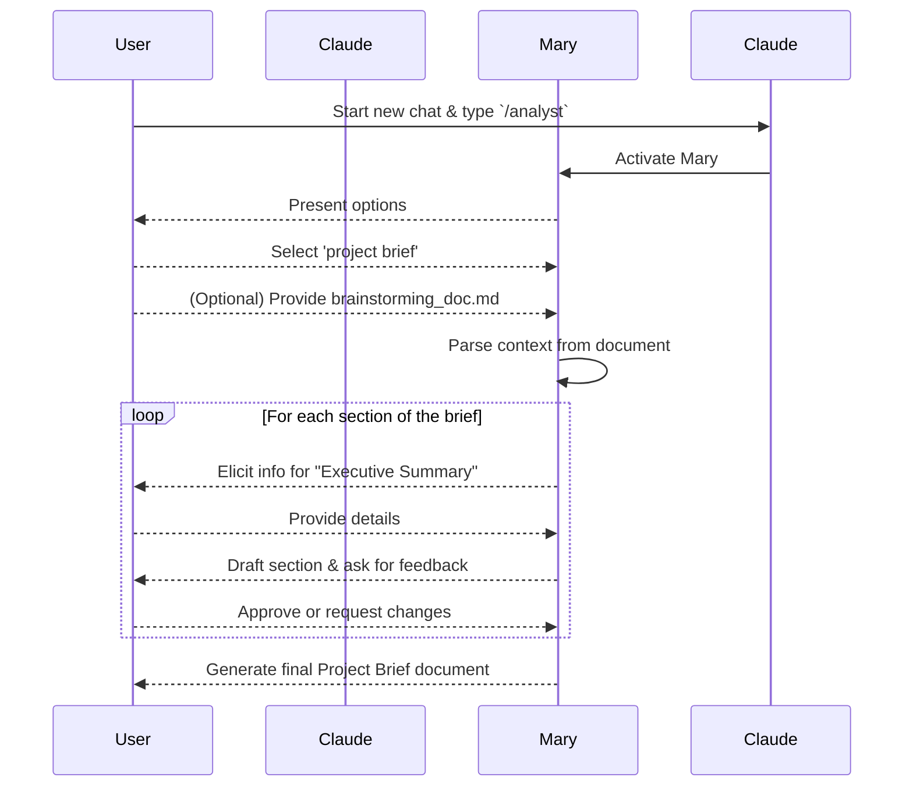
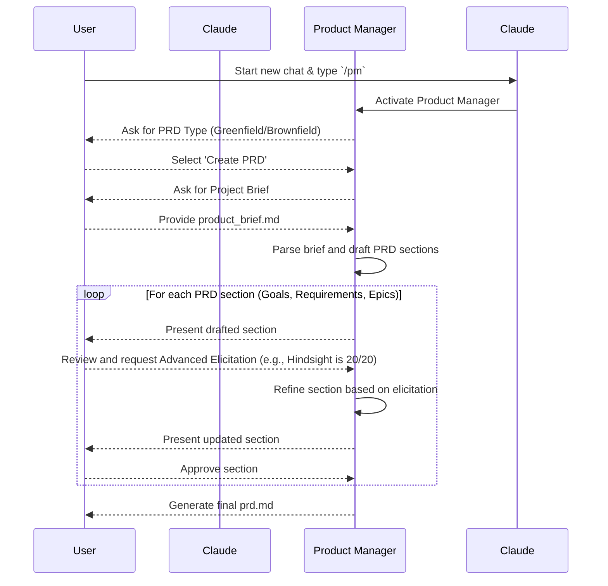
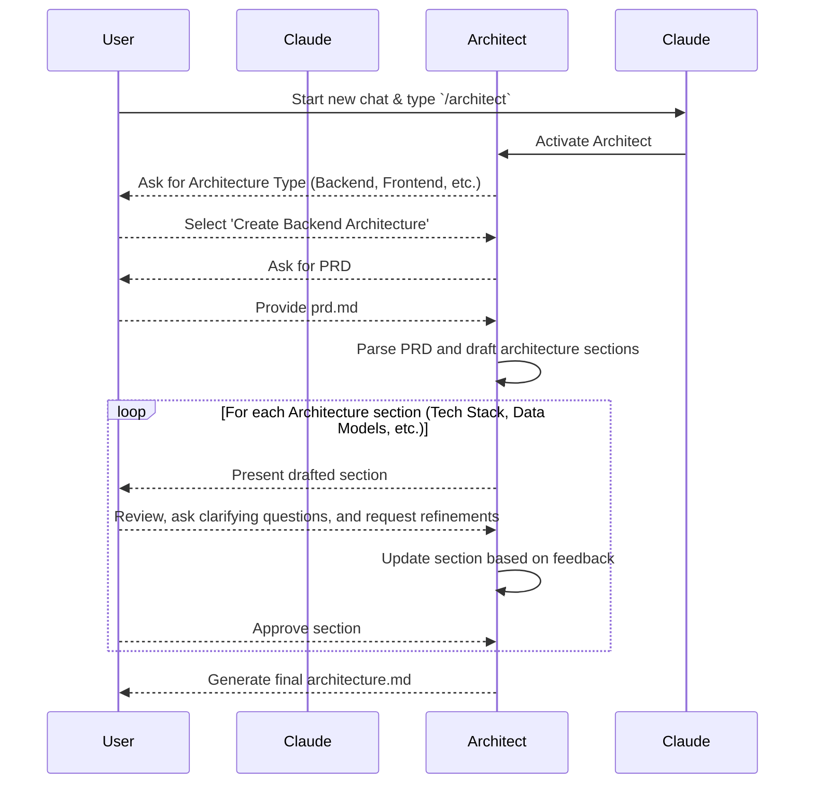
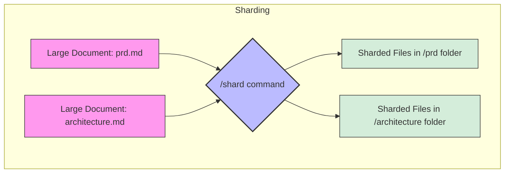
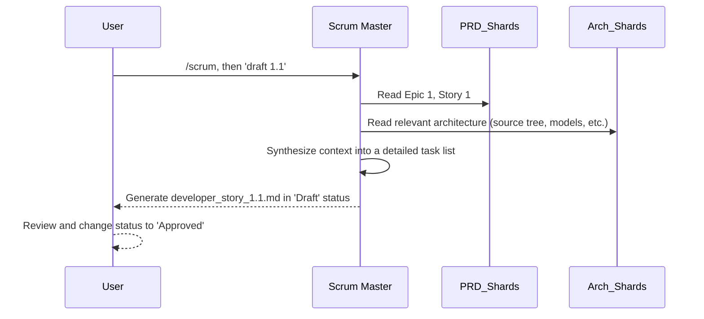
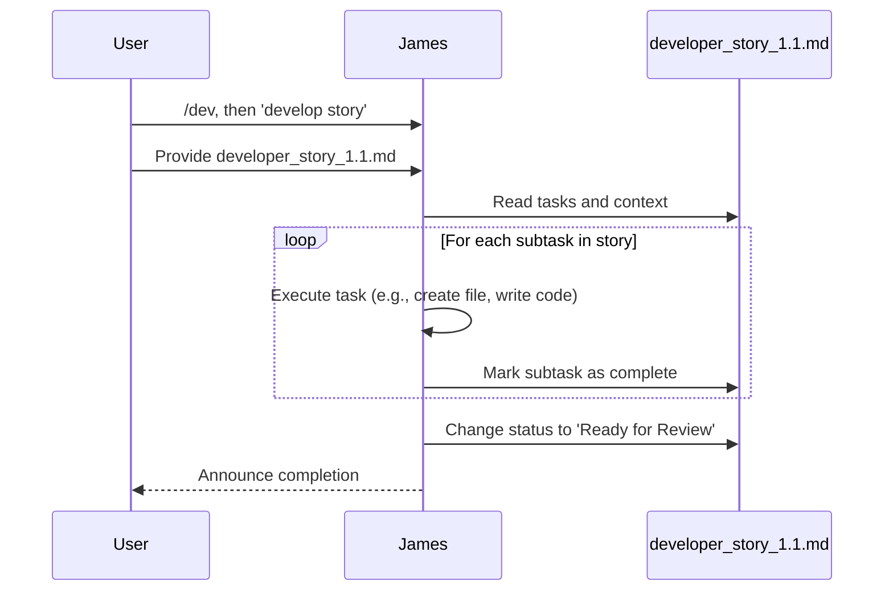
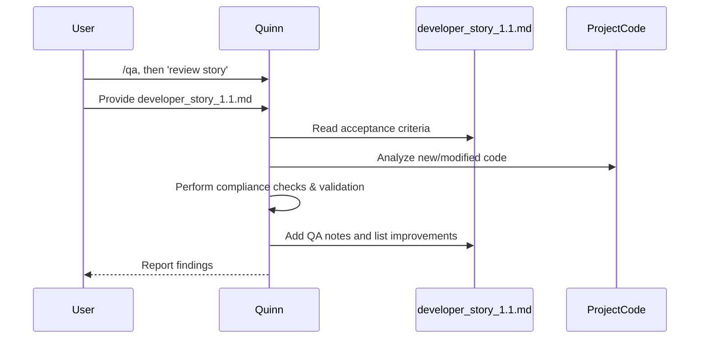

# BMAD Method Workflow Explained
---
## Following the below you tube video:
https://www.youtube.com/watch?v=LorEJPrALcg&ab_channel=BMadCode

## Description
This is the video I've wanted to create since the beginning. As the creator of the BMad-Method, I'm finally presenting the official, definitive masterclass on the entire system. Many channels have given a high level quick run through of the basic concepts, but there is so much more and in this video I will cover every agent, all of their amazing powers, and why this is still the best system available - but now made even better as it can fully be run from the IDE with the amazing power of Claude Code. This 1-hour+ deep dive is the ultimate guide to mastering the complete BMad workflow, from initial setup to final execution, all from within the comfort of your IDE. While this walkthrough features Claude Code, the core principles and methods you'll learn are universal and will elevate your workflow in any advanced agentic environment. I go beyond the basics in this one while still keeping a logical flow, to explore powerful features and strategies I've never shared publicly before. In this masterclass, you will learn:

- A complete A-to-Z walkthrough of the method, with no steps skipped.
- How to configure and run the entire process inside an IDE, eliminating the need for a web UI.
- The core philosophy that will allow you to adapt the method to any project or tool.
- Never-before-revealed tips and tricks to maximize the method's power.
- My personal strategies for unlocking the full potential of agentic development.
- The most amazing agent in the system is the one you would not expect and I expose the unbridled power it offers.

[My goal is that this will allow you understand the BMad-Method at a deeper level and equip you with my complete creator's blueprint to master it. Community & Support Join the Discord: The discussion is more active than ever. Join us and be part of what's next.   [ / discord](https://www.youtube.com/redirect?event=video_description&redir_token=QUFFLUhqbHJ0cmNYRm00TlhOOC1xRVJuN3M3eGdhUFFPUXxBQ3Jtc0ttWmdKck5ETU1nRUpvckZKTndCeUdHWEdpNzROTUlYNjdlMEYxS0ZCSUkzTXU1ME5Ea0hrZlJoRkJ4U3BpeTdIaU15NmxPT1ZvZkJOYUhUR24tU01mSkJyMEg4YmxXLWRaYU1EVG54ZFp5aVVoVmpQTQ&q=https%3A%2F%2Fdiscord.gg%2Fgk8jAdXWmj&v=LorEJPrALcg)   Support The Method: If you love what we do, consider buying me a coffee! All supporters get access to 1:1 live chats for help or advice. [https://buymeacoffee.com/bmad](https://www.youtube.com/redirect?event=video_description&redir_token=QUFFLUhqbm9NM2k1UC1Fd3hmUnZwWnVpVFY0QW9KSkhtd3xBQ3Jtc0ttYUFrRUVzZ3FVUzZfVWZncXc3SjJoc1Y5Y1BVQ2o0RHQ4TVkxWFZrWS0taEt3YTc3cS16cGU0N0lRblZPYXk2cTRLUkVHeFZlYTBlelRMbFgxNHRGX2JUQjNZQ0NIaTQ5eUtOU3NkM2VtYTQzcnV2RQ&q=https%3A%2F%2Fbuymeacoffee.com%2Fbmad&v=LorEJPrALcg) 
Resources BMAD Method GitHub Repo: [https://github.com/bmadcode/BMAD-METHOD](https://www.youtube.com/redirect?event=video_description&redir_token=QUFFLUhqbDRuQTd3a3F4VkZzcFItVHZJUzljalM2bUNuUXxBQ3Jtc0tsVkJYTWVEaUIzaVl5OFQ3YmVjLUFRNXZxdlZ2V1JpZUsxdy02Z3VTMEdKNTVnTlZ0cWxjelNoMVY2LVlJTnk2eDNfeXhSaThtbldRS0NhRHBGQzlYTFJQWXMza1M1TXcweU0tZlNLMExjSkJpLWJJaw&q=https%3A%2F%2Fgithub.com%2Fbmadcode%2FBMAD-METHOD&v=LorEJPrALcg) [#BMADMethod](https://www.youtube.com/hashtag/bmadmethod) [#AICoding](https://www.youtube.com/hashtag/aicoding) [#ClaudeCode](https://www.youtube.com/hashtag/claudecode) [#SpecEngineering](https://www.youtube.com/hashtag/specengineering) [#AITutorial](https://www.youtube.com/hashtag/aitutorial)](<My goal is that this will allow you to understand the **BMad-Method** at a deeper level and equip you with my complete creator's blueprint to master it.

---

## 🌐 Community & Support

### Join the Discord
The discussion is more active than ever. Join us and be part of what's next.

[ / discord](https://www.youtube.com/redirect?event=video_description&redir_token=QUFFLUhqbHJ0cmNYRm00TlhOOC1xRVJuN3M3eGdhUFFPUXxBQ3Jtc0ttWmdKck5ETU1nRUpvckZKTndCeUdHWEdpNzROTUlYNjdlMEYxS0ZCSUkzTXU1ME5Ea0hrZlJoRkJ4U3BpeTdIaU15NmxPT1ZvZkJOYUhUR24tU01mSkJyMEg4YmxXLWRaYU1EVG54ZFp5aVVoVmpQTQ&q=https%3A%2F%2Fdiscord.gg%2Fgk8jAdXWmj&v=LorEJPrALcg)

---

### Support The Method
If you love what we do, consider buying me a coffee!  
All supporters get access to 1:1 live chats for help or advice.

[Buy Me a Coffee →](https://www.youtube.com/redirect?event=video_description&redir_token=QUFFLUhqbm9NM2k1UC1Fd3hmUnZwWnVpVFY0QW9KSkhtd3xBQ3Jtc0ttYUFrRUVzZ3FVUzZfVWZncXc3SjJoc1Y5Y1BVQ2o0RHQ4TVkxWFZrWS0taEt3YTc3cS16cGU0N0lRblZPYXk2cTRLUkVHeFZlYTBlelRMbFgxNHRGX2JUQjNZQ0NIaTQ5eUtOU3NkM2VtYTQzcnV2RQ&q=https%3A%2F%2Fbuymeacoffee.com%2Fbmad&v=LorEJPrALcg)

[https://buymeacoffee.com/bmad](https://buymeacoffee.com/bmad)

---

## 📖 Chapters

- [0:00](https://www.youtube.com/watch?v=LorEJPrALcg) — Masterclass: The Promise  
- [1:16](https://www.youtube.com/watch?v=LorEJPrALcg&t=76s) — GitHub & Workflow Tour  
- [2:21](https://www.youtube.com/watch?v=LorEJPrALcg&t=141s) — The Getting Started Guide  
- [4:02](https://www.youtube.com/watch?v=LorEJPrALcg&t=242s) — Complete Installation  
- [7:52](https://www.youtube.com/watch?v=LorEJPrALcg&t=472s) — 10 Second Install  
- [9:00](https://www.youtube.com/watch?v=LorEJPrALcg&t=540s) — Important IDE Note  
- [12:30](https://www.youtube.com/watch?v=LorEJPrALcg&t=750s) — The Most Powerful Agent Unmasked  
- [22:00](https://www.youtube.com/watch?v=LorEJPrALcg&t=1320s) — The Brainstorming Session  
- [27:14](https://www.youtube.com/watch?v=LorEJPrALcg&t=1634s) — Mastering the Product Manager  
- [35:32](https://www.youtube.com/watch?v=LorEJPrALcg&t=2132s) — Crafting the PRD  
- [39:10](https://www.youtube.com/watch?v=LorEJPrALcg&t=2350s) — PRD: Advanced Techniques  
- [51:18](https://www.youtube.com/watch?v=LorEJPrALcg&t=3078s) — Mastering the Architect Agent  
- [57:23](https://www.youtube.com/watch?v=LorEJPrALcg&t=3443s) — Architecture Review  
- [59:00](https://www.youtube.com/watch?v=LorEJPrALcg&t=3540s) — Sharding the Docs  
- [1:02:07](https://www.youtube.com/watch?v=LorEJPrALcg&t=3727s) — Developer Custom Loading Config  
- [1:06:38](https://www.youtube.com/watch?v=LorEJPrALcg&t=3998s) — Scrum Master Story Drafting  
- [1:10:24](https://www.youtube.com/watch?v=LorEJPrALcg&t=4224s) — Developer Agent Story Build  
- [1:12:00](https://www.youtube.com/watch?v=LorEJPrALcg&t=4320s) — QA with Quinn  

---

## 🧠 Resources

### BMAD Method GitHub Repo  
[https://github.com/bmadcode/BMAD-METHOD](https://www.youtube.com/redirect?event=video_description&redir_token=QUFFLUhqbDRuQTd3a3F4VkZzcFItVHZJUzljalM2bUNuUXxBQ3Jtc0tsVkJYTWVEaUIzaVl5OFQ3YmVjLUFRNXZxdlZ2V1JpZUsxdy02Z3VTMEdKNTVnTlZ0cWxjelNoMVY2LVlJTnk2eDNfeXhSaThtbldRS0NhRHBGQzlYTFJQWXMza1M1TXcweU0tZlNLMExjSkJpLWJJaw&q=https%3A%2F%2Fgithub.com%2Fbmadcode%2FBMAD-METHOD&v=LorEJPrALcg)

---

## 🔖 Hashtags

- [#BMADMethod](https://www.youtube.com/hashtag/bmadmethod)  
- [#AICoding](https://www.youtube.com/hashtag/aicoding)  
- [#ClaudeCode](https://www.youtube.com/hashtag/claudecode)  
- [#SpecEngineering](https://www.youtube.com/hashtag/specengineering)  
- [#AITutorial](https://www.youtube.com/hashtag/aitutorial)>)
---

The **BMAD (Brian's Method for Agentic Development)** method provides a structured, agent-driven framework for software development, from initial idea to code implementation. It leverages a team of AI agents within an IDE like VS Code with Claude Code to guide the user through a comprehensive, agile-inspired workflow.

## High-Level Workflow Overview

The BMAD method follows a logical progression from high-level ideation to detailed development tasks. The initial phases focus on refining the project idea and establishing a solid foundation before any code is written. The process is designed to be flexible, allowing users to skip optional steps like brainstorming if the project requirements are already well-defined.

Here is a top-level view of the workflow:

## Module 1: Project Initialization & Setup

This is the first step in using the BMAD method. It involves creating a new project directory and installing the necessary agent configurations and custom commands into your development environment. This is done without needing to clone the entire BMAD GitHub repository.

### Workflow Steps:

1. **Invoke Installer**: From your desired parent directory (e.g., `~/dev`), run the command `npx bmad-method install`.
    
2. **Select Version**: Choose the version of the BMAD method to install.
    
3. **Define Project Path**: Specify the full path for your new project directory (e.g., `./simple-todo`). The installer will create this directory if it doesn't exist.
    
4. **Select Core Components**: Choose the components to install. The `BMAD Core` is essential for the agile workflow.
    
5. **Configure Sharding**: Decide whether to "shard" (split) large documents like the Product Requirements Document (PRD) and Architecture design. Sharding is recommended as it breaks down large files into smaller, more manageable pieces, which helps the AI agents by optimizing the context they need to load.
    
6. **Select IDE**: Use the spacebar to select one or more IDEs to install the agent configurations for (e.g., Claude Code for VS Code).
    
7. **Web Bundles**: Decide whether to include pre-built web bundles. These are not necessary for working exclusively within the IDE.
    
8. **Create Directory**: Confirm the creation of the project directory.
    

The installer then sets up the `.bmad` folder with the agent system prompts and the `.vscode` folder with custom commands and tasks for the selected IDE.

### Mermaid Diagram: Project Initialization

## Module 2: The Analyst Phase

The **Analyst Phase** is an optional but highly recommended stage for refining a project idea. It's facilitated by **Mary, the Business Analyst agent**. This phase is particularly useful for greenfield projects or when the initial idea needs more clarity. It consists of two main activities: **Brainstorming** and creating a **Project Brief**.

### 2.1 Brainstorming (Optional)

The goal of brainstorming is to explore creative possibilities and uncover innovative ideas beyond the initial concept. Mary acts as a coach, guiding the user through various structured brainstorming techniques.

#### Workflow Steps:

1. **Launch Claude Code**: Open your IDE and start a new Claude Code session by typing `claude`.
    
2. **Activate the Analyst**: Type `/analyst` to activate Mary.
    
3. **Initiate Brainstorming**: Select the `brainstorm` command (or type `5`).
    
4. **Answer Initial Questions**: Mary will ask four clarifying questions about the brainstorming topic, constraints, goals, and desired output format.
    
5. **Select Brainstorming Technique**: Choose a brainstorming method:
    
    - **Pick Techniques**: Manually select from a list of ~20 techniques (e.g., Six Thinking Hats, Five Whys, Role-Playing).
        
    - **Agent Recommended**: Let Mary suggest techniques based on the project.
        
    - **Random Creative Chaos**: A fun, unpredictable option.
        
    - **Progressive Creative Journey**: A structured path from broad to focused ideas.
        
6. **Engage in the Session**: Work interactively with Mary. She will guide you through each step of the chosen technique, pushing you to think creatively.
    
7. **Generate Brainstorming Document**: Once the session is complete, Mary compiles the entire conversation, including all ideas and exercises, into a structured Markdown document saved in the `/docs` folder. This document includes an executive summary and breaks down ideas into immediate, future, and "moonshot" categories.
    

### Mermaid Diagram: Brainstorming Session

### 2.2 Project Brief Creation

After brainstorming (or as a starting point), you can work with Mary to create a formal **Project Brief**. This document solidifies the project's vision, goals, and scope.

#### Workflow Steps:

1. **Start a New Chat**: To ensure a clean context, clear the current session or start a new Claude Code instance.
    
2. **Activate the Analyst**: Load the analyst again with `/analyst`.
    
3. **Select Project Brief**: Choose the `project brief` command (or type `2`).
    
4. **Provide Context (Optional)**: If you completed a brainstorming session, drag and drop the generated document into the chat to provide Mary with context. This kickstarts the process.
    
5. **Interactive Elicitation**: Mary will guide you through creating the brief section by section (e.g., Executive Summary, Goals, Scope). She uses embedded instructions from YAML templates to ask targeted questions and elicit the necessary information.
    
6. **Review and Refine**: For each section, Mary will present a draft. You can correct it, ask for changes, or approve it to move on.
    
7. **Finalize the Brief**: Once all sections are complete, Mary generates the final Project Brief document, which will be used to inform the next phase with the Product Manager.
    

### Mermaid Diagram: Project Brief Creation

## Module 3: The Product Manager (PM) Phase

After the Analyst phase, the **Product Manager (PM) agent** takes over. The PM's primary role is to translate the high-level Project Brief into a detailed **Product Requirements Document (PRD)**. This document defines the functional and non-functional requirements, establishes the scope for the Minimum Viable Product (MVP), and breaks the work down into actionable epics and user stories.

### Workflow Steps:

1. **Start a New Chat**: Clear the context with `/clear` or start a new Claude session.
    
2. **Activate the PM**: Type `/pm` to invoke the Product Manager agent.
    
3. **Select PRD Type**: Choose the type of PRD to create.
    
    - **Create PRD**: For **Greenfield** projects (starting from scratch).
        
    - **Create Brownfield PRD**: For **Brownfield** projects (working on an existing application), which involves additional steps to analyze the current codebase.
        
4. **Provide Project Brief**: When prompted, drag and drop the `product_brief.md` into the chat. This gives the PM a head start. If no brief is provided, the PM will ask more questions to gather the necessary information.
    
5. **Define Requirements**: The PM works with you section by section to define goals, user personas, and functional/non-functional requirements.
    
6. **Use Advanced Elicitation**: This is a critical step for refining the PRD. You can ask the PM to use techniques like **"Hindsight is 20/20"** to identify potential future problems or **"Deep Think"** to analyze the logical flow of user stories. This helps challenge the PM's assumptions and solidify the plan.
    
7. **Scope the MVP**: The PM helps distinguish between essential features for the initial launch (MVP) and features that can be developed later (Post-MVP).
    
8. **Create Epics and Stories**: The PM breaks down the requirements into high-level **Epics**, which are then broken down into granular **User Stories**. Each story has clear acceptance criteria tailored for a developer agent.
    
9. **Finalize the PRD**: After reviewing and refining all sections, the final `prd.md` document is generated.
    

### Mermaid Diagram: PRD Creation

## Module 4: The Architect Phase

With a finalized PRD, the **Architect agent** steps in to create the technical blueprint for the project. This phase is crucial for ensuring the development agents have a clear, consistent, and robust plan to follow, preventing them from deviating from the chosen technology stack or design patterns.

### Workflow Steps:

1. **Start a New Chat**: Ensure a clean context for the architect.
    
2. **Activate the Architect**: Type `/architect` to begin.
    
3. **Select Architecture Type**: Choose the appropriate architecture document to create:
    
    - **Full Stack**: For projects with both frontend and backend components.
        
    - **Backend**: For services, utilities, or CLI applications.
        
    - **Frontend**: For standalone web frontends.
        
    - **Brownfield**: For designing changes to an existing architecture.
        
4. **Provide the PRD**: Drag and drop the `prd.md` to give the architect the full functional context.
    
5. **Define Technical Specifications**: The architect will work with you to define:
    
    - **High-Level Design**: Including sequence diagrams and database schemas.
        
    - **Technology Stack**: A specific list of languages, frameworks, libraries, and their versions. This is critical for keeping developer agents on track.
        
    - **Directory Structure**: A source tree defining where files should be created.
        
    - **Data Models**: TypeScript interfaces or data structures to ensure consistency.
        
    - **Coding Standards**: Rules for formatting, commenting (e.g., JS Doc style), and error handling.
        
6. **Ask Questions and Refine**: This is a learning opportunity. Ask the architect _why_ it chose a specific technology or designed a data model in a certain way. You can directly edit the document or ask the agent to add details, such as specific commenting requirements.
    
7. **Finalize Architecture Document**: Once all sections are reviewed and approved, the final `architecture.md` document is ready.
    

### Mermaid Diagram: Architecture Creation

## Module 5: Document Sharding

The final preparation step before development is **sharding**. The PRD and Architecture documents can become very large. Sharding breaks them down into smaller, single-purpose files based on their section headings. This optimizes the context for the developer agents, ensuring they only load the specific information they need for a given task (e.g., a single user story or the data models).

### Workflow Steps:

1. **Activate the Shard Command**: In a new Claude session, type `/shard`.
    
2. **Select Document to Shard**: When prompted, drag and drop the `prd.md` file into the chat.
    
3. **Execute Sharding**: The tool uses `md-tree` to "explode" the document. It creates a new folder (e.g., `/prd`) and populates it with smaller Markdown files, one for each major section (e.g., `epic-1.md`, `non-functional-requirements.md`).
    
4. **Repeat for Architecture**: Repeat the process for the `architecture.md` file, which will be sharded into its own `/architecture` folder.
    
5. **Organize Artifacts**: It's good practice to move the original, large `prd.md` and `architecture.md` files, along with the initial brainstorming and brief documents, into a separate reference folder (e.g., `/project-references`) to avoid polluting the context for the development agents.
    

### Mermaid Diagram: Sharding Process

## Module 6: The Development Phase

This is the implementation phase where the project comes to life. It's an iterative cycle involving the **Scrum Master**, **Developer**, and **QA Agent** working together to build and verify the application one user story at a time.

### 6.1 The Scrum Master: Drafting Stories

The **Scrum Master agent** orchestrates the development flow. Its main job is to take the high-level user stories from the PRD and transform them into detailed, self-contained "developer stories" that are ready for implementation.

#### Workflow Steps:

1. **Activate the Scrum Master**: In a new chat, type `/scrum` to start.
    
2. **Draft the Next Story**: Use the `draft` command. You can specify the story (e.g., `draft 1.1` for Epic 1, Story 1) or just say `draft next story`, and the agent will find the next one in sequence.
    
3. **Context Engineering**: The Scrum Master performs **context engineering**. It reads the relevant high-level story from the sharded PRD folder and pulls in all necessary context from the sharded architecture documents (like the directory structure, data models, and coding standards).
    
4. **Generate Developer Story**: It creates a new, detailed story file. This file includes the original acceptance criteria plus a granular, step-by-step task list for the developer agent. This ensures the developer has everything it needs in one place.
    
5. **Approve the Story**: Review the drafted developer story. Once satisfied, change its status from `Draft` to `Approved`. This signals that the story is ready for development.
    

#### Mermaid Diagram: Scrum Master

### 6.2 The Developer: Implementing Stories

**James, the Full Stack Developer agent**, takes the approved story and writes the code.

#### Workflow Steps:

1. **Activate the Developer**: Start a new chat and type `/dev`.
    
2. **Assign the Story**: Use the `develop story` command and provide the approved developer story file. The agent will read the file and its detailed task list.
    
3. **Step-by-Step Implementation**: The developer follows the subtasks in the story precisely, creating files, writing code, and installing dependencies as required. For safety, it may prompt for confirmation before executing commands, though this can be disabled.
    
4. **Update Story Status**: As it completes tasks, the developer agent updates its own internal to-do list within the story file.
    
5. **Mark as Ready for Review**: Once all implementation tasks are complete, the developer changes the story's status to `Ready for Review`.
    

#### Mermaid Diagram: Developer

### 6.3 The QA Agent: Verifying Stories

**Quinn, the QA Agent**, is the final step in the loop. Quinn's job is to review the developer's work against the story's acceptance criteria and the project's standards.

#### Workflow Steps:

1. **Activate the QA Agent**: In a new, clean chat, type `/qa`.
    
2. **Assign Story for Review**: Use the `review story` command and provide the story file that is marked as `Ready for Review`.
    
3. **Conduct Deep Examination**: The QA agent analyzes the code written for the story. It checks for compliance with coding standards, verifies that all acceptance criteria have been met, and looks for potential bugs or inconsistencies.
    
4. **Report and Remediate**: The agent lists its findings and any improvements it made directly in the story file. For simple issues, it may correct them automatically.
    
5. **Final Approval**: Once the QA process is complete and any issues are resolved, the story can be considered "Done." The cycle then repeats with the Scrum Master drafting the next story.
    

#### Mermaid Diagram: QA Agent

