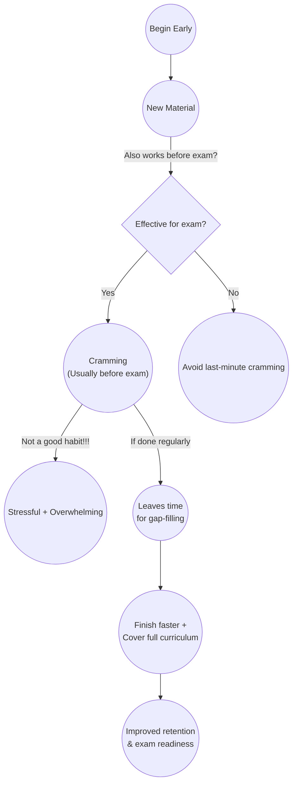

#Learning
- [ ] Need To Create Sketch in Excalidraw instead of the above mermaid embedded see 
- [ ] WIP [[DB+Justing Sung+What I Learned After 10,000 Hours of Studying]]

1. Do this in the very beginning of learning new material | only if its works also before the exam
2. Cramming usually done before exam for me! - not a good habit!!!!
3. Nice strategy of learning if our mind is used to doing cramming regularly before exams
4. if done in the beginning, leaves a lot of time to finding and filling gaps in the material during the learning period
5. if we can finish learn faster! we should finish the whole curriculum! (חומר הלימוד) and leaves time to finding and filling gaps in the material during the learning period

experiencing with Mermaid syntax for above info

