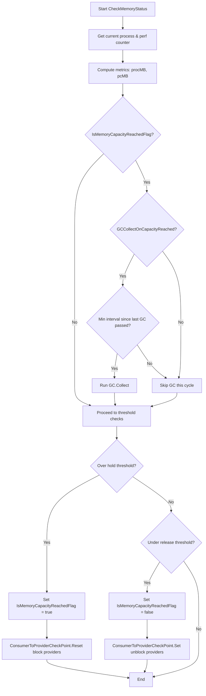
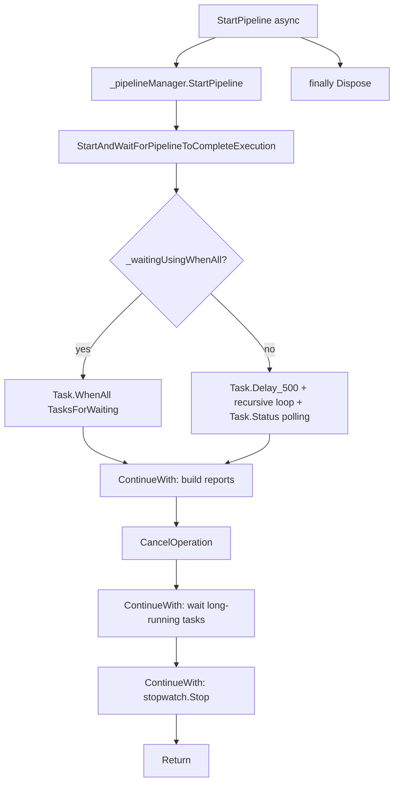
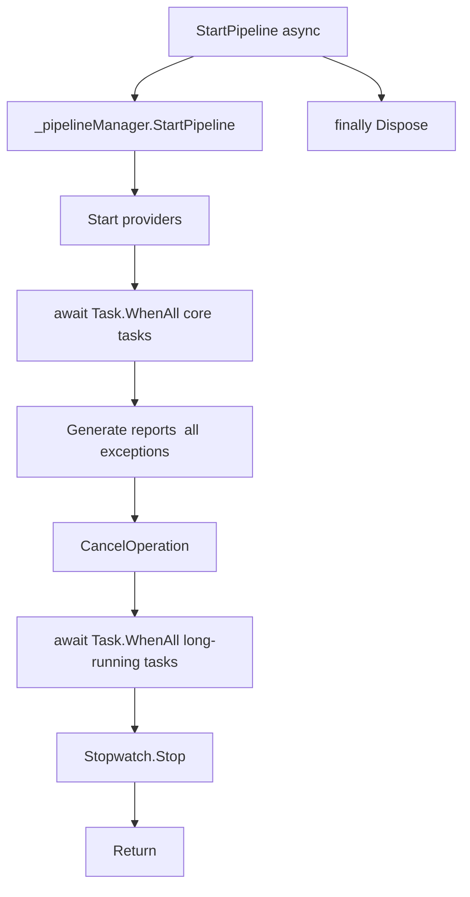

```mermaid
flowchart TD
    A[Start CheckMemoryStatus]
    A --> B[Get current process & perf counter]
    B --> C[Compute metrics: procMB, pcMB]

    C --> D{IsMemoryCapacityReachedFlag?}
    D -- Yes --> E{GCCollectOnCapacityReached?}
    E -- Yes --> F{Min interval since last GC passed?}
    F -- Yes --> G[Run GC.Collect]
    F -- No --> H[Skip GC this cycle]
    E -- No --> H
    D -- No --> I[Proceed to threshold checks]
    G --> I
    H --> I

    I --> J{Over hold threshold?}
    J -- Yes --> K[Set IsMemoryCapacityReachedFlag = true]
    K --> L[ConsumerToProviderCheckPoint.Reset block providers]
    L --> U[End]

    J -- No --> M{Under release threshold?}
    M -- Yes --> N[Set IsMemoryCapacityReachedFlag = false]
    N --> O[ConsumerToProviderCheckPoint.Set unblock providers]
    O --> U

    M -- No --> U[End]
```

```mermaid
flowchart TD
  A[StartPipeline async] --> B[_pipelineManager.StartPipeline]
  B --> C[StartAndWaitForPipelineToCompleteExecution]
  C --> D{_waitingUsingWhenAll?}
  D -- yes --> E[Task.WhenAll TasksForWaiting]
  D -- no --> F[Task.Delay_500 + recursive loop + Task.Status polling]
  E --> G[ContinueWith: build reports]
  F --> G
  G --> H[CancelOperation]
  H --> I[ContinueWith: wait long-running tasks]
  I --> J[ContinueWith: stopwatch.Stop]
  J --> K[Return]
  A --> L[finally Dispose]
```

```mermaid
flowchart TD
  A[StartPipeline  async ] --> B[_pipelineManager.StartPipeline ]
  B --> C[Start providers]
  C --> D[await Task.WhenAll core tasks ]
  D --> E[Generate reports  all exceptions ]
  E --> F[CancelOperation]
  F --> G[await Task.WhenAll long-running tasks ]
  G --> H[Stopwatch.Stop]
  H --> I[Return]
  A --> J[finally Dispose ]
```
