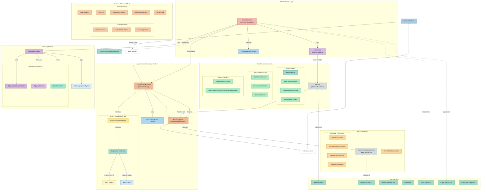

```mermaid

flowchart TD
    %% Main data flow
    ExternalSystems["External Systems"]:::external
    
    %% Data Collection Layer
    subgraph "Data Collection Layer"
        DataCollectorEx["DataCollectorEx\n(Central Orchestration)"]:::orchestrator
        FieldsMap["FieldsMap\n(Field ID mapping)"]:::datamodel
        RegistrationSystem["Field Registration System"]:::control
    end
    
    %% Core Interfaces Layer
    subgraph "Core Interfaces"
        IFieldsProvider["IFieldsProvider"]:::interface
        IFieldsConsumerEx["IFieldsConsumerEx"]:::interface
        IFieldsConsumerCom["IFieldsConsumerCom"]:::interface
        IFieldsFilter["IFieldsFilter"]:::interface
        IDataCollectorEx["IDataCollectorEx"]:::interface
        IDataCollectorCom["IDataCollectorCom"]:::interface
        IDataCollectorFactory["IDataCollectorFactory"]:::interface
    end
    
    %% Asynchronous Processing Pipeline
    subgraph "Asynchronous Processing Pipeline"
        AsyncPipelineManager["AsyncPipelineManager\n(Task Scheduling)"]:::pipeline
        ProcessingNode["ProcessingNode\n(Pipeline Implementation)"]:::pipeline
        ConcurrencyControls["Concurrency & Task Controls"]:::control
        subgraph "System Diagnostics Bridge"
            SystemDiagnosticsBridge["SystemDiagnosticsBridge"]:::bridge
            DiagnosticsInterfaces["Diagnostics Interfaces"]:::interface
            MockObjects["Mock Objects"]:::testing
            RealObjects["Real Objects"]:::implementation
        end
    end
    
    %% Data Providers
    subgraph "Data Providers (Readers)"
        AReader["AReader\n(Abstract Base Class)"]:::abstract
        subgraph "Result Readers"
            IResultsReader["IResultsReader"]:::interface
            WaferResultsProvider["WaferResultsProvider"]:::provider
            WaferResultsInfoProvider["WaferResultsInfoProvider"]:::provider
            SortedResultProvider["SortedResultProvider"]:::provider
        end
        subgraph "Specialized Providers"
            CalcVolumeProvider["CalcVolumeProvider"]:::provider
            DieGeometricProvider["DieGeometricProvider"]:::provider
            WaferInfoReader["WaferInfoReader"]:::provider
        end
        subgraph "Custom Providers"
            CooplanarityDiceCount["CooplanarityDiceCount"]:::provider
            WaferRangeProvider["WaferRangeOfDieBumpHeightsMinMaxProvider"]:::provider
        end
    end
    
    %% Data Consumers
    subgraph "Data Consumers"
        AbstractFieldsConsumerEx["AbstractFieldsConsumerEx\n(Base Consumer)"]:::abstract
        subgraph "Die/Wafer Consumers"
            DieDataConsumer["DieDataConsumer"]:::consumer
            DieObjectIdDataConsumer["DieObjectIdDataConsumer"]:::consumer
            DieZoneDataConsumer["DieZoneDataConsumer"]:::consumer
            WaferDataConsumer["WaferDataConsumer"]:::consumer
        end
        EventFieldsConsumerEx["EventFieldsConsumerEx"]:::consumer
    end
    
    %% Data Aggregation
    subgraph "Data Aggregation"
        AggregatingStorage["AggregatingStorage"]:::storage
        subgraph "Aggregation Structures"
            AggregatingStorageReader["AggregatingStorageReader"]:::storage
            AggregationInfo["AggregationInfo"]:::datamodel
            DataSetHandler["DataSetHandler"]:::handler
        end
        eDataAggregationTypes["eDataAggregationTypes"]:::enum
    end
    
    %% Common Utilities
    subgraph "Common Utilities and Tools"
        subgraph "Threading Utilities"
            TaskExtensions["TaskExtensions"]:::utility
            AwaitableMethodCalls["AwaitableMethodCalls"]:::utility
            SimpleObjectPool["SimpleObjectPool"]:::utility
        end
        subgraph "Helper Functions"
            HelpFunctions["HelpFunctions"]:::utility
            XmlHelp["XmlHelp"]:::utility
            ConcurrentHashSet["ConcurrentHashSet"]:::utility
            MultiValueDictionary["MultiValueDictionary"]:::utility
            NameAndId["NameAndId"]:::utility
        end
    end
    
    %% Connections - Primary Data Flow
    ExternalSystems -->|"Results Data"| DataProviders["Data Providers"]:::group
    DataProviders --> AsyncPipelineManager
    AsyncPipelineManager --> ProcessingNode
    ProcessingNode --> DataConsumers["Data Consumers"]:::group
    DataConsumers --> ExternalSystems
    
    %% Data Collection orchestration
    DataCollectorEx -->|"Orchestrates"| AsyncPipelineManager
    DataCollectorEx -->|"Uses"| FieldsMap
    DataCollectorEx -->|"Manages"| RegistrationSystem
    FieldsMap -->|"Maps Field IDs"| AReader
    
    %% Interface implementations
    AReader -.->|"Implements"| IFieldsProvider
    AbstractFieldsConsumerEx -.->|"Implements"| IFieldsConsumerEx
    DataCollectorEx -.->|"Implements"| IDataCollectorEx
    DataCollectorEx -.->|"Implements"| IDataCollectorCom
    DataCollectorEx -.->|"Implements"| IAsyncPipelineManagerFacade["IAsyncPipelineManagerFacade"]:::interface
    
    %% Provider-Consumer Relationships
    AReader -->|"Provides Data"| ProcessingNode
    ProcessingNode -->|"Processes"| AbstractFieldsConsumerEx
    
    %% Aggregation Flow
    DataCollectorEx -->|"Uses"| AggregatingStorage
    AggregatingStorage -->|"Uses"| AggregatingStorageReader
    AggregatingStorage -->|"Manages"| AggregationInfo
    AggregatingStorage -->|"Uses"| DataSetHandler
    AggregatingStorage -->|"Types"| eDataAggregationTypes
    
    %% AsyncPipeline Relationships
    AsyncPipelineManager -->|"Creates"| ProcessingNode
    AsyncPipelineManager -->|"Uses"| ConcurrencyControls
    AsyncPipelineManager -->|"Monitors"| SystemDiagnosticsBridge
    SystemDiagnosticsBridge -->|"Abstracts"| DiagnosticsInterfaces
    DiagnosticsInterfaces -->|"Implemented by"| MockObjects
    DiagnosticsInterfaces -->|"Implemented by"| RealObjects

    %% Click Events based on component mapping
    click DataCollectorEx "DataCollectorEx.cs"
    click FieldsMap "FieldsMap.cs"
    click AsyncPipelineManager "AsynchronousPipeline/AsyncPipelineManager.cs"
    click ProcessingNode "AsynchronousPipeline/ProcessingNode.Common.cs"
    click ConcurrencyControls "AsynchronousPipeline/LimitedConcurrencyLevelTaskScheduler.cs"
    click SystemDiagnosticsBridge "AsynchronousPipeline/SystemDiagnosticsBridge/SystemDiagnosticsBridge.cs"
    click AReader "Readers/AReader.cs"
    click IResultsReader "Readers/IResultsReader.cs"
    click WaferResultsProvider "Readers/WaferResultsProvider.cs"
    click WaferResultsInfoProvider "Readers/WaferResultsInfoProvider.cs"
    click SortedResultProvider "Readers/SortedResultProvider.cs"
    click CalcVolumeProvider "Readers/CalcVolumeProvider.cs"
    click DieGeometricProvider "Readers/DieGeometricProvider.cs"
    click WaferInfoReader "Readers/WaferInfoReader.cs"
    click CooplanarityDiceCount "CustomFieldsProviders/CooplanarityDiceCount.cs"
    click WaferRangeProvider "CustomFieldsProviders/WaferRangeOfDieBumpHeightsMinMaxProvider.cs"
    click AbstractFieldsConsumerEx "Consumers/AbstractFieldsConsumerEx.cs"
    click DieDataConsumer "Consumers/DieDataConsumer.cs"
    click DieObjectIdDataConsumer "Consumers/DieObjectIdDataConsumer.cs"
    click DieZoneDataConsumer "Consumers/DieZoneDataConsumer.cs"
    click WaferDataConsumer "Consumers/WaferDataConsumer.cs"
    click EventFieldsConsumerEx "Consumers/EventFieldsConsumerEx.cs"
    click AggregatingStorage "Aggregating/AggregatingStorage.cs"
    click AggregatingStorageReader "Aggregating/AggregatingStorageReader.cs"
    click AggregationInfo "Aggregating/AggregationInfo.cs"
    click DataSetHandler "Aggregating/DataSetHandler.cs"
    click eDataAggregationTypes "eDataAggregationTypes.cs"
    click TaskExtensions "Tools/TaskExtensions.cs"
    click AwaitableMethodCalls "Tools/AwaitableMethodCalls.cs"
    click SimpleObjectPool "Tools/SimpleObjectPool.cs"
    click HelpFunctions "Tools/HelpFunctions.cs"
    click XmlHelp "Tools/XmlHelp.cs"
    click ConcurrentHashSet "Tools/ConcurrentHashSet.cs"
    click MultiValueDictionary "Tools/MultiValueDictionary.cs"
    click NameAndId "Tools/NameAndId.cs"
    click IFieldsProvider "IFieldsProvider.cs"
    click IFieldsConsumerEx "IFieldsConsumerEx.cs"
    click IFieldsConsumerCom "IFieldsConsumerCom.cs"
    click IFieldsFilter "IFieldsFilter.cs"
    click IDataCollectorEx "IDataCollectorEx.cs"
    click IDataCollectorCom "IDataCollectorCom.cs"
    click IDataCollectorFactory "IDataCollectorFactory.cs"
    click IAsyncPipelineManagerFacade "AsynchronousPipeline/Interfaces/IAsyncPipelineManagerFacade.cs"
    click DiagnosticsInterfaces "AsynchronousPipeline/SystemDiagnosticsBridge/Interfaces"
    click MockObjects "AsynchronousPipeline/SystemDiagnosticsBridge/MockObjects"
    click RealObjects "AsynchronousPipeline/SystemDiagnosticsBridge/RealObjects"

    %% Styling
    classDef external fill:#A9CCE3,stroke:#2874A6,color:#17202A
    classDef orchestrator fill:#F5B7B1,stroke:#C0392B,color:#17202A,stroke-width:2px
    classDef datamodel fill:#D7BDE2,stroke:#8E44AD,color:#17202A
    classDef control fill:#AED6F1,stroke:#2E86C1,color:#17202A
    classDef interface fill:#A2D9CE,stroke:#138D75,color:#17202A
    classDef pipeline fill:#EDBB99,stroke:#DC7633,color:#17202A
    classDef bridge fill:#F9E79F,stroke:#D4AC0D,color:#17202A
    classDef abstract fill:#D5DBDB,stroke:#566573,color:#17202A,stroke-dasharray: 5 5
    classDef provider fill:#ABEBC6,stroke:#28B463,color:#17202A
    classDef consumer fill:#FAD7A0,stroke:#D68910,color:#17202A
    classDef storage fill:#D2B4DE,stroke:#7D3C98,color:#17202A
    classDef enum fill:#D6EAF8,stroke:#2874A6,color:#17202A
    classDef utility fill:#F5CBA7,stroke:#CA6F1E,color:#17202A
    classDef testing fill:#FCF3CF,stroke:#D4AC0D,color:#17202A
    classDef implementation fill:#D4E6F1,stroke:#2E86C1,color:#17202A
    classDef handler fill:#A3E4D7,stroke:#17A589,color:#17202A
    classDef group fill:none,stroke:#85929E,color:#17202A,stroke-dasharray: 3 3

```