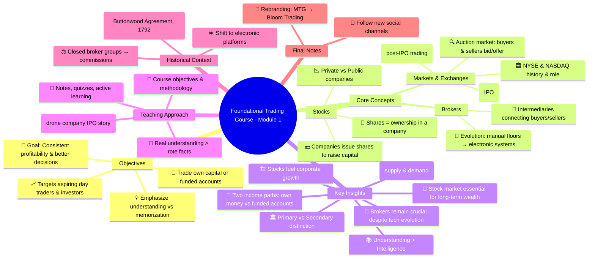
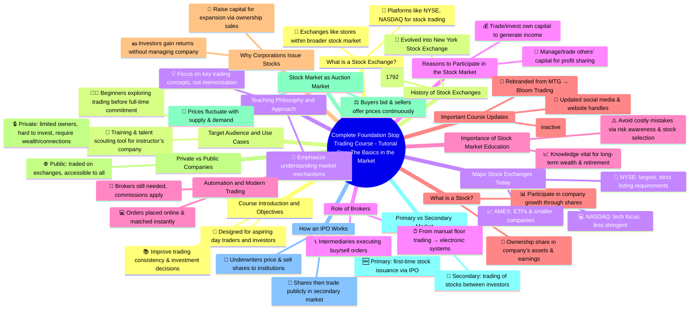
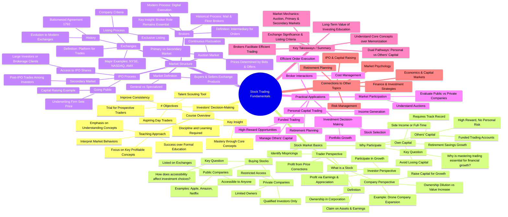
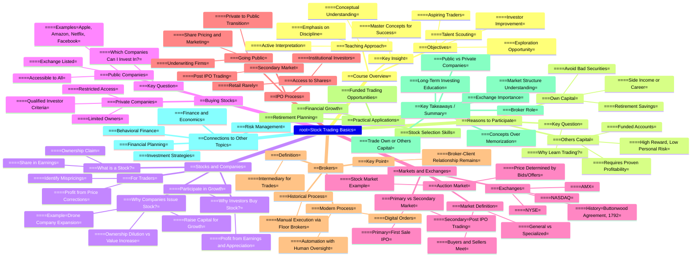

# [*The Complete Foundation Stock Trading Course*](https://www.udemy.com/course/foundation-course/learn/lecture/7549660#overview)

==============================================

# Lecture 1
[ 1. The Foundation Stock Trading Course: The Basic and the Market 📈 | Learn to Trade Like a Pro ](https://www.youtube.com/watch?v=CBlhB_BnppQ&t=219s)

## Summary
- The video transcript is the first module of a foundational trading course aimed at beginners and aspiring day traders. It introduces the course objectives, teaching methodology, and fundamental concepts of the stock market. The instructor emphasizes the importance of understanding the core principles of trading and investing rather than just memorizing information. The course is designed to help individuals become consistent and profitable traders, make better investment decisions, and explore opportunities to trade with their own capital or manage others’ money through funded accounts.

- The module explains what stocks are—shares representing ownership in a company—and why companies issue shares to raise capital. It contrasts private companies with public companies, highlighting that stock trading happens mainly in public companies on stock exchanges. The video details how markets and exchanges operate, focusing on the auction nature of the stock market where buyers and sellers continuously bid and offer prices. It also covers the difference between primary and secondary markets, explaining the process of IPOs (Initial Public Offerings) and how stocks start trading publicly.

- The history and role of stock exchanges like the New York Stock Exchange (NYSE) and NASDAQ are described, including the origins of brokers and the evolution from manual trading floors to automated electronic systems. The instructor stresses that trading requires education, discipline, and a deep understanding of market concepts, sharing anecdotes about smart individuals failing and others succeeding in trading.

- Finally, the video mentions a rebranding from the instructor’s old company (MTG) to a new one (Bloom Trading), advising students to follow the updated social media channels for accurate information.
Highlights

    📈 The course targets aspiring day traders and investors seeking better decision-making skills.
    💡 Emphasis on understanding trading concepts rather than rote memorization of facts.
    🏢 Explanation of stocks as ownership shares and why companies issue them to raise capital.
    📉 Differentiation between private and public companies and the accessibility of their stocks.
    🏛️ Overview of stock exchanges (NYSE, NASDAQ) and their role in facilitating stock trades.
    🔄 Explanation of primary vs. secondary markets and the IPO process.
    🤖 Evolution of brokers and trading from manual floors to automated electronic systems.

### Key Insights

📚 Education and Understanding Trump Intelligence Alone: The instructor highlights that success in trading is less about formal intelligence or academic background and more about truly understanding the core concepts of the market. This insight challenges the assumption that only highly educated individuals can succeed in trading, emphasizing the value of practical comprehension over theoretical knowledge.

💼 Two Paths to Trading Income: Personal Capital vs. Funded Accounts: Traders can either trade their own money or, after proving consistent profitability, manage other people’s funds through funded accounts. This pathway offers larger capital and potentially higher rewards with reduced personal financial risk, illustrating an important career progression for traders.

🏦 Importance of Stock Market Involvement for Everyone: The instructor stresses that everyone should engage with the stock market at some point because long-term wealth accumulation (e.g., retirement savings) depends heavily on investing in stocks. Learning trading and investing minimizes the risk of losing capital and maximizes growth potential over decades.

🏗️ Stocks as a Mechanism for Corporate Growth: By issuing shares, companies raise capital to expand operations. Investors buy these shares to participate in the company’s growth, earning returns without direct involvement in the business. This mutual benefit drives the fundamental relationship between corporations and shareholders.

🔍 The Stock Market as an Auction Market: Unlike fixed-price markets (e.g., grocery stores), the stock market operates as a continuous auction where buyers and sellers compete on prices. Understanding this dynamic is crucial for traders to identify mispricings and capitalize on market inefficiencies.

🏛️ Primary vs. Secondary Market Distinction and IPO Nuances: The primary market involves the initial sale of stock in an IPO, which is often limited to institutional investors and large clients. The secondary market, where most retail investors trade, consists of all subsequent transactions. This distinction affects access, pricing, and liquidity.

🤝 Role of Brokers and Technological Evolution in Trading: Brokers act as intermediaries facilitating trades between buyers and sellers. Historically, trading involved physical presence and manual negotiation, but technology has automated much of this process, speeding up execution and broadening access while retaining the broker’s role as an essential conduit.

### Expanded Summary and Analysis

- This foundational trading course module serves as an essential primer for those interested in entering the stock trading world, whether as day traders, swing traders, or long-term investors. The instructor begins by setting clear course objectives: to help students become consistent traders, improve investment decisions, and understand the mechanics of the market deeply. He encourages learners to engage actively with module notes and quizzes, fostering a structured learning approach.

- A key early message is the distinction between knowing concepts and truly understanding them. The instructor draws from personal experience, noting that academic brilliance does not guarantee trading success. Instead, comprehension and application of market concepts determine profitability. This perspective underlines the teaching approach: focusing on critical ideas that can differentiate profitable traders from unsuccessful ones, rather than overwhelming students with information to memorize.

- The course then moves to foundational definitions. A stock is ownership in a corporation, granting shareholders a claim on assets and earnings. This is illustrated through a hypothetical drone company example, showing how entrepreneurs issue shares to raise capital for expansion. By selling 50% of the company for $5 million, the entrepreneur gains enough capital to open multiple stores, thereby increasing overall earnings. Although owning fewer shares, the shareholder’s portion of a larger pie results in greater absolute returns.

- The difference between private and public companies is crucial. Private companies have limited owners and cannot sell shares freely in public markets. Investing in private companies typically requires personal connections or high net worth status, making it inaccessible for most retail investors. Public companies, conversely, trade on stock exchanges and allow virtually anyone to buy shares through brokers, democratizing ownership.

- Markets and exchanges are explained in relatable terms. A market is a place where goods are bought and sold, but the stock market is an auction market where prices fluctuate based on bids and offers from buyers and sellers. This continuous price negotiation is unlike fixed-price retail markets, requiring traders to understand supply and demand dynamics and identify opportunities arising from price misalignments.

- The module also clarifies the primary and secondary markets. The primary market is where companies first issue shares through an IPO, typically handled by underwriting firms who price shares to balance raising capital and market demand. IPO shares are allocated primarily to institutional investors and large clients, making them difficult for the average investor to access. The secondary market is where most trading occurs, with shares changing hands among investors after the IPO.

- A brief historical account of stock exchanges enriches understanding. The New York Stock Exchange originated from informal gatherings of traders who formalized their operations through the Buttonwood Agreement in 1792. This agreement created a closed group of brokers who facilitated trades and charged commissions. The evolution from physical meeting places to electronic platforms has modernized trading but maintained the broker’s intermediary role.

- The video concludes with a practical update about the instructor’s rebranding from MTG to Bloom Trading, ensuring students follow the correct social media channels for course updates and resources.
Final Thoughts

- This module lays a strong foundation by combining theoretical knowledge with practical insights and real-world examples. It demystifies the stock market’s operation, sets realistic expectations for trading success, and motivates learners to pursue deeper understanding. The focus on conceptual clarity, combined with historical and technical context, prepares students well for subsequent modules covering more advanced topics.

## Extended infomration
Summary of “The Complete Foundation Stop Trading Course – Tutorial One: The Basics in the Market”
- [00:01 → 04:39] Course Introduction and Teaching Philosophy

    Course Purpose & Objectives:
        Designed for aspiring day traders and those wanting to improve consistency.
        Also valuable for investors wanting to make better investment decisions.
        Serves as the first-level training for professional traders at the instructor’s firm.
        Used as a talent scouting tool to recruit promising traders.
        Suitable for those curious about trading before fully committing.

    Advice for Beginners:
        Encourages learning and testing the waters before quitting other jobs.
        Emphasizes trading requires discipline, education, and effort.

    Teaching Approach:
        Focus on understanding key trading concepts, not rote memorization.
        Distinguishes between knowing concepts and truly understanding them to become profitable.
        Views conceptual understanding as the key difference between successful and unsuccessful traders, regardless of formal education level.

- [04:39 → 08:42] Reasons to Be Involved in the Stock Market

    Two primary reasons to engage with the stock market:
        Trading or investing your own capital to generate income.
        Trading or investing others’ capital to generate income (e.g., through proprietary firms or fund management).

    Trading Your Own Capital:
        Many trade to generate a side income or as their full-time job.
        Everyone, at some point, should be invested in stocks, especially for retirement savings.
        Investing without knowledge can lead to significant losses (examples given of half a million dollars lost).
        Conversely, good stock selection can easily double capital over decades.
        Learning to invest/trade is worth months to a year of effort given the long-term benefits.

    Trading Others’ Capital:
        Requires proving your trading ability with a consistent track record (e.g., 8-12 months).
        Successful traders can be funded by companies with large capital, trading bigger amounts with no personal capital risk.
        Traders keep a percentage of the profits from trading others’ money.

    Key Conclusion:
        Regardless of your end goal, learning to trade and invest is essential since it impacts your financial future.

- [08:42 → 17:09] What is a Stock? Private vs. Public Companies

    Definition of a Stock:
        A stock (or share) represents ownership in a corporation.
        Owning stock means having a claim on the company’s assets and earnings.

    Why Corporations Issue Stock:
        To raise capital for growth, e.g., expanding operations or opening new stores.
        Example: A drone company owner with $100,000 profit wants to expand nationwide but needs millions; sells 50% of the company shares to investors to raise $5 million.
        Selling shares means giving up a portion of ownership but potentially increasing overall earnings.

    Why Investors Buy Stock:
        To participate in the company’s growth and earn returns without operational involvement.

    Stock Pricing and Trading:
        Traders look for mispricing — times when stock prices are too high or low compared to intrinsic value — to profit.

    Buying Stocks:
        Depends on whether a company is private or public.
            Private companies: Few owners, no public trading; shares bought only via relationships or as qualified investors.
            Public companies: Listed on public exchanges; anyone can buy shares easily via brokers.

    Qualified Investors:
        Often individuals with high income/assets (example: in Canada, earning $200K-$400K+ annually and $2 million+ in assets).

    Conclusion:
        Public companies provide easier access and liquidity.
        Private companies are harder to invest in due to restrictions.

- [17:09 → 26:37] What is a Market? Primary vs. Secondary Markets

    Market Definition:
        A market is a place where buyers and sellers exchange goods.
        Different markets specialize in different products.

    Two Types of Markets:
        Regular Market: Fixed prices set by the seller (e.g., grocery stores).
        Auction Market: Prices are determined by bids and offers from buyers and sellers competing simultaneously.

    Stock Market as Auction Market:
        No fixed prices; buyers bid and sellers offer simultaneously.
        Prices fluctuate continuously throughout the trading day.

    Primary Market:
        Where stocks are sold for the first time ever during an IPO (Initial Public Offering).
        Example: A company goes public by selling shares to the public to raise capital.

    Secondary Market:
        All trading after the IPO.
        Investors buy and sell shares from each other, not directly from the company.
        Most public trading happens here (e.g., NASDAQ, NYSE).

    IPO Process Overview:
        Companies hire underwriting firms to price and sell shares.
        Underwriters allocate shares to brokers and institutional investors.
        IPO shares are often difficult for retail investors to access.

    Key Insight:
        Retail investors typically trade on secondary markets, not in the IPO.

- [26:37 → 34:44] What is an Exchange? History and Major Exchanges

    Exchange vs. Market:
        Market = broad concept of buyers and sellers.
        Exchange = specific venue or platform where trades are executed.
        Example analogy: Grocery store (market) vs. Walmart or Whole Foods (exchanges).

    Historical Background:
        Early stock trading involved manual matching of buyers and sellers in informal gatherings.
        The Buttonwood Agreement (1792) signed by 24 brokers in New York formalized trading rules.
        This led to the creation of the New York Stock Exchange (NYSE).

    Modern Exchanges:
        Trades are now automated; brokers act as intermediaries.
        Major U.S. exchanges:
            NYSE: Largest, most demanding in listing criteria.
            NASDAQ: Less demanding, tech-focused companies.
            AMEX: Focuses on ETFs (Exchange Traded Funds).

    Listing Requirements:
        Companies must apply and meet criteria to be listed on an exchange.
        Requirements include company size, share price, trading volume, and other financial metrics.

    Trading Locations:
        Stocks usually trade on one exchange, not multiple.
        Knowing the exchange tells you where to buy/sell a stock.

- [34:44 → 37:33] What is a Broker?

    Definition:
        A broker is a licensed intermediary who facilitates buying and selling of stocks.

    Historical Role:
        Initially, investors contacted brokers via mail, then phone.
        Brokers hired floor brokers who physically executed trades on the exchange floor.
        Trades were slower and required verbal communication.

    Modern Role:
        Trading is largely automated and computerized.
        Investors place orders online or by phone; orders are routed electronically.
        Brokers still charge commissions and are the official intermediaries.

    Key Point:
        Despite automation, brokers remain essential for executing trades and regulatory compliance.

- [37:33 → 38:58] Important Update from Instructor

    The instructor has started a new company called Bloom Trading, replacing the previous company MTG.
    Students are advised not to follow or interact with old MTG social media handles.
    Updated contact info and social media for Bloom Trading are provided.
    Further information about the new company and changes is available on Bloom Trading’s official channels.

Key Concepts and Definitions
| Term                              | Definition                                                                                                                         |
| --------------------------------- | ---------------------------------------------------------------------------------------------------------------------------------- |
| **Stock / Share**                 | A unit of ownership in a corporation, representing claim on assets and earnings.                                                   |
| **Private Company**               | A company with limited owners, not publicly traded on exchanges, difficult for outsiders to invest in.                             |
| **Public Company**                | A company whose shares are listed on public exchanges and available for trading by the general public.                             |
| **Primary Market**                | The market where stocks are issued and sold to the public for the first time (IPO).                                                |
| **Secondary Market**              | The market where existing shares are bought and sold between investors after the IPO.                                              |
| **IPO (Initial Public Offering)** | The first sale of stock by a private company to the public, typically facilitated by underwriting firms.                           |
| **Stock Exchange**                | A formal marketplace (physical or electronic) where stock trades are executed (e.g., NYSE, NASDAQ, AMEX).                          |
| **Broker**                        | A licensed intermediary who facilitates stock transactions between buyers and sellers.                                             |
| **Auction Market**                | A market where buyers bid and sellers offer simultaneously, leading to price discovery (stock markets operate as auction markets). |
| **Qualified Investor**            | An investor meeting certain income and asset thresholds allowing them to invest in private companies (criteria vary by country).   |

Timeline Table: Stock Market Evolution (Brief)
| Period/Year           | Event                                                                                                |
| --------------------- | ---------------------------------------------------------------------------------------------------- |
| **Pre-1792**          | Informal stock trading via word-of-mouth and journals in cities like New York.                       |
| **1792**              | Buttonwood Agreement signed by 24 brokers under a tree in New York, formalizing stock trading.       |
| **1793**              | Group moves from tree to a coffee shop, later buys a building—the foundation of NYSE.                |
| **20th Century**      | Introduction of telephone orders, floor brokers, and physical trading floors.                        |
| **Late 20th Century** | Transition to automated, computerized trading systems; brokers act as intermediaries electronically. |
| **Present**           | Stock trading occurs mainly via electronic exchanges (NYSE, NASDAQ, AMEX) with brokers facilitating. |

Key Insights

    Understanding trading concepts deeply is critical for success, more so than formal education alone.
    Stock ownership represents partial company ownership, with rights to assets and earnings.
    Public markets offer liquidity and easy access, while private markets are restricted to qualified investors.
    Stock markets operate as auction markets, with continuously changing prices driven by bids and offers.
    Primary markets involve IPOs where companies raise capital; secondary markets involve ongoing trading of issued shares.
    Stock exchanges are specific venues where trades are executed, with varying listing requirements and specialization.
    Brokers remain essential intermediaries despite automation, facilitating trade execution and compliance.
    Education in trading and investing is vital as it impacts long-term financial security and wealth accumulation.

This summary captures the foundational concepts introduced in the first tutorial module, setting the stage for more advanced trading knowledge and skills.

## visualize 
### Mind Map summarized

### Flow Chart

```mermaid
flowchart TD
    A[Foundational Trading Course - Module 1] --> B[Objectives]
    A --> C[Core Concepts]
    A --> D[Key Insights]
    A --> E[Teaching Approach]
    A --> F[Historical Context]
    A --> G[Final Notes]

    B --> B1[📈 Targets aspiring day traders & investors]
    B --> B2[💡 Emphasize understanding vs memorization]
    B --> B3[🎯 Goal: Consistent profitability & better decisions]
    B --> B4[💼 Trade own capital or funded accounts]

    C --> C1[Stocks]
    C --> C2[Markets & Exchanges]
    C --> C3[Brokers]

    C1 --> C11[🏢 Shares = ownership in a company]
    C1 --> C12[💵 Companies issue shares to raise capital]
    C1 --> C13[📉 Private vs Public companies]

    C2 --> C21[🔍 Auction market: buyers & sellers bid/offer]
    C2 --> C22[🔄 Primary Market - IPO]
    C2 --> C23[🔄 Secondary Market - post-IPO trading]
    C2 --> C24[🏛️ NYSE & NASDAQ history & role]

    C3 --> C31[🤝 Intermediaries connecting buyers/sellers]
    C3 --> C32[🏦 Evolution: manual floors → electronic systems]

    D --> D1[📚 Understanding > Intelligence]
    D --> D2[💼 Two income paths: own money vs funded accounts]
    D --> D3[🏦 Stock market essential for long-term wealth]
    D --> D4[🏗️ Stocks fuel corporate growth]
    D --> D5[🔍 Market = continuous auction - supply & demand]
    D --> D6[🏛️ Primary vs Secondary distinction]
    D --> D7[🤖 Brokers remain crucial despite tech evolution]

    E --> E1[📘 Course objectives & methodology]
    E --> E2[📝 Notes, quizzes, active learning]
    E --> E3[🧠 Real understanding > rote facts]
    E --> E4[📊 Practical examples - drone company IPO story]

    F --> F1[📜 Origins of NYSE - Buttonwood Agreement, 1792]
    F --> F2[⚖️ Closed broker groups → commissions]
    F --> F3[⏩ Shift to electronic platforms]

    G --> G1[🔄 Rebranding: MTG → Bloom Trading]
    G --> G2[📲 Follow new social channels]
```

## Mind map extended

## SUPER EXTENDED

Summary of the Video Transcript: Complete Foundation Stock Trading Course – Tutorial One: The Basics of the Market
General Overview

This video serves as the introductory module of a comprehensive stock trading course. It lays the groundwork by explaining the course objectives, teaching philosophy, and fundamental stock market concepts. The instructor stresses understanding over rote memorization and emphasizes the practical applications of trading and investing knowledge. The content ranges from why to participate in the stock market, what stocks are, how companies raise capital, stock markets and exchanges, to brokers and their roles.
Detailed Segmented Summary with Timestamps

    [00:01 → 03:12] Course Introduction, Objectives, and Teaching Approach

        Course Objectives:
            Designed for aspiring day traders and those wanting to improve consistency.
            Also valuable for investors seeking to make better investment decisions.
            Serves as a first-level training for traders employed by the instructor’s company.
            Used as a talent scouting tool for identifying promising traders.
            Provides an opportunity for prospective traders to explore the field before committing full-time.

        Teaching Approach:
            Emphasizes conceptual understanding rather than memorization.
            Highlights that success in trading depends more on understanding concepts than on formal education or intelligence.
            The course focuses on key concepts that differentiate profitable traders from unprofitable ones.
            Encourages learners to understand why market behaviors occur and how to interpret information in different contexts.

        Key Insight: Trading and investing require discipline, learning, and understanding; it’s not an easy path but can be mastered by focusing on core concepts.

    [03:12 → 08:42] Reasons to Participate in the Stock Market and Capital Management

        Two primary reasons to be involved in the stock market:
            Trade/invest your own capital to generate income.
            Trade/invest other people’s capital to generate income.

        Trading your own capital:
            Can be a side income or full-time career.
            The instructor believes everyone should invest in stocks at some point, particularly for retirement savings.
            Shares personal experience witnessing large retirement accounts either doubled or wiped out due to stock selection.

        Learning to invest/trade is crucial because:
            It can significantly increase retirement savings over decades by choosing good stocks.
            It helps avoid losing capital by avoiding bad securities.

        Trading other people’s capital:
            Requires proving consistent profitability.
            Funded trading accounts allow trading with larger capital and high rewards, with no personal capital risk.
            Companies that fund traders typically require a track record of consistent profits over months or more.

        Conclusion: Regardless of goal, mastering trading/investing is essential for financial growth and sustainability.

    [08:42 → 13:39] What is a Stock? Why Companies Issue Stock? Why People Buy Stock?

        Definition:
            A stock (or share) is a security representing ownership in a corporation.
            Owning stock means you have a claim on company assets and earnings.

        Why companies issue stock:
            To raise capital for growth (e.g., expanding store locations, scaling operations).
            Example: A drone company earns $100,000 annually as a 100% owner; to expand nationwide, it needs $5 million to open several stores.
            Selling 50% ownership to investors for $5 million allows expansion and larger profits overall.
            Though ownership is diluted, the value of the stake increases due to company growth.

        Why investors buy stock:
            To participate in the company’s growth without doing the work.
            Investors profit via earnings and capital appreciation.

        For traders:
            The goal is to identify mispricings in stock prices.
            By assessing if a stock is over- or under-valued, traders seek to profit from price corrections.

    [13:39 → 17:09] How to Buy Stocks: Public vs. Private Companies

        Private companies:
            Have limited owners.
            Do not trade on public exchanges.
            Buying shares requires knowing owners, being a relative, employee, or a qualified investor (high income and assets).
            Difficult for the general public to invest in private companies.

        Public companies:
            Are listed on stock exchanges.
            Anyone can buy shares without knowing the owners.
            Examples: Apple, Amazon, Netflix, Facebook.

        Qualified Investor Criteria (example from Canada):
            Income between $200,000 - $400,000 per year for the last 3 years.
            Assets over $2 million.

        Summary: The course focuses on public companies and public stock markets since these are accessible to most traders and investors.

    [17:09 → 20:46] What is a Market? Types of Markets and Auction Markets

        Market definition:
            A place where buyers and sellers come together to exchange products.
            Markets can be general (variety of products) or specialized (specific product).

        Conventional markets:
            Prices are fixed (e.g., grocery store apples at $2 per pound).
            Buyers accept or reject the fixed price; no bargaining.

        Auction market (stock market):
            Prices are determined by competing bids (buyers) and offers (sellers).
            Buyers and sellers actively compete to set prices.
            Example analogy: Multiple sellers offering different apple prices; buyers bidding different prices simultaneously.

        Stock market is an auction market:
            Prices fluctuate continuously during the trading day based on supply/demand.

        Two types of stock markets:
            Primary market: Where stocks are sold for the first time (IPO).
            Secondary market: Where stocks are traded after the IPO (all subsequent trades).

    [20:46 → 26:37] IPO Process and Primary vs. Secondary Market Details

        Going public (IPO):
            Private company decides to sell shares to public for first time.
            Hires an underwriting firm specializing in IPOs.
            Underwriters assess company value, amount of capital needed, and set a stock price.
            Example: Selling 1 million shares at $100 each to raise $100 million.

        Underwriting firms’ role:
            Balance between maximizing capital and ensuring all shares are sold.
            They market shares to banks, brokers, and institutional investors.

        Access to IPO shares:
            Typically limited to large institutional investors or big clients of brokerage firms.
            Individual retail investors rarely access IPO shares directly.

        Secondary market:
            After IPO, shares trade on exchanges between investors.
            All trades post-IPO are considered secondary market transactions.

    [26:37 → 34:15] What is an Exchange? History and Major Stock Exchanges

        Market vs. Exchange:
            Market: general place for buying/selling stocks.
            Exchange: specific location or platform where trades are executed.

        Examples:
            New York Stock Exchange (NYSE)
            NASDAQ
            AMX (for ETFs, Exchange Traded Funds)

        Historical background:
            Early trading required finding counterparties individually.
            Traders met physically in New York under a Buttonwood tree (1792) and signed the Buttonwood Agreement.
            The agreement formed a group of 24 brokers who agreed to trade exclusively among themselves and charge commissions.
            This group evolved into the New York Stock Exchange.

        Modern exchanges:
            NYSE: largest, most demanding listing requirements.
            NASDAQ: less demanding, known for tech companies.
            AMX: focused on ETFs.

        Listing process:
            Companies must apply and meet criteria to be listed on an exchange.
            Listings are exclusive; a company is usually listed on one exchange.

    [34:15 → 37:02] What is a Broker? Role and Evolution

        Broker definition:
            An intermediary who executes buy/sell orders on behalf of clients.

        Historical process:
            Orders sent via mail or telephone to brokers.
            Brokers hired floor brokers who physically executed trades on the exchange floor.
            Floor brokers matched buyers and sellers manually, with trades taking minutes.

        Modern process:
            Orders are now entered digitally and matched instantly via automated systems.
            Brokers still serve as intermediaries, routing orders to exchanges.
            Commissions are paid to brokers for their services.

        Key point: Though technology has automated trading, the broker-client relationship remains essential.

    [37:33 → 38:58] Company Rebranding Announcement
        Instructor announces transition from old company MTG to new company Bloom Trading.
        Social media handles and branding have changed accordingly.
        Current course materials may reference old handles; students are advised to follow new Bloom Trading channels.
        Additional information about changes available on Bloom Trading’s website and YouTube channel.

Key Insights and Concepts
Concept 	Explanation
Stock 	A security representing partial ownership in a corporation, entitling the holder to claim assets and earnings.
Primary Market 	The market where shares are sold for the first time (IPO).
Secondary Market 	The market where shares are traded after the IPO, between investors.
IPO (Initial Public Offering) 	The process through which a private company offers stock to the public for the first time.
Underwriting Firm 	A company that manages the IPO process, pricing, and marketing shares to investors.
Exchange 	A physical or electronic marketplace for buying and selling stocks (e.g., NYSE, NASDAQ).
Broker 	An intermediary who executes buy/sell orders for clients on stock exchanges.
Auction Market 	A market where buyers and sellers compete with bids and offers to determine prices (stock market).
Private vs. Public Company 	Private companies have limited owners and no public trading; public companies are listed on exchanges and accessible to anyone.
Summary Timeline Table of Key Events and Processes
Timestamp 	Event/Topic 	Details
00:01 – 03:12 	Course Intro and Objectives 	Goals for traders, investors; emphasis on understanding concepts.
03:12 – 08:42 	Reasons to Trade/Invest 	Trade own vs. others’ capital; importance of education.
08:42 – 13:39 	What is a Stock? 	Ownership, claims on assets, company growth, and investor benefits.
13:39 – 17:09 	Buying Stocks: Public vs Private 	Accessibility differences, qualified investor criteria.
17:09 – 20:46 	Market Types: Auction Market Explained 	Stock market as auction market, primary vs. secondary markets.
20:46 – 26:37 	IPO Process and Market Transactions 	Underwriting, share allocation, secondary market explained.
26:37 – 34:15 	Stock Exchanges and History 	NYSE origins, major exchanges, listing requirements.
34:15 – 37:02 	Brokers and Trading Evolution 	Role of brokers, automation in trading execution.
37:33 – 38:58 	Company Rebranding Announcement 	Move from MTG to Bloom Trading, updated social media and communication.
Conclusion

This foundational tutorial thoroughly introduces learners to the fundamentals of stock trading and investing, emphasizing:

    The necessity of understanding key concepts rather than memorizing facts.
    The dual pathways in trading: using personal capital or managing others’ capital.
    The structure of the stock market, including primary and secondary markets, and the auction mechanism that determines stock prices.
    The importance of stock exchanges as marketplaces with specific listing criteria.
    The essential role of brokers as intermediaries facilitating trades.
    The difference between public and private companies in terms of stock accessibility.

The instructor also underscores the practical and long-term importance of investing education for personal financial security and growth.

Note: Some numerical examples are illustrative and not exact market data.

