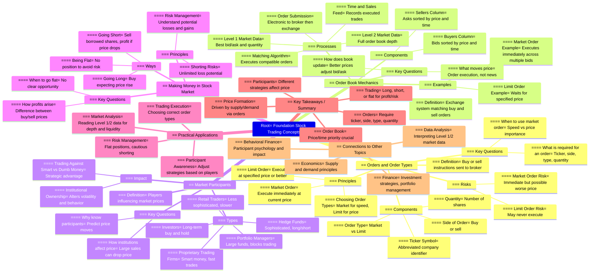

*The Complete Foundation Stock Trading Course*
==============================================
# Lecture 2
[ 2. The Foundation Stock Trading Course: Order and Prices 📈 | Learn to Trade Like a Pro ](https://youtu.be/sSM2DwYgf2c?si=Oe7mroBiWMh_IErS)

# Summary

This video tutorial comprehensively covers foundational concepts in stock trading, focusing on orders and prices, market mechanics, types of market participants, and ways to make money in the stock market. It starts by explaining how orders work—highlighting market and limit orders—and how orders are transmitted through brokers to exchanges. The video then delves into how prices move based on the order book dynamics, the concepts of bid, ask, spread, and order matching on exchanges using a simplified example. It explains the importance of the Level 1 and Level 2 quotes and the time and sales data as tools for traders. The tutorial also discusses different market players, including proprietary trading firms, retail traders, mutual funds, hedge funds, and portfolio managers, emphasizing how their behavior influences stock price movements. Finally, it covers the three primary ways to profit in the stock market: going long, going short, and being flat (no position), highlighting the risks and benefits of each approach. Throughout, the tutorial stresses the importance of understanding order flow, market participants, and strategic positioning to succeed in trading.
Highlights

    📝 Explanation of market and limit orders and when to use each.
    📈 Detailed breakdown of the order book, including Level 1, Level 2, and time and sales data.
    📊 Demonstration of how prices move due to supply and demand via order matching.
    💼 Overview of different market participants and their trading behaviors.
    💡 Insight into institutional ownership and its impact on price movement.
    📉 Explanation of short selling, its mechanics, risks, and rewards.
    ⚖️ Introduction to being flat (no position) as a valid trading strategy to avoid losses.

Key Insights

    🔄 Order Types Drive Execution and Price: Market orders prioritize speed of execution without price guarantees, while limit orders prioritize price but may delay execution. Traders must balance urgency versus price sensitivity to optimize outcomes.
    📊 Order Book is the Heart of Price Discovery: The bid and ask prices, along with their quantities in the order book, directly influence price movements. Price changes reflect new orders entering or existing orders being filled, not merely news or events.
    🕵️‍♂️ Understanding Market Participants is Crucial: Different players (retail traders, mutual funds, hedge funds, proprietary trading firms) have distinct motives and behaviors. For example, mutual funds often sell shares on good news to unload large positions without tanking the price. Knowing who owns what helps anticipate price moves.
    📉 Short Selling Is Risky but Profitable When Timed Right: Shorting involves borrowing shares to sell high and buy back lower. The maximum gain is limited to the initial sale price, whereas losses can be unlimited if the stock price rises. This asymmetry demands careful risk management.
    📈 Being Flat is a Strategic Position: Avoiding trades when the market conditions or opportunities are unclear helps preserve capital. Not every moment requires a position; sometimes, the best trade is no trade.
    💰 Spread Matters for Trading Costs: The difference between bid and ask prices (spread) can affect profitability, especially in less liquid stocks with wider spreads. Market orders in such cases can lead to immediate losses due to unfavorable fills.
    🔎 Real-Time Market Data Tools Are Essential: Level 2 data and time and sales provide deeper insights into market sentiment and order flow beyond the top-level quotes, enabling more informed trading decisions.

Outline

    Introduction to Orders and Order Types
        What is an order?
        Market vs. limit orders: definitions, differences, and when to use each
        Required elements of an order: ticker symbol, side (buy/sell), price (for limit orders), quantity
        Modern electronic order transmission

    Price Movement and Order Book Mechanics
        Basics of shares outstanding vs. float
        Simplified example with 10 participants and their shareholdings
        How orders enter the exchange and are matched
        Bid and ask columns, price and time priority
        Level 2 (order book) vs. Level 1 (best bid/ask) data
        Time and Sales: recording executed trades
        How order flow drives price changes (supply and demand)
        Concepts of bid, ask, spread, and impact on trading costs

    Market Participants and Their Influence
        Different types of players: proprietary trading firms, retail traders, mutual funds, portfolio managers, hedge funds
        Institutional ownership and its importance
        Behavioral patterns of different participants
        How knowledge of participants helps in anticipating price movements
        Trading “against” different players and strategic considerations

    Ways to Make Money in the Stock Market
        Going long: buying stocks to profit from price appreciation
        Going short: mechanics of short selling, borrowing shares, risks of unlimited loss, and rewards
        Being flat: the strategy of holding no position to avoid losses and preserve capital
        Risk management considerations for each method

    Conclusion
        Recap of key concepts
        Importance of research, understanding order flow, and market participants
        Preview of upcoming modules covering advanced order types, margin accounts, and short selling in detail

Keywords

    Order types
    Market order
    Limit order
    Order book (Level 1, Level 2)
    Bid-ask spread
    Institutional ownership
    Short selling

FAQs

    Q1: What is the difference between a market order and a limit order?
    A1: A market order executes immediately at the best available price, while a limit order executes only at a specified price or better, potentially delaying execution.

    Q2: How do prices move in the stock market?
    A2: Prices move based on the supply and demand reflected in buy and sell orders entering the order book, not directly because of news or events.

    Q3: Who are the main participants in the stock market?
    A3: They include proprietary trading firms, retail traders, mutual funds, hedge funds, and portfolio managers, each with different strategies and influences on price.

    Q4: How does short selling work?
    A4: Short selling involves borrowing shares to sell them at a high price, then buying them back later at a lower price to return to the lender, profiting from the price difference.

    Q5: What does it mean to be “flat” in trading?
    A5: Being flat means having no open position in the market, which helps avoid unnecessary risk and potential losses when no clear opportunity exists.

Core Concepts

    Orders and Their Role in Trading: Every transaction in the stock market begins with an order—a directive to buy or sell a specific quantity of shares at a certain price. Orders can be market orders, which prioritize immediate execution regardless of price, or limit orders, which prioritize price but may delay execution. Understanding when and how to use these orders is fundamental to trading effectively.

    Order Book and Price Discovery: The stock exchange maintains an order book (Level 2 data) that lists all buy orders (bids) and sell orders (asks) by price and quantity. The top of the book (Level 1) shows the best bid and ask prices. Trades occur when buy and sell orders match, creating a last traded price that reflects market consensus. Price movements are thus a direct consequence of changing supply and demand as orders enter and exit the book.

    Market Participants and Their Impact: Different types of market participants behave differently, influencing stock prices in unique ways. Institutional investors like mutual funds and hedge funds often trade large volumes strategically, while retail traders typically trade smaller amounts and may lack sophisticated tools. Recognizing who is active in a stock helps anticipate potential price movements.

    Short Selling Mechanics and Risks: Short selling allows traders to profit from falling prices by borrowing and selling shares they don’t own, then repurchasing them at a lower price. However, losses can be unlimited if prices rise instead of fall, making shorting a high-risk strategy requiring careful management and margin accounts.

    Strategic Use of Being Flat: Not holding a position—being flat—is a crucial strategy to avoid unnecessary losses when market conditions are uncertain or unfavorable. This highlights the importance of discipline in trading, where sometimes the best action is no action.

    Bid-Ask Spread and Trading Costs: The spread between the highest price a buyer is willing to pay and the lowest price a seller is willing to accept represents a hidden cost to traders, especially in less liquid stocks with wide spreads. Awareness of the spread helps optimize order types and timing to minimize trading costs.

    Importance of Real-Time Data: Access to Level 2 order book data and time and sales information provides traders with a clearer picture of market sentiment and order flow, enabling better decision-making beyond the simple best bid and ask prices.

This detailed understanding equips traders to navigate the market more effectively by knowing how orders affect prices, who the main players are, and how to employ different trading strategies prudently.

Summary of Video Transcript on Foundation Stock Trading Concepts
[00:01 → 05:27] Orders and Order Types

    Key Concept: To buy or sell a stock, you must send an order to your broker specifying what you want done.
    Order Transmission Evolution: From letters → phone calls → now mostly online electronic orders.
    Order Components:
        Ticker Symbol: Abbreviated company identifier (e.g., Microsoft = MSFT, Citigroup = C).
        Side of Order: Whether it’s a buy or sell order.
        Order Type: Two fundamental types introduced:
            Market Order: Execute immediately at the current market price, regardless of price.
            Limit Order: Execute only at a specified price or better; may not fill if price isn’t reached.
        Quantity: Number of shares to buy or sell (e.g., 100, 200 shares).
    Choosing Order Types:
        Use market orders when execution speed is critical and price is less important.
        Use limit orders when price is important but you can wait for the price to be met.
    Limit Order Risk: Might never execute if the stock price never reaches the limit price.
    Market Order Risk: Immediate execution but possibly at a worse price.
    Summary: Orders require ticker, side, type, quantity; sent electronically today for quick execution.

[05:27 → 36:55] What Makes Prices Move: Order Book Mechanics

    Misconception: News/events do not directly move prices; rather, orders do.
    Example Company Setup:
        Company ticker: DRN (Drone company).
        Shares Outstanding: 100,000.
        Float (shares available for trading): 75,000 (25,000 shares locked).
    Market Participants: Hypothetical 10 participants owning different shares (e.g., participant 1 owns 40,000 shares).
    No Trades Yet: Despite ownership, no market price exists until trades occur.
    Order Submission:
        Example: Participant 1 wants to buy 3,000 shares at a limit price of $41.
        Orders sent electronically to broker → exchange.
    Exchange’s Order Book:
        Computer system with two columns:
            Buyers (bids) on the left.
            Sellers (asks) on the right.
        Orders sorted by price priority first (best prices on top), then time priority (earlier orders have precedence).
    Order Matching Algorithm:
        Matches buyer and seller orders at compatible prices for execution.
    Order Book Example:
        Participant 1 buys 3,000 shares @ $41 (highest bid).
        Participant 2 buys 5,000 shares @ $39 (lower bid).
        Participant 2 also sells 5,000 shares @ $55 (ask).
    Level 2 Market Data:
        Shows full order book: all bids and asks, quantities, and prices.
        Updated live with incoming orders.
    Level 1 Market Data:
        Shows only the best bid and best ask with quantities.
        For example, best bid = $41 for 3,000 shares, best ask = $55 for 5,000 shares.
    No Trades Until Orders Match:
        No last price or execution until a buyer and seller agree on a price.
    Additional Orders:
        Participant 3 sells 2,000 shares @ $52 (better ask price, moves ahead in book).
        Participant 5 buys 1,000 shares @ $50 (better bid price, moves ahead in book).
    Book and Level 1 Updates:
        As orders come in at better prices, the best bid/ask and quantities adjust.
    Market Order Example:
        Participant 9 submits a market sell order for 5,000 shares.
        Market sell executes immediately against best bid orders (starting with $50 bid).
        Partial fills occur as order matches multiple bids at descending prices ($50, $48, $46).
    Time and Sales Feed:
        Records every executed trade: stock, time, price, quantity.
        Shows recent transactions and last traded price.
    Price Movement Explained:
        Price changes when orders execute at new prices (e.g., last trade price changes from $46 to $53 due to new buyer willing to pay $53).
        Price movement is driven by supply and demand (orders), not directly by news.
    Terminology:

Key Market Terms
| Term             | Definition                                                        |
| ---------------- | ----------------------------------------------------------------- |
| **Bid**          | Highest price a buyer is willing to pay.                          |
| **Ask**          | Lowest price a seller is willing to accept.                       |
| **Spread**       | Difference between best ask and best bid prices.                  |
| **Level 1**      | Best bid and ask prices with quantities (simplified market view). |
| **Level 2**      | Full order book with all bids and asks visible.                   |
| **Time & Sales** | Record of executed trades including time, price, and quantity.    |

Types of Market Participants
| Player Type                           | Characteristics & Trading Style                                                  |
| ------------------------------------- | -------------------------------------------------------------------------------- |
| **Proprietary Trading Firms**         | “Smart money,” use advanced tools, exploit market inefficiencies, trade quickly. |
| **Investors**                         | Buy and hold stocks long-term, less frequent trading.                            |
| **Retail Traders**                    | Individual traders at home, less sophisticated, considered “dumb money.”         |
| **Portfolio Managers (Mutual Funds)** | Manage large funds, follow investment mandates, buy/sell large blocks.           |
| **Hedge Funds**                       | Sophisticated, can go long/short, often high capital, discreet positioning.      |

    Spread Importance: Large spreads can cause immediate losses if buying then selling quickly (e.g., buy at $52, sell at $50 → 4% loss).
    NBBO (National Best Bid and Offer): Similar to Level 1, represents the best available bid and ask nationally.
    Summary: Price changes are caused by orders entering the order book and executing, with bid/ask dynamics central to price formation.

[36:55 → 47:22] Market Participants and Their Impact

    Understanding Participants Improves Prediction: Knowing who owns shares and how they trade helps anticipate price moves.
    Example: A participant owning 40,000 shares (large institutional owner) selling shares can cause price drops.
    Trading Behavior Differentiation:

Player Type 	Characteristics & Trading Style
Proprietary Trading Firms 	“Smart money,” use advanced tools, exploit market inefficiencies, trade quickly.
Investors 	Buy and hold stocks long-term, less frequent trading.
Retail Traders 	Individual traders at home, less sophisticated, considered “dumb money.”
Portfolio Managers (Mutual Funds) 	Manage large funds, follow investment mandates, buy/sell large blocks.
Hedge Funds 	Sophisticated, can go long/short, often high capital, discreet positioning.

    Institutional Ownership Impact:
        Stocks with high institutional ownership trade differently than retail-dominated stocks.
        Institutions may sell on good news to unload large positions without crashing the price.
        Retail stocks can be more volatile with larger price swings.
    Mutual Funds Performance:
        Mutual funds typically underperform ETFs due to fees (~2% expense ratio) and management inefficiencies.
    Trading Against Smart vs. Dumb Money:
        Traders benefit by understanding who they’re trading against.
        Taking money from less informed retail traders is a common strategic approach.
    Summary: Knowing institutional ownership and participant behavior is crucial to informed trading strategies.

[47:22 → 54:00] Three Ways to Make Money in the Stock Market

    1. Going Long:
        Buy stock expecting price to rise.
        Profit = Sell price − Buy price.
        Risk = Price falls after purchase.
    2. Going Short:
        Betting the stock price will fall.
        Mechanism:
            Borrow shares from broker.
            Sell borrowed shares at current price.
            Buy back later at lower price.
            Return shares to broker; keep difference as profit.
        Risks:
            Maximum gain = initial sell price (if stock goes to zero).
            Potentially unlimited losses (stock price can rise infinitely).
        Requires a margin account.
        Stocks tend to drift upwards over time, making shorting riskier.
        Shorting profits often come from rapid price drops.
    3. Being Flat:
        Having no position (neither long nor short).
        Avoids risk and potential losses.
        Can be a strategic choice to preserve capital.
        Important for traders to stay flat if no clear opportunity exists.
    Summary: Successful trading includes going long, going short, and knowing when to stay flat.

Core Concepts Highlighted

    Order Types: Market vs. Limit orders and when to use them.
    Order Book Dynamics: How buy and sell orders stack up and interact on the exchange.
    Market Data Levels:
        Level 1: Best bid/ask and last price.
        Level 2: Full order depth.
        Time & Sales: Execution details.
    Price Formation: Driven by supply/demand through order flow, not solely news.
    Market Participants: Different players influence price behavior due to their trading patterns.
    Making Money: Long, short, and staying flat as methods for trading profits and risk management.

Quantitative Data Table: Example Order Book Snapshot
| Participant | Side | Quantity | Price (\$) | Order Type | Position in Book                  |
| ----------- | ---- | -------- | ---------- | ---------- | --------------------------------- |
| 1           | Buy  | 3,000    | 41         | Limit      | Highest bid (best bid)            |
| 5           | Buy  | 1,000    | 50         | Limit      | Above some bids, updated best bid |
| 6           | Buy  | 2,000    | 48         | Limit      | Below 50, above 41                |
| 2           | Buy  | 5,000    | 39         | Limit      | Lower bid                         |
| 7           | Sell | 1,000    | 51         | Limit      | Better ask, higher than 52        |
| 3           | Sell | 2,000    | 52         | Limit      | Sits below 51                     |
| 2           | Sell | 5,000    | 55         | Limit      | Higher ask, lower priority        |
| 2           | Sell | 5,000    | 59         | Limit      | Lowest priority ask               |

Key Insights

    Market prices are set by matched orders, not by news alone.
    Order priority is first by price, then by time, crucial for execution order.
    Understanding the order book (Level 2) provides insight into market sentiment and potential price moves.
    Market participants have differing strategies and information, impacting price behavior.
    Short selling is riskier than going long due to unlimited loss potential.
    Sometimes the best trade is no trade (being flat), which can preserve capital.

Recommended Focus for Learners

    Master order types and when to use each for optimal execution and cost control.
    Learn to read Level 1 and Level 2 data to analyze market depth and liquidity.
    Understand the role and behavior of different market participants to anticipate price moves.
    Practice risk management by incorporating flat positions and using short selling cautiously.

This comprehensive summary captures all key points, definitions, processes, and examples strictly based on the transcript content, providing a clear, detailed understanding of foundational stock trading concepts.

