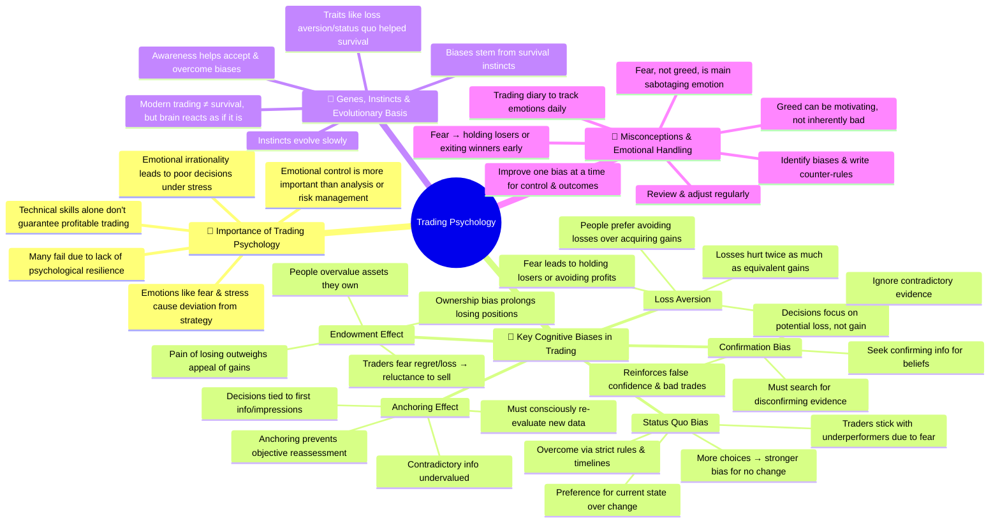

*The Complete Foundation Stock Trading Course*
==============================================

# Lecture 6
## Summary
[ 6. Trading Psychology: The Complete Foundation Stock Trading Course 💰📉 | Master the Market ](https://youtu.be/KlxEMEpIrD8?si=BtTs5LCq5cmGEaKI)

Summary of the Video Transcript: Foundation Stock Trading Course – Tutorial 6: Trading Psychology
[00:00 → 04:44] Introduction & Importance of Trading Psychology

    This lecture opens the Foundation Stock Trading Course focusing on trading psychology.
    Upcoming lectures will cover key psychological biases affecting traders: loss aversion, endowment effect, status quo bias, anchoring effect, confirmation bias, and their impacts.
    Emphasizes that trading psychology is the most important factor for trading success, even more than technical analysis, risk management, or fundamental analysis.
    The main reason traders fail is not lack of skill but inability to manage emotions, handle stress, and follow trading rules.
    Many traders neglect psychology, focusing instead on technical or risk management, which is a mistake.
    Emotions cause irrational decisions; thus, handling emotions logically under stress is critical.
    Money trading triggers deep emotional responses because money relates to fundamental human needs (shelter, family, security).
    Traders often don’t realize when emotions are impacting their decisions, resulting in suboptimal performance.
    The course aims to help traders recognize and improve emotional control to enhance their trading outcomes.

[04:44 → 07:54] Overview of Loss Aversion

    The next topic introduced is loss aversion, a critical bias in trading psychology.
    Loss aversion means that losses psychologically hurt about twice as much as equivalent gains bring pleasure.
    Example: People tend to avoid a fair 50/50 bet of winning or losing $5,000 because the pain of losing outweighs the gain.
    Loss aversion is a well-studied phenomenon in economics and decision theory.
    Understanding biases like loss aversion is crucial to becoming a successful trader.
    Awareness of biases allows traders to identify irrational behaviors and begin to correct them.

[07:54 → 18:58] Loss Aversion Demonstrated by Job Choice Study

    A classic study is described where participants choose between two jobs differing in social contact and commute time.
    When starting from an isolated job with a short commute, most preferred a job with limited social contact but shorter commute (Job A).
    When starting from a highly social job with a long commute, most chose a job with moderate social contact and shorter commute (Job D).
    The key insight: People’s choices depend heavily on their current reference point, focusing more on what they would lose rather than what they would gain.
    People try to minimize perceived losses, often ignoring possible gains.
    This illustrates loss aversion’s effect on decision-making, important in trading when evaluating profits and losses.

[18:58 → 25:44] Loss Aversion in Risk Assessment Study

    Another study is explained involving willingness to pay to reduce risks of injury from a fictitious insecticide.
    Participants were willing to pay ~$3.78 extra to eliminate a 15/10,000 injury risk.
    However, when asked how much price reduction they’d require to accept an increase of 1/10,000 in risk, 77% refused to buy at any positive price, even a cent.
    This is irrational economically but highlights loss aversion and emotional fear of regret and blame.
    People anticipate negative emotions and avoid risk increases even when compensated.
    In trading, this explains why traders hold losing positions instead of cutting losses—they fear regret and blame.
    Loss aversion leads to distorted risk-taking and poor decision-making.

[25:44 → 28:40] Impact of Loss Aversion on Trading

    Loss aversion causes traders to perceive losses as much larger than gains, skewing rational decision-making.
    For example, if a stock rises from $10 to $20 but falls back to $15, traders feel the $5 loss from the peak more than the $5 gain from their entry.
    This emotional pain leads to hesitation in taking profits or cutting losses.
    Traders may take excessive risks to compensate for losses, worsening their position.
    The bias is fundamental and intertwined with other biases.

[28:40 → 44:18] Endowment Effect

    The endowment effect is introduced: people value something more just because they own it.
    Studies show owners of items (e.g., mugs) demand roughly twice as much to sell as buyers are willing to pay.
    Even with open market bargaining eliminated, this effect persists.
    Another experiment showed that people who could choose between owning a mug or money behaved more like buyers (valuing the mug less), while actual owners valued it more.
    Importantly, owners do not necessarily perceive the item as better, but the pain of giving it up is greater (linked to loss aversion).
    In trading, this means once a trader owns a stock, they overvalue it due to fear of loss and regret.
    This causes holding onto losing positions too long, fearing missing out on gains.
    Traders must recognize this bias and rigorously follow trading plans to avoid emotional attachment.

[44:18 → 52:58] Status Quo Bias

    Status quo bias means people prefer to stay in their current state rather than change, fearing losses from change.
    Many studies confirm that given a choice, people often stick with their current situation/product.
    The more options available, the stronger this bias becomes.
    This bias is linked to loss aversion because people fear losing what they have.
    In trading, it explains why traders hold onto stagnant or losing stocks instead of switching to better opportunities.
    Despite many investment choices, traders often remain stuck, hoping for a turn-around.
    To combat this, traders should set strict time limits on holding positions in their trading plans.
    Following such rules helps break the status quo bias and improve decision-making.

[52:58 → 58:50] Anchoring Effect

    The anchoring effect refers to the tendency to rely too heavily on the first piece of information when making decisions.
    In trading, this means the initial reason for buying a stock (e.g., positive news) anchors the trader’s judgment.
    Subsequent negative information tends to be underweighted or ignored.
    This bias causes traders to stick with outdated views, ignoring changing market conditions.
    Traders are advised to evaluate all new information fairly and reset their reference points regularly.
    Being aware of anchoring helps traders adapt to evolving data rather than being stuck on initial assumptions.

[58:50 → 01:06:35] Confirmation Bias

    Confirmation bias means people seek and interpret information that confirms their existing beliefs and ignore contradictory evidence.
    Example: Searching “why milk is bad” will yield many confirmatory results, reinforcing existing beliefs.
    In trading, confirmation bias leads traders to selectively gather data supporting their buy or sell decisions.
    This creates a feedback loop that reinforces potentially wrong positions.
    Traders should deliberately seek out information that challenges their beliefs to avoid biased decisions.
    Confirmation bias also interacts with anchoring, making it harder to objectively update views.
    The key is to balance evidence and adjust beliefs based on all data, not just supporting facts.

[01:06:35 → 01:21:49] Genes, Instincts, and Evolutionary Origins of Biases

    Explains why humans possess these biases: they are deeply rooted in genes and instincts shaped by evolution.
    Instincts are inherited behavioral patterns passed genetically (e.g., babies crying, animals hunting).
    Evolution favored genes that enhanced survival in ancient environments (e.g., fear of loss, status quo).
    Example: Giraffes with longer necks survived better; white bears camouflaged better in snow.
    Humans evolved in dangerous environments with threats from predators and scarcity of resources.
    Biases like loss aversion, status quo bias, and endowment effect helped ancestors survive by promoting caution and preservation.
    These instincts are slow to adapt to modern environments, where threats are very different (e.g., trading money vs. fighting predators).
    Trading triggers the same ancient survival emotions because money represents security.
    This mismatch makes trading psychologically challenging.
    Traders must learn to override these instincts consciously to succeed.

[01:21:49 → End] Misconceptions and Improving Emotional Control

    Common misconception: fear and greed are the main emotions ruining traders.
    The instructor argues fear is the dominant negative emotion, not greed.
    Fear causes traders to hold losing positions or exit winning ones prematurely due to regret anticipation.
    Greed, in contrast, can be a motivating force in business and is not inherently harmful.
    To improve trading psychology:
        Keep a trading diary to document daily emotions, decisions, mistakes, and lessons.
        Regularly review emotional triggers and specific biases affecting your trades.
        Write down strategies and rules to counteract biases (e.g., anchoring, loss aversion).
        Place these reminders in visible locations to reinforce discipline.
        Address biases one at a time, gradually improving emotional control.
    Treat emotional management as an essential part of trading skill development.
    The course will further address trading plans and systematic approaches to mitigate psychological biases.

| Term                   | Definition/Explanation                                                                                                       |
| ---------------------- | ---------------------------------------------------------------------------------------------------------------------------- |
| **Loss Aversion**      | Losses feel about twice as painful as equivalent gains feel pleasurable; people prefer avoiding losses over acquiring gains. |
| **Endowment Effect**   | People value things more simply because they own them, due to the pain of giving them up (linked to loss aversion).          |
| **Status Quo Bias**    | Preference to remain in current state to avoid perceived losses from change; change is feared more than staying put.         |
| **Anchoring Effect**   | Relying too heavily on the first piece of information when making decisions, leading to biased judgments.                    |
| **Confirmation Bias**  | Seeking or interpreting information that confirms existing beliefs, ignoring contradictory evidence.                         |
| **Trading Psychology** | The study and management of emotional and cognitive biases affecting trading decisions and success.                          |

| Time Period         | Key Events/Concepts                                                                |
| ------------------- | ---------------------------------------------------------------------------------- |
| \~200,000 years ago | Homo sapiens emerge; survival depends on instincts & biases.                       |
| 5,000 years ago     | First civilizations; slower gene evolution begins to mismatch modern environments. |
| 200 years ago       | Industrial revolution; humans begin desk-based, abstract work (e.g., trading).     |
| Present             | Trading triggers ancient survival instincts resulting in psychological biases.     |

Summary of Psychological Biases Impacting Trading

    Loss aversion causes traders to avoid realizing losses, leading to poor exit timing.
    Endowment effect makes traders overvalue owned stocks, causing emotional attachment and reluctance to sell.
    Status quo bias encourages holding onto losing or stagnant positions due to fear of change.
    Anchoring effect traps traders into outdated views based on initial decisions.
    Confirmation bias leads to selective information gathering, reinforcing potentially false beliefs.
    All biases are rooted in evolutionary survival mechanisms but are maladaptive in modern trading.
    Awareness, documentation, and systematic trading plans are essential to mitigate these biases.

Final Key Insights

    Trading success depends more on managing psychology than on technical skills.
    Emotions, especially fear, drive irrational trading behaviors and losses.
    Biases like loss aversion and endowment effect are universal but can be controlled through awareness and discipline.
    Keeping a trading journal and following strict rules helps counteract emotional biases.
    Understanding the evolutionary origin of biases explains why they are so powerful and difficult to overcome.
    Traders must consciously retrain their instincts to adapt to modern trading environments.

This comprehensive summary captures the core content and insights presented in the video transcript on trading psychology, highlighting the critical biases, their effects on trading, and practical advice for emotional management.

Summary of Trading Psychology and Behavioral Biases in Stock Trading

This comprehensive lecture explores trading psychology, emphasizing its critical role in trading success. The speaker delves into key cognitive biases that influence traders’ decisions, explains their psychological and evolutionary origins, and offers practical advice for managing emotions and biases to improve trading outcomes.
Importance of Trading Psychology

    Trading psychology is the most crucial factor in trading success, more important than technical analysis, risk management, or fundamental analysis.
    Many traders fail not due to lack of knowledge but because they cannot manage their emotions—fear, regret, and stress—leading them to break their own trading rules.
    Emotional control determines whether traders follow their plans during stressful situations (e.g., taking losses or locking profits).
    Traders often focus too much on improving technical skills while neglecting emotional discipline, which is a significant reason many struggle.
    Emotions can make traders irrational, causing hasty or poor decisions, particularly when money (a fundamental human need) is involved.
    Traders may fail to recognize their emotional struggles, mistakenly blaming losses on poor analysis rather than psychological factors.
    Psychological skills require dedicated time and effort to develop, similar to technical skills.

Overview of Key Cognitive Biases Affecting Traders

The lecture introduces several biases that undermine rational trading decisions. These are grounded in economic and psychological research, particularly the work of Daniel Kahneman, Jack L. Knetsch, and Richard H. Thaler.
Bias Name 	Definition 	Impact on Trading
Loss Aversion 	Losses have approximately twice the psychological impact of equivalent gains. 	Traders feel the pain of losses more than the joy of gains, leading to poor decisions like holding losing positions too long.
Endowment Effect 	People value owned items more than identical items they do not own. 	Traders overvalue stocks they hold, reluctant to sell even when objective evidence suggests they should.
Status Quo Bias 	Preference for the current state, resisting change. 	Traders stick with current positions or strategies, even if better alternatives exist, due to fear of losing what they have.
Anchoring Effect 	Overreliance on the first piece of information when making decisions. 	Traders fixate on initial reasons for buying a stock, discounting new contradictory information.
Confirmation Bias 	Seeking and interpreting information that confirms existing beliefs while ignoring contradicting evidence. 	Traders selectively gather information supporting their current view, ignoring warning signs and contrary data.
Detailed Exploration of Biases
1. Loss Aversion

    Loss aversion explains why traders perceive losses as more painful than gains of the same magnitude are pleasurable.
    Example: When faced with a 50/50 bet to win or lose $5,000, most people avoid the bet because the pain of losing outweighs the pleasure of winning.
    Studies show losses are roughly twice as powerful psychologically as gains.
    Experiments involving job choices demonstrate how people’s preferences change depending on their reference points, focusing on what they would lose rather than what they would gain.
    Another study at a shopping mall showed participants would pay to reduce a risk but refused compensation to accept a slightly increased risk, illustrating irrational aversion to losses.
    In trading, loss aversion causes:
        Traders to hold losing positions too long, hoping to avoid realizing a loss.
        Avoidance of taking profits early because the pain of foregoing potential bigger gains weighs heavily.
        Overtrading or riskier trades to compensate for perceived losses, damaging overall performance.

2. Endowment Effect

    People value something more once they own it, regardless of its intrinsic worth.
    In one experiment, students owning mugs valued them at roughly twice the price that non-owners were willing to pay.
    This effect persists even after controlling for bargaining behavior and market mechanisms.
    The difference is not because owners perceive the item as better but because the pain of losing the item is greater than the pleasure of acquiring it.
    In trading, this bias leads to:
        Overvaluing owned stocks and reluctance to sell, even when fundamentals deteriorate.
        Emotional attachment to positions reduces objectivity in decision-making.
        Holding losing positions due to fear of regret and loss, rather than rational analysis.
    The longer a trader holds a stock, the stronger the endowment effect becomes, increasing attachment.

3. Status Quo Bias

    People prefer to maintain their current situation rather than change it due to fear of losses.
    Multiple studies confirm people resist switching to alternative choices, even if objectively better.
    The more options available, the stronger the bias to maintain the status quo.
    In trading, this results in:
        Traders holding stagnant or losing stocks for extended periods instead of reallocating capital.
        Missing out on better opportunities due to inertia and fear of regret.
        Difficulty in adjusting strategies or trying new approaches.
    Practical advice includes setting maximum holding periods in trading plans to counteract this bias.

4. Anchoring Effect

    Anchoring occurs when the first piece of information disproportionately influences subsequent judgments.
    Once traders anchor on an initial reason for entering a trade (e.g., a promising news event), they tend to overweight that information.
    New, potentially negative information is underweighted or ignored.
    This bias leads to poor adaptability and rigidity in trading decisions.
    Traders must consciously re-evaluate new data objectively and avoid clinging to initial beliefs.

5. Confirmation Bias

    Confirmation bias causes individuals to search for and favor information that supports their existing beliefs.
    People tend to ignore or undervalue information that contradicts their opinions.
    Example: Someone who believes milk is bad for health will find abundant supporting evidence online, rarely encountering opposing views.
    In trading, confirmation bias manifests as:
        Selectively gathering data that confirms bullish or bearish views.
        Ignoring warning signs that could prevent losses.
        Reinforcing false beliefs, leading to repeated mistakes.
    To combat this, traders should actively seek contradictory evidence to test their hypotheses.
    New information that disproves existing beliefs should be given greater weight than confirming evidence.

Evolutionary and Genetic Basis of Biases

    The biases discussed are deeply rooted in human genes and instincts, shaped by evolution over hundreds of thousands of years.
    Humans inherited these biases because they enhanced survival in ancient environments, not because they are suited for modern financial markets.
    Examples:
        Loss aversion helped ancestors avoid losing scarce resources crucial for survival.
        Status quo bias favored staying in safe, known environments rather than risky new ones.
        Endowment effect encouraged holding onto possessions essential for survival.
    These instincts are encoded in genes passed down through generations, slowly adapting over millennia.
    Modern trading is a relatively recent phenomenon (few hundred years), and our brains are not evolved to handle the abstract, high-stakes, and fast-paced environment of financial markets.
    Trading triggers primal survival emotions because money symbolizes security (food, shelter, family), invoking the same fear and stress responses as life-threatening situations.
    This mismatch explains why traders struggle psychologically, despite intellectual understanding.

Misconceptions about Trading Psychology

    Popular belief attributes trading failures to fear and greed.
    The speaker argues greed is not inherently harmful; it can drive motivation and improvement.
    Fear is the primary emotion that undermines traders, causing hesitation, inability to cut losses, and poor decision-making.
    Fear manifests as:
        Fear of regret when exiting a position before it rallies.
        Fear of blame and self-reproach for making the wrong move.
        Fear of losing what one already has, overriding logical analysis.
    Fear leads to running away from losses rather than moving toward gains.
    Recognizing that fear—not greed—is the main obstacle allows traders to better focus on emotional control.

Practical Ways to Improve Trading Psychology

    Maintain a trading diary documenting trades, decisions, emotions, and mistakes.
    Daily or regular review of emotional states and biases helps identify patterns influencing poor decisions.
    Pinpoint the specific bias or emotion affecting each trade and write explicit rules to counteract it.
        Example: “If new information contradicts my initial reason for entering, weigh it more heavily and consider exiting.”
    Keep these rules visible during trading to reinforce discipline.
    Progressively work on controlling one bias at a time for gradual improvement.
    Understand that emotional control is a skill developed over time through consistent practice and self-reflection.

Summary Table of Biases and Their Trading Impacts
Bias 	Psychological Mechanism 	Typical Trading Behavior 	Suggested Mitigation Strategy
Loss Aversion 	Losses felt twice as painful as gains are pleasurable 	Holding losers too long; avoiding realizing losses 	Set strict stop-losses; accept losses as part of trading
Endowment Effect 	Overvaluing owned assets due to pain of giving up 	Holding losing stocks to avoid regret 	Follow pre-defined exit strategies; detach emotionally
Status Quo Bias 	Preference to maintain current state to avoid loss 	Resistance to change positions or strategies 	Impose max holding periods; evaluate alternatives objectively
Anchoring Effect 	Reliance on initial information as reference point 	Ignoring new contradictory information 	Regularly reassess decisions with fresh data
Confirmation Bias 	Seeking info that confirms existing beliefs 	Biased research reinforcing incorrect views 	Actively search for disconfirming evidence
Core Concepts and Key Insights

    Trading psychology governs the ability to follow rules and manage risk effectively.
    Cognitive biases are universal human traits rooted in evolutionary survival mechanisms.
    Modern trading environments conflict with ancient instincts, creating emotional challenges.
    Fear, not greed, is the main emotional challenge in trading.
    Awareness and understanding of biases allow traders to implement structured countermeasures.
    Systematic use of trading journals and predefined plans reduces the impact of biases.
    Emotional mastery is a continuous learning process, essential for long-term trading success.

Keywords

    Trading Psychology
    Cognitive Biases
    Loss Aversion
    Endowment Effect
    Status Quo Bias
    Anchoring Effect
    Confirmation Bias
    Evolutionary Psychology
    Emotional Control
    Trading Discipline
    Fear in Trading
    Behavioral Finance

Conclusion

This lecture lays a foundational understanding of how psychological biases and emotions profoundly impact trading decisions. It stresses the paramount importance of mastering trading psychology over technical skills alone. By recognizing and addressing biases such as loss aversion, endowment effect, and confirmation bias, traders can improve decision-making, reduce emotional errors, and enhance profitability. The evolutionary perspective provides a compelling explanation for why these biases exist and why overcoming them is challenging. Finally, practical advice like maintaining a trading diary and creating explicit rules to counteract biases gives traders actionable tools to develop emotional resilience and discipline critical for long-term success.

This detailed and evidence-based exploration equips traders with a deeper understanding of the mental hurdles in trading and offers clear strategies to navigate and overcome them effectively.

## By chapter

    [00:00 → 04:12] Introduction to Trading Psychology and Its Importance

    The lecture opens with an introduction to trading psychology, emphasizing its critical role in trader success. The instructor outlines the upcoming topics, including various cognitive biases that affect decision-making such as loss aversion, endowment effect, status quo bias, anchoring effect, and confirmation bias. Additionally, there will be discussions on genes and instincts influencing behavior, common misconceptions about trading psychology, and strategies to improve emotional control.

    Key points:
        Trading psychology is arguably the most crucial factor in trading success, even more so than technical or fundamental analysis and risk management.
        Failures in trading usually stem not from lack of knowledge but from an inability to handle stress, emotions, and psychological pressure.
        Many traders fail to dedicate enough time to improving their trading psychology, often focusing instead on technical skills after losing money.
        Emotional control directly impacts the ability to follow trading rules and manage losses/profits.
        Emotions make traders irrational, and since trading involves money (a deeply emotional and survival-linked resource), it triggers strong psychological responses.
        Traders often fail to recognize when emotions are negatively impacting their decisions.

    Conclusion: Trading psychology deserves significant focus and continuous practice as it underpins the ability to execute sound trading strategies effectively.

    [04:12 → 07:54] Introduction to Biases: Loss Aversion

    The lecture begins exploring loss aversion, defined as a cognitive bias whereby losses have about twice the psychological impact of equivalent gains. This bias causes people to fear losing more than they value equivalent gains, influencing their risk-taking and decision-making.

    Example:
        A 50/50 game to win or lose $5,000 is generally rejected because the pain of potentially losing $5,000 outweighs the pleasure of winning it.

    The instructor cites Daniel Kahneman, Jack L. Knetsch, and Richard H. Thaler’s 1991 study which is foundational in behavioral economics on this topic. This study and others verify that loss aversion is deeply embedded in human decision-making and trading behavior.

    Important insights:
        Loss aversion is always evaluated relative to a reference point — the current state or baseline.
        The perception of loss is often stronger than the perception of gain from the same amount.
        This bias can cause traders to irrationally hold losing positions or avoid taking profits prematurely.

    [07:54 → 18:58] Loss Aversion Study: Job Choice Experiment

    The instructor summarizes a study where participants had to choose between jobs differing in social contact and commute times. The key findings:
    Scenario 	Current Job Conditions 	Job A (Choice 1) 	Job D (Choice 2) 	Majority Preference
    1 	Isolated contact, 10-min commute 	Limited contact, 20-min commute 	Moderate social, 60-min commute 	Job A (limited contact but smaller commute increase)
    2 	Very social, 80-min commute 	Limited contact, 20-min commute 	Moderate social, 60-min commute 	Job D (moderate social, shorter commute than baseline)

    Key insight: Participants’ choices depended on what they perceived they would lose relative to their current situation rather than what they would gain. In scenario 1, the increase in commute time was more painful than the gain in social contact. In scenario 2, the decrease in social contact was more painful than the reduction in commute time.

    Conclusion: People tend to make decisions based on minimizing perceived losses, demonstrating how loss aversion affects choices.

    [18:58 → 25:44] Loss Aversion Study: Risk Willingness and Pricing Experiment

    Another study involved respondents at a hardware store being asked about willingness to pay to reduce risk of injury from an insecticide and willingness to accept price reduction to increase risk.

    Quantitative summary:
    Condition 	Willingness to Pay (to eliminate risk) 	Willingness to Accept (to increase risk) 	Key Observation
    Households without children 	$3.78 over $10 price 	Majority refused any price to accept risk increase 	Respondents refused to accept even small risk increases despite willingness to pay to reduce risk

    Key insight: Respondents showed asymmetric risk perception — they would pay to reduce risk but would not accept any compensation to increase risk, despite the mathematical inconsistency. This reflects fear of blame and regret.

    Trading implication: Traders often refuse to cut risk by selling losing positions and instead irrationally hold or increase risk, driven by emotional anticipation of regret and blame.

    [25:44 → 28:40] Loss Aversion in Trading Behavior

    The instructor connects loss aversion to common trading behaviors:
        Traders may refuse to take profits when a stock retraces from its high, focusing emotionally on the lost potential gain rather than the realized profit.
        Loss aversion causes traders to overvalue losses, leading to poor decision-making like holding losing positions too long or overtrading to recover losses.
        Recognizing loss aversion helps traders understand why losses feel disproportionately painful and why this bias must be managed to trade effectively.

    [28:40 → 44:18] Endowment Effect

    The endowment effect is introduced as the bias where people assign greater value to things merely because they own them. Ownership increases perceived worth beyond objective valuation.

    Summary of the key findings from a study in an economics class:
    Group 	Condition 	Willingness to Pay (Buyers) 	Willingness to Accept (Sellers) 	Price Difference (Ratio)
    Buyers 	Do not own mug 	Approx. $2.50 - $3.00 	N/A 	N/A
    Sellers 	Own mug 	N/A 	Approx. $6.00 	Sellers ask roughly twice buyers’ price
    Market participants 	Open market with buying/selling allowed 	Buyers: $2.75; Sellers: $5.25 	Price gap reduced but still significant 	

    Additional experiments showed that people endowed with a mug valued it significantly higher than non-owners, independent of actual attractiveness or quality. This effect remained even after controlling for bargaining behavior.

    Crucially, the endowment effect is not because owners perceive the item as better, but because of the greater pain associated with giving it up — a direct link to loss aversion.

    Trading relevance:
        Once a trader owns a stock, they tend to overvalue it emotionally and are reluctant to sell, even if objectively the position is losing.
        This bias leads to holding losing stocks for too long, driven by fear of regret and loss.
        Traders must recognize the endowment effect to detach ownership emotions from rational exit decisions.

    [44:18 → 53:29] Status Quo Bias

    Status quo bias is the preference for maintaining the current state and resisting change. It is an emotional bias where people favor the baseline or status quo because any change is perceived as a loss.

    Key study insights:
        People often refuse to change from their current position or product, even when objectively better alternatives exist.
        The more options available, the stronger the status quo bias becomes, as decision-making complexity increases.
        The root cause is fear of losing what one currently has, tying back to loss aversion.

    In trading:
        Traders often stubbornly hold losing positions or delay switching strategies due to comfort with the current state.
        Given thousands of stocks and options, this bias can cause “dead money” situations where traders remain invested in underperforming assets.
        One solution is to impose strict time-based exit rules in trading plans to force change and reduce bias impact.

    [53:29 → 58:50] Anchoring Effect

    The anchoring effect is a cognitive bias where individuals rely too heavily on the first piece of information (the “anchor”) when making decisions, even if subsequent information is more relevant.

    Trading example:
        A trader buys a stock based on initial positive news (e.g., promising drug trials).
        Despite later negative news (e.g., CEO selling shares, firing employees), the trader remains anchored to the initial positive info and underweights new data.
        This leads to delayed or poor decision-making.

    Advice:
        Traders must reassess new information objectively and avoid giving undue weight to their initial decision or first data point.

    [58:50 → 01:06:35] Confirmation Bias

    Confirmation bias is the tendency to seek, interpret, and recall information that confirms one’s preexisting beliefs, while ignoring or undervaluing contradictory evidence.

    Explanation:
        For instance, if someone believes milk is bad, they search for and recall only supporting evidence.
        This selective exposure and interpretation reinforce false or biased beliefs.

    Trading impact:
        Traders who believe a stock will rise may only look for positive indicators, ignoring warning signs.
        Since many indicators can be interpreted to support either buy or sell, confirmation bias can heavily skew decision-making.
        Traders should actively seek contradictory evidence to challenge their assumptions and avoid biased decisions.

    Relationship to anchoring:
        The first information or decision biases subsequent evaluation, reinforcing confirmation bias.

    [01:06:35 → 01:21:49] Genes, Instincts, and Evolutionary Origins of Biases

    The instructor presents a theory on why humans have these biases, rooted in instincts and genetics shaped by evolution.

    Main points:
        Instincts are inherited behaviors driven by genes that have evolved because they enhanced survival.
        Examples:
            Giraffes evolved long necks by chance mutations that proved advantageous.
            White bears survived better in snowy environments due to camouflage.
        Humans evolved in harsh environments (200,000 years ago) where survival depended on:
            Avoiding unnecessary risks (status quo bias)
            Valuing possessions (endowment effect)
            Avoiding losses more than seeking gains (loss aversion)
        Traits that enhanced survival were passed down; those who lacked them perished.
        Our brain’s cognitive algorithms are highly optimized but slow to adapt to modern environments.
        Modern trading environments are drastically different from ancestral environments:
            No immediate physical threats but intense emotional responses to money and risk remain.
        Trading triggers the same fight or flight emotional responses as survival threats did in the past.
        Thus, trading psychology struggles stem from a mismatch between ancient instincts and modern financial environments.

    [01:21:49 → 01:29:00] Misconceptions and Improving Emotional Control in Trading

    The instructor challenges common beliefs about trading emotions:
        Popular culture attributes trading failure mainly to fear and greed.
        However, the instructor argues that greed is not inherently detrimental; it can motivate hard work and innovation.
        Fear is the primary negative emotion affecting traders, leading to:
            Holding losing positions due to fear of regret.
            Fearing to exit profitable trades because of fear of missing out (FOMO).
        Fear causes irrational decisions more than greed.

    Practical advice for improving trading psychology:

        Maintain a Trading Diary:
            Record daily trades, decisions, emotions, and mistakes.
            Reflect on emotional triggers and biases affecting performance.
            Identify emotional patterns and biases (e.g., anchoring, confirmation bias).

        Document Bias-Specific Rules:
            Write specific strategies to counter identified biases (e.g., “If new opposing information arises, consider exiting”).
            Post these rules visibly to reinforce behavior change.

        Continuous Improvement:
            Address one bias/emotion at a time.
            Gradually reduce emotional errors through systematic practice.

    Final insight:
        Treat emotional control as an essential skill in trading, equal to technical or fundamental analysis.
        Recognize biases are natural but manageable with awareness and discipline.

    [01:29:00 → End] Conclusion and Course Wrap-up

    The chapter concludes by summarizing that trading psychology is a multifaceted domain involving understanding cognitive biases, evolutionary instincts, and emotional management. Mastery of these areas is essential for long-term trading success.

Summary Table of Key Biases Covered
Bias Name 	Definition 	Trading Impact 	Key Study/Example
Loss Aversion 	Losses psychologically hurt about twice as much as equivalent gains please. 	Traders irrationally fear losses, hold losing positions too long, avoid taking profits. 	Job choice experiment, insecticide risk study
Endowment Effect 	Ownership increases perceived value of an asset beyond objective worth. 	Traders overvalue owned stocks, reluctant to sell even when advisable, leading to suboptimal exits. 	Mug ownership studies in economic classes
Status Quo Bias 	Preference for current state; resistance to change due to fear of losing current benefits. 	Traders hold losing positions or strategies to avoid perceived loss from change, missing opportunities. 	Multiple choice experiments on product/situation changes
Anchoring Effect 	Overreliance on first information or decision, undervaluing new data. 	Traders stick to initial reasoning despite contradictory evidence, causing poor decision-making. 	Hypothetical stock example with shifting news
Confirmation Bias 	Seeking and favoring information that confirms existing beliefs; ignoring opposing data. 	Biased research to justify positions, ignoring red flags, leading to faulty trading decisions. 	Searching biased info online (e.g., milk example)
Key Insights

    Trading success depends more on mastering psychology than technical skills alone.
    Loss aversion and endowment effect create emotional hurdles that lead to poor decision-making.
    Status quo bias and anchoring effect cause resistance to change and overreliance on initial information.
    Confirmation bias traps traders in self-reinforcing beliefs, impairing objectivity.
    These biases are deeply rooted in human evolution, shaped by survival needs in ancient environments.
    Modern trading environments trigger ancient instincts, causing emotional responses mismatched to market realities.
    Fear—not greed—is the dominant emotion sabotaging trader performance.
    Systematic journaling, self-awareness, and structured trading plans are essential to mitigate biases and improve emotional control.

Recommended Practices for Traders

    Dedicate substantial time to studying and practicing trading psychology.
    Keep a detailed trading diary to identify emotional patterns and biases.
    Develop specific rules to counteract biases and commit to them strictly.
    Reassess all information objectively, avoiding anchoring and confirmation traps.
    Set time-based exit rules to overcome status quo bias.
    Understand that emotional struggles are natural due to evolutionary programming but can be managed with discipline.

This comprehensive summary is grounded entirely in the provided transcript content and accurately reflects the detailed teaching on trading psychology presented therein.
