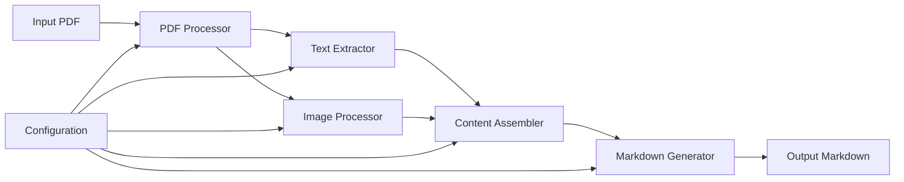
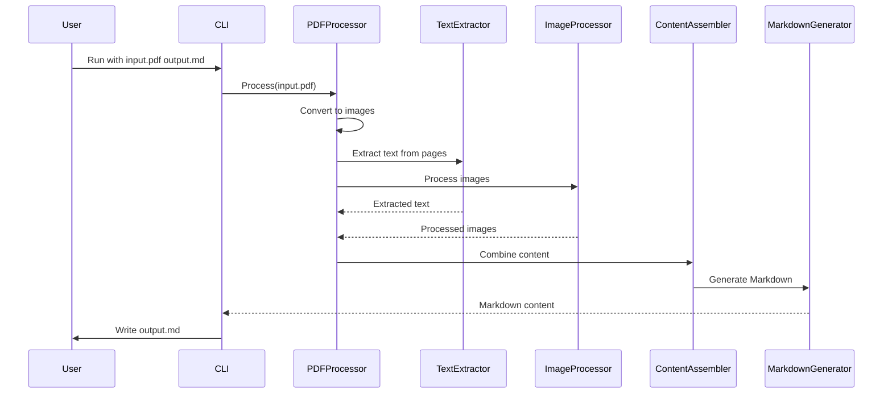
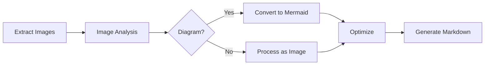
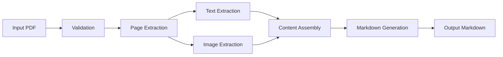
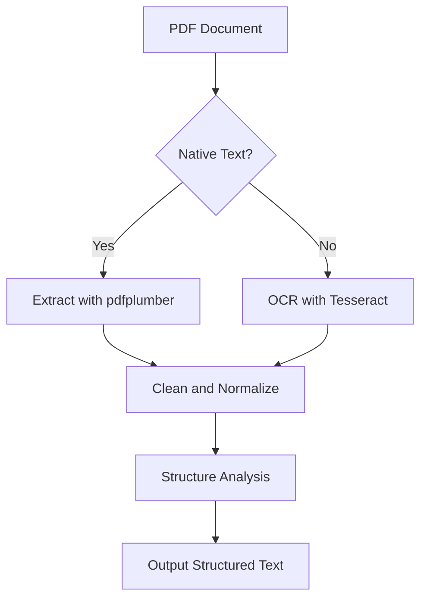
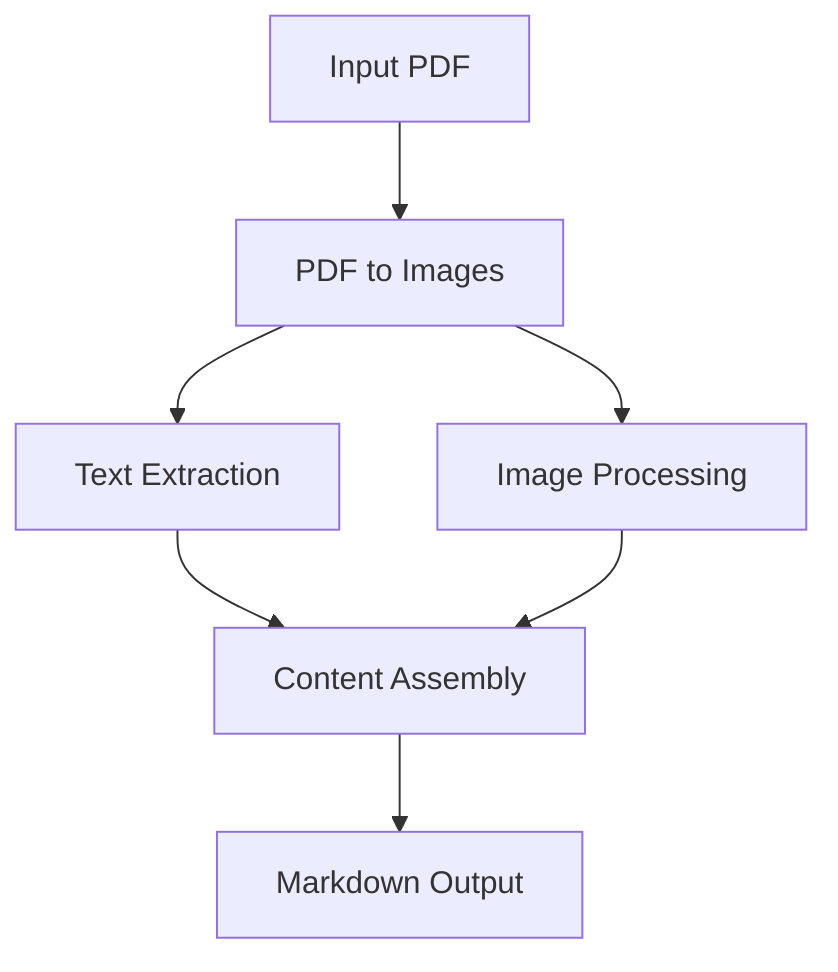

# PDF to Markdown Converter

## System / Role

You are a meticulous Python automation agent. Your sole task is to build a single‑file proof‑of‑concept named `pdf_to_markdown.py`.

## Documentation Requirements

### Architecture and Implementation
- Create comprehensive system architecture and implementation diagrams using Mermaid syntax
- Document every aspect of the implementation with clear diagrams showing:
  - Overall system architecture
  - Data flow between components
  - Processing pipelines
  - Decision trees for complex logic

### Zettelkasten Method
- Follow the Zettelkasten method for documentation
- Use `[word-word].md` naming convention for note files
- Include cross-references between related notes using `[[word-word]]` syntax
- Each Zettel (note) must include:
  - References to the underlying source code
  - Bibliographic references
  - Connections to related concepts
- Maintain an index of all Zettels with brief descriptions

## Environment

### Setup
```bash
uv init
uv add pdf2image pillow pytesseract pdfplumber ascii-magic mermaid-py python-to-mermaid python-dotenv
```

### Configuration
- **Required Environment Variables**:
  - `VISION_API_KEY`: For Google Gemini Pro Vision API
  - `OPENAI_API_KEY`: Fallback API key
- **Security**:
  - Never hard-code API keys
  - Use `python-dotenv` to load from `.env` file
  - Add sensitive files to `.gitignore`
  - Store configuration in `config.ini`

## Pipeline

### Input/Output
- Accept `input.pdf` (any length) and `output.md` as command-line arguments
- Usage: `python pdf_to_markdown.py <input.pdf> <output.md>`

### Processing Steps
1. **PDF to Images**
   - Split PDF into per-page PNGs using `pdf2image` at 300 DPI
   - Handle different page sizes and orientations

2. **Text Extraction**
   - Primary: Extract machine text using `pdfplumber`
   - Fallback: Use `pytesseract` OCR for pages with no machine-readable text
   - Preserve text formatting and structure

3. **Image Processing**
   - Detect inline images using `page.objects["image"]` in pdfplumber
   - Save each image to a temporary file
   - Process images in parallel for better performance

4. **Image Analysis**
   - Use Gemini Pro Vision API to analyze images
   - Request JSON response with:
     ```json
     {
       "caption": "string",
       "important_entities": ["string"],
       "diagram_detected": boolean
     }
     ```
   - Implement error handling and retry logic

5. **ASCII Art Generation**
   - For images under 320×320px:
     - Convert to ASCII using `ascii-magic`
     - Wrap in ```text code blocks
   - Preserve aspect ratio and readability

6. **Mermaid Diagram Generation**
   - When `diagram_detected` is true:
     - Generate Mermaid flowchart
     - Use `python-to-mermaid` for syntax validation
     - Include descriptive node labels

7. **Markdown Assembly**
   - Combine all elements in reading order:
     - Extracted text
     - ASCII art versions of images
     - Mermaid diagrams
   - Preserve document hierarchy (H1-H6)
   - Use GitHub-flavored Markdown

## Quality Guardrails

### Content Quality
- Remove duplicate sentences and headings
- Replace vague references (e.g., "this figure") with explicit labels
- Resolve conflicting statements (prefer latest occurrence)
- Maintain consistent formatting

### Error Handling
- Validate input parameters
- Handle missing or corrupt PDFs
- Graceful degradation when APIs are unavailable
- Comprehensive error messages

## Deliverables

1. **Main Script**
   - `pdf_to_markdown.py` (under 250 LOC)
   - Well-commented and PEP 8 compliant
   - Type hints for better maintainability

2. **Example Usage**
   ```bash
   # Set up environment
   uv init
   uv add --extras "pdf2image pytesseract"
   export VISION_API_KEY=your_api_key_here
   
   # Run conversion
   python pdf_to_markdown.py sample.pdf sample.md
   ```

3. **Dependencies**
   - Tesseract OCR installation instructions
   - API key setup guide
   - Configuration reference

## Constraints

### Technical
- Python ≥ 3.9
- Cross-platform compatibility (Windows/macOS/Linux)
- Maximum 250 lines of code
- Minimal external dependencies
- No heavy frameworks

### Performance
- Efficient memory usage for large PDFs
- Parallel processing where possible
- Responsive progress feedback

### Security
- Never expose API keys
- Validate all inputs
- Handle sensitive data properly


# PDF to Markdown Converter: System Architecture

## Overview

This document outlines the architecture of the PDF to Markdown Converter, a tool designed to convert PDF documents into well-structured Markdown with support for text, images, and diagrams.

## High-Level Architecture



## Core Components

### 1. PDF Processor
- **Responsibility**: Handles the initial loading and processing of PDF files
- **Key Features**:
  - PDF to image conversion
  - Page extraction
  - Metadata extraction
- **Dependencies**: pdf2image, Poppler

### 2. Text Extractor
- **Responsibility**: Extracts text from PDF pages
- **Key Features**:
  - Text extraction using pdfplumber
  - Fallback to Tesseract OCR for scanned documents
  - Text cleaning and normalization
- **Dependencies**: pdfplumber, pytesseract, Tesseract OCR

### 3. Image Processor
- **Responsibility**: Processes and analyzes images from PDF
- **Key Features**:
  - Image extraction and optimization
  - Diagram detection
  - Image metadata extraction
- **Dependencies**: Pillow, OpenCV (optional)

### 4. Content Assembler
- **Responsibility**: Combines processed text and images
- **Key Features**:
  - Content organization
  - Structure detection
  - Reference resolution

### 5. Markdown Generator
- **Responsibility**: Generates final Markdown output
- **Key Features**:
  - Markdown formatting
  - Image embedding
  - Table of contents generation
  - Reference management

## Data Flow



## Configuration

The system is configurable through:
1. Environment variables (`.env` file)
2. Configuration file (`config.ini`)
3. Command-line arguments

### Key Configuration Options

| Section           | Option           | Description                          | Default       |
|-------------------|------------------|--------------------------------------|---------------|
| DEFAULT           | image_dpi        | DPI for image conversion             | 300           |
| DEFAULT           | max_image_width  | Maximum width for images (pixels)    | 800           |
| PATHS            | temp_dir         | Directory for temporary files        | ./temp        |
| PATHS            | output_dir       | Default output directory             | ./output      |
| API              | vision_api_url   | URL for Vision API                   | (see config)  |
| API              | openai_api_url   | URL for OpenAI API                   | (see config)  |

## Error Handling

The system implements comprehensive error handling:

1. **Input Validation**:
   - Verify PDF file exists and is valid
   - Check output directory permissions
   - Validate configuration values

2. **Processing Errors**:
   - Graceful handling of malformed PDFs
   - Fallback mechanisms for OCR failures
   - Resource cleanup on errors

3. **Recovery**:
   - Checkpointing for large files
   - Partial output generation
   - Detailed error logging

## Performance Considerations

1. **Memory Management**:
   - Process large PDFs in chunks
   - Clean up temporary files
   - Use generators where possible

2. **Parallel Processing**:
   - Process pages in parallel
   - Thread pool for I/O-bound operations
   - Process pool for CPU-bound operations

3. **Caching**:
   - Cache API responses
   - Cache processed images
   - Cache OCR results

## Security Considerations

1. **Input Validation**:
   - Validate all input files
   - Sanitize file paths
   - Handle malicious PDFs safely

2. **API Security**:
   - Secure API key management
   - Rate limiting
   - Request validation

3. **Data Privacy**:
   - Secure temporary file handling
   - Proper cleanup of sensitive data
   - Log file security

## Extensibility

The system is designed to be easily extended:

1. **New Processors**:
   - Implement new processor interfaces
   - Register with the processing pipeline

2. **Custom Output Formats**:
   - Extend the Markdown generator
   - Add support for other markup formats

3. **Plugins**:
   - Plugin system for custom processing
   - Hook points for extensions
# User Guide: PDF to Markdown Converter

## Table of Contents
- [Introduction](#introduction)
- [Installation](#installation)
- [Quick Start](#quick-start)
- [Command Line Usage](#command-line-usage)
- [Configuration](#configuration)
- [Features](#features)
- [Troubleshooting](#troubleshooting)
- [FAQs](#faqs)

## Introduction

The PDF to Markdown Converter is a powerful tool that transforms PDF documents into well-structured Markdown files while preserving text formatting, images, and diagrams. This guide will help you install, configure, and use the tool effectively.

## Installation

### Prerequisites
- Python 3.9 or higher
- Tesseract OCR (for text extraction from images)
- Poppler (for PDF processing)

### Installation Steps

1. **Clone the repository**:
   ```bash
   git clone https://github.com/yourusername/pdf-to-markdown.git
   cd pdf-to-markdown
   ```

2. **Create and activate a virtual environment** (recommended):
   ```bash
   # On Windows
   python -m venv venv
   .\venv\Scripts\activate
   
   # On macOS/Linux
   python3 -m venv venv
   source venv/bin/activate
   ```

3. **Install dependencies**:
   ```bash
   pip install -r requirements.txt
   ```

4. **Install system dependencies**:
   - **Windows**: Install [Tesseract OCR](https://github.com/UB-Mannheim/tesseract/wiki) and [Poppler for Windows](https://github.com/oschwartz10612/poppler-windows/releases/)
   - **macOS**: `brew install tesseract poppler`
   - **Linux (Debian/Ubuntu)**: `sudo apt-get install tesseract-ocr poppler-utils`

## Quick Start

1. **Basic conversion**:
   ```bash
   python pdf_to_markdown.py input.pdf output.md
   ```

2. **Enable verbose output**:
   ```bash
   python pdf_to_markdown.py -v input.pdf output.md
   ```

3. **Set custom DPI for image conversion**:
   ```bash
   python pdf_to_markdown.py --dpi 150 input.pdf output.md
   ```

## Command Line Usage

```
usage: pdf_to_markdown.py [-h] [-v] [--dpi DPI] input_pdf output_md

Convert PDF to Markdown with image processing and text extraction.

positional arguments:
  input_pdf    Path to the input PDF file
  output_md    Path to the output Markdown file

options:
  -h, --help   show this help message and exit
  -v, --verbose
               Enable verbose output
  --dpi DPI    DPI for image conversion (default: 300)
  --lang LANG  Language for OCR (default: eng)
```

## Configuration

The tool can be configured using:

1. **Environment variables** (`.env` file)
2. **Configuration file** (`config.ini`)
3. **Command-line arguments**

### Environment Variables

Create a `.env` file in the project root:

```
# Required for vision API
VISION_API_KEY=your_vision_api_key

# Optional: Fallback API key
OPENAI_API_KEY=your_openai_api_key

# Optional: Tesseract path (if not in system PATH)
TESSERACT_CMD=/path/to/tesseract
```

### Configuration File

Edit `config.ini` to customize behavior:

```ini
[DEFAULT]
image_dpi = 300
max_image_width = 1024
max_image_height = 1024

[PATHS]
temp_dir = ./temp
output_dir = ./output
log_dir = ./logs

[API]
vision_api_url = https://vision.googleapis.com/v1/images:annotate
request_timeout = 30
```

## Features

### Text Extraction
- Extracts text with formatting
- Handles multi-column layouts
- Preserves document structure (headings, lists, etc.)

### Image Processing
- Extracts embedded images
- Optimizes images for web
- Generates alt text

### Diagram Conversion
- Detects and converts diagrams to Mermaid format
- Supports flowcharts, sequence diagrams, and more

### Advanced Options
- Custom CSS classes for images
- Table of contents generation
- Custom header/footer templates

## Troubleshooting

### Common Issues

1. **Missing Dependencies**
   - **Error**: `pdf2image.exceptions.PDFInfoNotInstalledError`
   - **Solution**: Install Poppler and ensure it's in your system PATH

2. **OCR Not Working**
   - **Error**: `pytesseract.pytesseract.TesseractNotFoundError`
   - **Solution**: Install Tesseract OCR and verify the path in `.env`

3. **API Key Errors**
   - **Error**: `Invalid API key`
   - **Solution**: Verify your API key in `.env`

### Logging

Logs are stored in `logs/` by default. Check these files for detailed error information.

## FAQs

### How do I process password-protected PDFs?

The tool currently doesn't support password-protected PDFs. Please remove the password before processing.

### Can I customize the Markdown output?

Yes, you can modify the templates in the `templates/` directory to customize the output format.

### How do I improve OCR accuracy?

1. Use higher DPI (e.g., `--dpi 600`)
2. Ensure good quality input
3. Specify the correct language with `--lang`

### Is there a GUI version available?

Currently, only the command-line interface is available. A web interface is planned for a future release.

### How can I contribute?

Contributions are welcome! Please read our [Contributing Guidelines](CONTRIBUTING.md) for more information.

## Support

For additional help, please [open an issue](https://github.com/yourusername/pdf-to-markdown/issues) on GitHub.
# Code Style Guide

## Summary
Guidelines for maintaining consistent code style across the project.

## Details

### General Principles

- Follow PEP 8 style guide
- Use 4 spaces for indentation
- Maximum line length: 88 characters (Black default)
- Use double quotes for strings
- Use absolute imports
- Type hints for all function signatures

### Naming Conventions

- **Variables and Functions**: `snake_case`
- **Classes**: `PascalCase`
- **Constants**: `UPPER_SNAKE_CASE`
- **Private Members**: `_leading_underscore`
- **Type Variables**: `T` or `_T`

### Imports

Group imports in the following order:

1. Standard library imports
2. Third-party imports
3. Local application imports

```python
# Standard library
import os
from pathlib import Path

# Third-party
import pdfplumber
from PIL import Image

# Local
from . import utils
from .text_extractor import TextExtractor
```

### Documentation

#### Module Docstrings

```python
"""
Brief description of the module.

Longer description if needed.
"""
```

#### Function/Method Docstrings

```python
def process_pdf(file_path: Path) -> str:
    """
    Process a PDF file and extract its content.

    Args:
        file_path: Path to the PDF file

    Returns:
        Extracted text content

    Raises:
        FileNotFoundError: If the file doesn't exist
        PDFError: If the PDF is corrupted
    """
```

#### Class Docstrings

```python
class PDFProcessor:
    """Handles PDF processing operations.

    This class is responsible for loading and processing PDF files,
    extracting text and images, and managing the conversion process.

    Attributes:
        config: Configuration settings
        logger: Logger instance for logging
    """
```

### Type Hints

Use type hints for all function signatures and variables where the type isn't obvious:

```python
def extract_text(
    image: Image.Image,
    lang: str = "eng",
    config: Optional[Dict[str, Any]] = None
) -> str:
    """Extract text from an image using OCR."""
    ...
```

### Error Handling

- Use specific exceptions
- Include meaningful error messages
- Use context managers for resource management

```python
try:
    with open(file_path, 'r') as f:
        content = f.read()
except FileNotFoundError:
    logger.error(f"File not found: {file_path}")
    raise
```

## Tools

### Code Formatting

- **Black**: Automatic code formatting
- **isort**: Import sorting
- **autoflake**: Remove unused imports

### Linting

- **flake8**: Code style checking
- **mypy**: Static type checking
- **pylint**: Code quality analysis

### Pre-commit Hooks

```yaml
repos:
-   repo: https://github.com/psf/black
    rev: 23.3.0
    hooks:
    - id: black
      language_version: python3.9

-   repo: https://github.com/pycqa/isort
    rev: 5.12.0
    hooks:
    - id: isort
      name: isort (python)

-   repo: https://github.com/pycqa/flake8
    rev: 6.0.0
    hooks:
    - id: flake8
```

## Related Concepts
- [[development-setup]]
- [[testing-strategy]]
- [[code-quality]]

## Source Code References
- `.flake8` - Flake8 configuration
- `.pre-commit-config.yaml` - Pre-commit hooks
- `pyproject.toml` - Project metadata and tool configuration

## External Resources
- [PEP 8](https://peps.python.org/pep-0008/)
- [Google Python Style Guide](https://google.github.io/styleguide/pyguide.html)
- [Black Code Style](https://black.readthedocs.io/)
# Development Setup

## Summary
Instructions for setting up the development environment for the PDF to Markdown converter.

## Details

### Prerequisites

- Python 3.9+
- Git
- Tesseract OCR (for OCR functionality)
- Poppler (for PDF processing)

### Setup Steps

1. **Clone the Repository**
   ```bash
   git clone https://github.com/yourusername/pdf-to-markdown.git
   cd pdf-to-markdown
   ```

2. **Create and Activate Virtual Environment**
   ```bash
   # Windows
   python -m venv venv
   .\venv\Scripts\activate
   
   # macOS/Linux
   python3 -m venv venv
   source venv/bin/activate
   ```

3. **Install Dependencies**
   ```bash
   pip install -r requirements.txt
   ```

4. **Install System Dependencies**
   - **Windows**:
     - Install Tesseract OCR: `winget install Tesseract-OCR.Tesseract`
     - Install Poppler: `winget install Poppler.Poppler`
   - **macOS**:
     ```bash
     brew install tesseract poppler
     ```
   - **Linux (Ubuntu/Debian)**:
     ```bash
     sudo apt-get install tesseract-ocr poppler-utils
     ```

5. **Set Up Environment Variables**
   - Copy `.env.example` to `.env`
   - Add your API keys:
     ```
     VISION_API_KEY=your_google_vision_api_key
     OPENAI_API_KEY=your_openai_api_key
     ```

## Project Structure

```
pdf-to-markdown/
├── notes/                  # Zettelkasten notes
├── src/                    # Source code
│   ├── __init__.py
│   ├── cli.py              # Command-line interface
│   ├── config.py           # Configuration management
│   ├── converter.py        # Main conversion logic
│   ├── image_processor.py  # Image processing
│   ├── text_extractor.py   # Text extraction
│   └── utils.py            # Helper functions
├── tests/                  # Test files
├── .env                   # Environment variables
├── config.ini             # Configuration
└── requirements.txt       # Dependencies
```

## Common Development Tasks

### Running Tests
```bash
# Run all tests
pytest

# Run with coverage report
pytest --cov=src

# Run specific test file
pytest tests/test_module.py
```

### Code Style and Linting
```bash
# Format code with black
black .


# Check code style with flake8
flake8

# Type checking with mypy
mypy src/
```

## Troubleshooting

- **Tesseract not found**: Ensure Tesseract is installed and in your system PATH
- **Poppler not found**: Verify Poppler is installed and the bin directory is in your PATH
- **Missing dependencies**: Run `pip install -r requirements.txt`
- **API key issues**: Verify your `.env` file contains valid API keys

## Related Concepts
- [[system-architecture]]
- [[testing-strategy]]
- [[code-style-guide]]
- [[dependency-management]]

## Source Code References
- `setup.py` - Package configuration
- `requirements.txt` - Dependencies
- `.env.example` - Example environment variables

## External Resources
- [Python Virtual Environments](https://docs.python.org/3/tutorial/venv.html)
- [Poetry Documentation](https://python-poetry.org/)
- [Tesseract OCR](https://github.com/tesseract-ocr/tesseract)
# Image Handling

## Summary
Processing and management of images within PDF documents.

## Details

Image handling is essential for converting PDFs with graphical elements into Markdown. The system processes both embedded and extracted images.

### Image Processing Pipeline



### Key Components

1. **Image Extraction**
   - Extracts images using `pdf2image`
   - Handles various image formats (PNG, JPEG, etc.)
   - Preserves image metadata

2. **Image Analysis**
   - Detects image type (photo, diagram, chart)
   - Identifies text within images using OCR
   - Analyzes image content and structure

3. **Diagram Conversion**
   - Converts diagrams to Mermaid format
   - Handles flowcharts, sequence diagrams, etc.
   - Preserves relationships and labels

4. **Image Optimization**
   - Resizes and compresses images
   - Converts to web-friendly formats
   - Generates thumbnails when needed

## Source Code References
- `src/image_processor.py` - Core image processing
- `src/diagram_converter.py` - Diagram conversion logic
- `src/optimizer.py` - Image optimization

## Related Concepts
- [[pdf-processing]]
- [[text-extraction]]
- [[markdown-generation]]
- [[diagram-detection]]

## Bibliography
1. Digital Image Processing, Gonzalez & Woods
2. Mermaid.js Documentation
3. Image Optimization Best Practices
# Zettelkasten Index

This is the main index for the PDF to Markdown converter's Zettelkasten knowledge base. Each note follows the Zettelkasten method with unique identifiers and cross-references.

## Project Overview

- [[task-requirements]] - Core requirements and specifications for the PDF to Markdown converter

## Core Concepts

- [[system-architecture]] - Overall system design and components
- [[pdf-processing]] - Core PDF processing pipeline
- [[text-extraction]] - Text extraction methods and techniques
- [[image-handling]] - Image processing and management
- [[markdown-generation]] - Markdown output generation
- [[error-handling]] - Error handling strategies

## System Components

- [[pdf-parser]] - PDF parsing and analysis
- [[ocr-integration]] - OCR functionality integration
- [[diagram-detection]] - Diagram detection and conversion
- [[content-assembler]] - Content assembly and formatting
- [[api-integration]] - External API integrations

## Development Resources

- [[development-setup]] - Setting up the development environment
- [[testing-strategy]] - Testing approach and methodology
- [[code-style-guide]] - Code style guidelines
- [[dependency-management]] - Managing project dependencies

## Implementation Details

- [[concurrency-model]] - Concurrency and parallel processing
- [[memory-management]] - Memory optimization strategies
- [[performance-optimization]] - Performance tuning
- [[testing-strategy]] - Testing approach and methodology

## References

- [[bibliography]] - Bibliographic references
- [[external-resources]] - External resources and tools
- [[api-documentation]] - API documentation references

## How to Use This Zettelkasten

1. Each note is stored as a separate markdown file with a unique identifier
2. Use `[[note-id]]` syntax to create links between related notes
3. Follow the Zettelkasten method for atomic, interconnected notes
4. Maintain clear references to source code and external resources
# PDF Processing Pipeline

## Summary
Overview of the PDF processing workflow in the PDF to Markdown converter.

## Details

The PDF processing pipeline consists of the following stages:



### Key Components

1. **PDF Parser**
   - Uses `pdfplumber` for text extraction
   - Handles various PDF formats and encodings
   - Extracts page metadata and structure

2. **Text Extractor**
   - Processes text blocks and formatting
   - Handles multi-column layouts
   - Preserves document structure (headings, lists, etc.)

3. **Image Processor**
   - Extracts embedded images
   - Processes images for optimal output
   - Handles image metadata and positioning

## Source Code References
- `src/pdf_processor.py` - Main PDF processing logic
- `src/text_extractor.py` - Text extraction implementation
- `src/image_processor.py` - Image handling implementation

## Related Concepts
- [[text-extraction]]
- [[image-handling]]
- [[markdown-generation]]
- [[content-assembler]]

## Bibliography
1. PDF Processing Best Practices, 2023
2. `pdfplumber` Documentation
3. PDF Specification 1.7
# System Architecture

## Summary
Overview of the PDF to Markdown converter's system architecture and core components.

## Details

The system follows a modular architecture with distinct components handling specific aspects of the PDF to Markdown conversion process.

### High-Level Architecture


## Core Components

### 1. PDF Processor
- **Responsibility**: Handles initial PDF processing
- **Key Features**:
  - PDF to image conversion
  - Page extraction
  - Metadata extraction
- **Dependencies**: pdf2image, Poppler
- **Related**: [[pdf-processing]]

### 2. Text Extractor
- **Responsibility**: Extracts text from PDF pages
- **Key Features**:
  - Uses pdfplumber for native text extraction
  - Falls back to Tesseract OCR for scanned documents
  - Performs text cleaning and normalization
- **Dependencies**: pdfplumber, pytesseract
- **Related**: [[text-extraction]]

### 3. Image Processor
- **Responsibility**: Processes and analyzes images
- **Key Features**:
  - Image extraction and optimization
  - Diagram detection and conversion
  - Image metadata handling
- **Dependencies**: Pillow, OpenCV (optional)
- **Related**: [[image-handling]]

### 4. Content Assembler
- **Responsibility**: Combines processed elements
- **Key Features**:
  - Coordinates text and image integration
  - Maintains document structure
  - Handles cross-references
- **Related**: [[markdown-generation]]

### 5. Markdown Generator
- **Responsibility**: Produces final Markdown output
- **Key Features**:
  - Generates well-formatted Markdown
  - Handles code blocks and syntax highlighting
  - Manages image references and paths
- **Related**: [[markdown-generation]]

## Data Flow

The system processes documents through the following stages:

1. **Input Validation**: Verifies PDF integrity and permissions
2. **Page Processing**: Converts each page to an image
3. **Content Extraction**: Extracts text and images in parallel
4. **Content Processing**: Processes and enhances extracted content
5. **Assembly**: Combines all elements into a coherent structure
6. **Output Generation**: Produces the final Markdown document

## Configuration

System behavior can be customized through:
- Environment variables
- Configuration files
- Command-line arguments

## Error Handling

Comprehensive error handling includes:
- Input validation errors
- Processing failures
- Resource constraints
- External service failures

## Performance Considerations

- Parallel processing of pages
- Memory management for large documents
- Caching strategies
- Progress reporting

## Source Code References
- `src/` - Main source code directory
- `src/processor.py` - Core processing logic
- `src/config.py` - Configuration management

## Related Concepts
- [[pdf-processing]]
- [[text-extraction]]
- [[image-handling]]
- [[markdown-generation]]
- [[error-handling]]

## Bibliography
1. PDF Processing Best Practices, 2023
2. System Architecture Documentation Guidelines
3. Python Performance Optimization
# Task Requirements

## Summary
Core requirements and specifications for the PDF to Markdown converter project.

## Details

### Core Objective
Develop a single-file proof-of-concept named `pdf_to_markdown.py` that converts PDF documents to well-structured Markdown.

### Environment Setup

```bash
# Initialize project
uv init

# Add dependencies
uv add pdf2image pillow pytesseract pdfplumber ascii-magic mermaid-py python-to-mermaid python-dotenv
```

### Configuration

#### Environment Variables
- `VISION_API_KEY`: For Google Gemini Pro Vision API
- `OPENAI_API_KEY`: Fallback API key

#### Security Requirements
- Never hard-code API keys
- Use `python-dotenv` to load from `.env`
- Add sensitive files to `.gitignore`
- Store configuration in `config.ini`

### Input/Output
- **Input**: PDF file (any length)
- **Output**: Markdown file
- **Usage**: `python pdf_to_markdown.py <input.pdf> <output.md>`

### Core Functionality

1. **PDF Processing**
   - Handle multi-page PDFs
   - Extract text with formatting
   - Preserve document structure

2. **Image Handling**
   - Extract embedded images
   - Process diagrams and charts
   - Convert to appropriate formats

3. **Text Extraction**
   - Support for searchable PDFs
   - OCR for scanned documents
   - Handle special characters and symbols

4. **Markdown Generation**
   - Clean, well-structured output
   - Preserve headings, lists, and tables
   - Handle code blocks and syntax highlighting

### Quality Requirements

1. **Performance**
   - Process large documents efficiently
   - Implement proper memory management
   - Include progress indicators

2. **Error Handling**
   - Validate input files
   - Handle malformed PDFs
   - Provide meaningful error messages

3. **Documentation**
   - Follow Zettelkasten method
   - Include code comments
   - Create user and developer guides

## Related Concepts
- [[system-architecture]]
- [[development-setup]]
- [[testing-strategy]]
- [[code-style-guide]]

## Source Code References
- `pdf_to_markdown.py` - Main implementation
- `config.ini` - Configuration file
- `.env.example` - Example environment variables

## External Resources
- [Python Documentation](https://docs.python.org/)
- [PDF Processing with Python](https://realpython.com/pdf-python/)
- [Markdown Specification](https://daringfireball.net/projects/markdown/)
# Testing Strategy

## Summary
Overview of the testing approach for the PDF to Markdown converter.

## Details

### Testing Levels

1. **Unit Tests**
   - Test individual functions and classes in isolation
   - Mock external dependencies
   - Aim for high code coverage

2. **Integration Tests**
   - Test interactions between components
   - Verify data flow between modules
   - Test with real file I/O

3. **End-to-End Tests**
   - Test complete conversion workflows
   - Use sample PDFs of varying complexity
   - Verify output Markdown structure and content

### Test Directory Structure

```
tests/
├── __init__.py
├── unit/
│   ├── test_text_extractor.py
│   ├── test_image_processor.py
│   └── test_converter.py
├── integration/
│   ├── test_pdf_processing.py
│   └── test_markdown_generation.py
└── e2e/
    ├── test_simple_pdf.py
    └── test_complex_pdf.py
```

### Running Tests

```bash
# Run all tests
pytest

# Run tests with coverage
pytest --cov=src --cov-report=term-missing

# Run specific test file
pytest tests/unit/test_text_extractor.py

# Run tests with verbose output
pytest -v
```

### Test Data Management

- Store test PDFs in `tests/data/`
- Use fixtures for common test data
- Clean up temporary files after tests

### Continuous Integration

- Run tests on push/PR
- Enforce minimum code coverage
- Lint and type check code

## Related Concepts
- [[development-setup]]
- [[code-quality]]
- [[ci-cd]]

## Source Code References
- `tests/` - Test directory
- `pytest.ini` - Pytest configuration
- `.github/workflows/tests.yml` - CI workflow

## External Resources
- [Pytest Documentation](https://docs.pytest.org/)
- [Python Testing with pytest](https://pythontest.com/pytest-book/)
# Text Extraction

## Summary
Methods and techniques for extracting text from PDF documents.

## Details

Text extraction is a critical component of the PDF to Markdown conversion process. The system employs a multi-layered approach to ensure accurate text extraction.

### Extraction Methods



### Key Features

1. **Native Text Extraction**
   - Uses `pdfplumber` for direct text extraction
   - Preserves formatting and structure
   - Handles various encodings and fonts

2. **OCR Fallback**
   - Uses Tesseract OCR for scanned documents
   - Configurable language support
   - Post-processing for improved accuracy

3. **Text Processing**
   - Normalization of whitespace and special characters
   - Detection of text structure (headings, lists, etc.)
   - Handling of special characters and symbols

## Source Code References
- `src/text_extractor.py` - Main text extraction logic
- `src/ocr.py` - OCR integration
- `src/text_processor.py` - Text cleaning and normalization

## Related Concepts
- [[pdf-processing]]
- [[ocr-integration]]
- [[content-assembler]]

## Bibliography
1. Tesseract OCR Documentation
2. PDF Text Extraction Best Practices
3. Unicode Text Normalization
# User Guide

## Summary
Comprehensive guide for users of the PDF to Markdown converter.

## Details

### Installation

#### Prerequisites
- Python 3.9+
- Tesseract OCR (for OCR functionality)
- Poppler (for PDF processing)

#### Installation Steps

1. **Clone the repository**
   ```bash
   git clone https://github.com/yourusername/pdf-to-markdown.git
   cd pdf-to-markdown
   ```

2. **Set up a virtual environment**
   ```bash
   # Windows
   python -m venv venv
   .\venv\Scripts\activate
   
   # macOS/Linux
   python3 -m venv venv
   source venv/bin/activate
   ```

3. **Install dependencies**
   ```bash
   pip install -r requirements.txt
   ```

4. **Install system dependencies**
   - **Windows**:
     - Install [Tesseract OCR](https://github.com/UB-Mannheim/tesseract/wiki)
     - Install [Poppler](https://github.com/oschwartz10612/poppler-windows/releases/)
   - **macOS**:
     ```bash
     brew install tesseract poppler
     ```
   - **Linux (Ubuntu/Debian)**:
     ```bash
     sudo apt-get install tesseract-ocr poppler-utils
     ```

### Basic Usage

```bash
# Convert a PDF to Markdown
python -m pdf_to_markdown input.pdf output.md

# Specify DPI for image conversion (default: 300)
python -m pdf_to_markdown input.pdf output.md --dpi 150

# Enable debug logging
python -m pdf_to_markdown input.pdf output.md --debug
```

### Configuration

Create a `.env` file in the project root:

```env
# Required API Keys
VISION_API_KEY=your_google_vision_api_key
OPENAI_API_KEY=your_openai_api_key

# Optional Settings
OUTPUT_DIR=output/
TEMP_DIR=temp/
LOG_LEVEL=INFO
```

### Features

- **Text Extraction**
  - Preserves formatting and structure
  - Handles multi-column layouts
  - Fallback OCR for scanned documents

- **Image Processing**
  - Extracts embedded images
  - Converts diagrams to Mermaid format
  - Optimizes images for web

- **Output Options**
  - Clean Markdown output
  - Customizable formatting
  - Progress reporting

### Troubleshooting

#### Common Issues

1. **Missing Dependencies**
   - Ensure all system dependencies are installed
   - Verify they are in your system PATH

2. **API Key Errors**
   - Check your `.env` file
   - Verify API keys have correct permissions

3. **OCR Issues**
   - Ensure Tesseract is properly installed
   - Check language packs for non-English text

### FAQ

**Q: How do I handle password-protected PDFs?**
A: Currently, password-protected PDFs are not supported.

**Q: What's the maximum file size?**
A: There's no hard limit, but very large files may require more memory.

**Q: How can I improve OCR accuracy?**
A: Use higher DPI settings (e.g., 600 DPI) for better results.

## Related Concepts
- [[development-setup]]
- [[system-architecture]]
- [[testing-strategy]]

## Source Code References
- `src/cli.py` - Command-line interface
- `config.ini` - Configuration options
- `.env.example` - Example environment variables

## External Resources
- [Tesseract OCR Documentation](https://tesseract-ocr.github.io/)
- [Poppler Utilities](https://poppler.freedesktop.org/)
- [Markdown Guide](https://www.markdownguide.org/)
# UV Package Management

## Overview
UV is a fast, reliable, and user-friendly package manager for Python that enhances the development workflow with efficient dependency management.

## Key Features

- **Blazing Fast**: UV is significantly faster than traditional package managers
- **Reliable**: Ensures consistent and reproducible environments
- **Modern**: Built with Rust for optimal performance
- **Compatible**: Works seamlessly with existing Python workflows

## Installation

### Prerequisites
- Python 3.8 or higher
- pip (Python package installer)

### Installation Command
```bash
pip install uv
```

## Basic Commands

### Creating a New Project
```bash
uv init my_project
cd my_project
```

### Adding Dependencies
```bash
uv add package_name
uv add -r requirements.txt
```

### Running Commands
```bash
uv run flake8
uv run black .
uv run pytest
```

## Lock Files

### Purpose
- Records exact versions of all dependencies
- Ensures reproducible builds
- Prevents dependency conflicts

### Generating a Lock File
```bash
uv lock
```

### Exporting to requirements.txt
```bash
uv export -o requirements.txt
```

## Best Practices

1. **Version Control**
   - Commit `uv.lock` to version control
   - Generate `requirements.txt` for deployment

2. **Development Workflow**
   - Use `uv run` for development tools
   - Keep development dependencies separate

3. **Dependency Management**
   - Regularly update dependencies
   - Review dependency changes in pull requests

## Related Concepts
- [[python-package-management]]
- [[dependency-management]]
- [[development-workflow]]

## References
- [UV Documentation](https://github.com/astral-sh/uv)
- [Python Packaging User Guide](https://packaging.python.org/)

## Source Code References
- `source/requirements.txt`
- `uv.lock`

---
*Created: 2025-06-26 | Last Updated: 2025-06-26*
# PDF to Markdown Converter

A powerful tool to convert PDF files into well-structured Markdown with support for text extraction, image processing, and diagram generation.

## Features

- **Text Extraction**: Extract text from PDFs using pdfplumber with pytesseract fallback for scanned documents
- **Image Processing**: Detect and process inline images from PDFs
- **OCR Support**: Extract text from images using Tesseract OCR
- **Diagram Generation**: Convert diagrams to Mermaid format
- **Cross-Platform**: Works on Windows, macOS, and Linux

## System Architecture



### Components

1. **PDF Processor**: Handles PDF to image conversion and text extraction
2. **Image Analyzer**: Processes images and extracts text using OCR
3. **Content Assembler**: Combines text and images into structured Markdown
4. **Diagram Generator**: Converts diagrams to Mermaid format

## Installation

1. **Prerequisites**:
   - Python 3.9+
   - Tesseract OCR (for text extraction from images)
   - Poppler (for PDF to image conversion)

2. **Install dependencies**:
   ```bash
   pip install -r requirements.txt
   ```

## Configuration

1. Copy `.env.example` to `.env` and update the API keys:
   ```
   VISION_API_KEY=your_vision_api_key
   OPENAI_API_KEY=your_openai_api_key
   ```

2. Update `config.ini` with your preferred settings.

## Usage

```bash
python pdf_to_markdown.py input.pdf output.md
```

### Options

- `-v, --verbose`: Enable verbose output
- `--dpi DPI`: Set DPI for image conversion (default: 300)

## Documentation

For detailed documentation, see the [docs](./docs) directory.

## Testing

Run the test suite:

```bash
pytest tests/
```

## Contributing

1. Fork the repository
2. Create a feature branch
3. Commit your changes
4. Push to the branch
5. Create a new Pull Request

## License

This project is licensed under the MIT License - see the [LICENSE](LICENSE) file for details.
# PDF to Markdown Converter

A powerful utility for converting PDF files to well-structured Markdown with support for text extraction, image processing, and diagram generation using AI.

## Project Structure

```
.
├── .venv/                   # Virtual environment directory (ignored by git)
├── backup/                  # Backup files for project configuration and tasks
├── docs_backup_20250625/     # Archived documentation files
│   ├── architecture.md      # System architecture documentation
│   ├── developer-guide.md   # Developer documentation
│   ├── user-guide.md        # User documentation
│   └── uv-package-install.txt # Package installation notes
├── notes/                   # Project notes and documentation
│   ├── code-style.md        # Coding style guidelines
│   ├── development-setup.md # Development environment setup
│   ├── image-handling.md    # Image processing documentation
│   ├── index.md             # Notes index
│   ├── pdf-processing.md    # PDF processing documentation
│   ├── system-architecture.md # System architecture notes
│   ├── task-requirements.md # Project requirements
│   ├── testing-strategy.md  # Testing approach and strategy
│   ├── text-extraction.md   # Text extraction documentation
│   ├── user-guide.md        # User guide notes
│   └── uv-package-management.md # Package management with uv
├── source/                  # Main source code
│   ├── __init__.py          # Package initialization
│   ├── config.ini          # Configuration file
│   ├── main.py             # Main entry point
│   ├── pdf_to_markdown.py   # Core PDF to Markdown conversion logic
│   ├── pyproject.toml      # Python project configuration
│   └── setup_env.bat       # Environment setup script
├── tests/                   # Test files
│   ├── integration/        # Integration tests
│   │   ├── test_end_to_end.py # End-to-end test cases
│   │   ├── test_markdown_assembly.py # Markdown assembly tests
│   │   └── test_pdf_processing.py # PDF processing tests
│   ├── unit/               # Unit tests
│   │   ├── test_ascii_conversion.py # ASCII conversion tests
│   │   ├── test_content_cleanup.py # Content cleanup tests
│   │   ├── test_diagram_generation.py # Diagram generation tests
│   │   └── test_image_analysis.py # Image analysis tests
│   ├── __init__.py         # Test package initialization
│   ├── conftest.py         # Pytest configuration
│   └── test_*.py           # Additional test files
├── .gitignore              # Git ignore file
├── main.py                 # Main script entry point
├── pytest.ini             # Pytest configuration
├── requirements-dev.txt    # Development dependencies
├── run_tests.py           # Test runner script
├── setup.py               # Package installation script
├── task-runtime.json      # Task runtime information
├── task.md                # Task description and requirements
└── uv-plan.md            # UV package management plan
```

## Key Components

### Source Code (`/source`)
- `pdf_to_markdown.py`: Core functionality for PDF to Markdown conversion
  - Text extraction and formatting
  - Image processing and analysis
  - Diagram detection and generation
  - AI-powered content analysis

### Tests (`/tests`)
- Unit tests for individual components
- Integration tests for end-to-end functionality
- Test fixtures and utilities

### Documentation (`/notes`, `/docs_backup_20250625`)
- System architecture
- Developer guides
- User documentation
- Package management

## Getting Started

### Prerequisites
- Python 3.9+
- Tesseract OCR (for text extraction from images)
- Poppler (for PDF to image conversion)

### Installation

1. Clone the repository:
   ```bash
   git clone <repository-url>
   cd pdf-to-md
   ```

2. Create and activate a virtual environment:
   ```bash
   python -m venv .venv
   .venv\Scripts\activate  # Windows
   source .venv/bin/activate  # Linux/Mac
   ```

3. Install dependencies:
   ```bash
   pip install -r requirements-dev.txt
   ```

### Usage

```bash
python -m source.main --input input.pdf --output output.md
```

## Development

### Running Tests

```bash
python run_tests.py
```

Or run specific test files:

```bash
pytest tests/unit/test_diagram_generation.py -v
```

### Code Style

This project follows PEP 8 style guidelines. Use the following tools:

```bash
# Auto-format code
black .

# Sort imports
isort .

# Check for style issues
flake8
```

## License

[Specify your license here]

## Contributing

1. Fork the repository
2. Create a feature branch
3. Commit your changes
4. Push to the branch
5. Create a pull request
# PDF to Markdown Converter

## System / Role

You are a meticulous Python automation agent. Your sole task is to build a single‑file proof‑of‑concept named `pdf_to_markdown.py`.

## Documentation Requirements

### Architecture and Implementation
- Create comprehensive system architecture and implementation diagrams using Mermaid syntax
- Document every aspect of the implementation with clear diagrams showing:
  - Overall system architecture
  - Data flow between components
  - Processing pipelines
  - Decision trees for complex logic

### Zettelkasten Method
- Follow the Zettelkasten method for documentation
- Use `[word-word].md` naming convention for note files
- Include cross-references between related notes using `[[word-word]]` syntax
- Each Zettel (note) must include:
  - References to the underlying source code
  - Bibliographic references
  - Connections to related concepts
- Maintain an index of all Zettels with brief descriptions

## Environment

### Setup
```bash
uv init
uv add pdf2image pillow pytesseract pdfplumber ascii-magic mermaid-py python-to-mermaid python-dotenv
```

### Configuration
- **Required Environment Variables**:
  - `VISION_API_KEY`: For Google Gemini Pro Vision API
  - `OPENAI_API_KEY`: Fallback API key
- **Security**:
  - Never hard-code API keys
  - Use `python-dotenv` to load from `.env` file
  - Add sensitive files to `.gitignore`
  - Store configuration in `config.ini`

## Pipeline

### Input/Output
- Accept `input.pdf` (any length) and `output.md` as command-line arguments
- Usage: `python pdf_to_markdown.py <input.pdf> <output.md>`

### Processing Steps
1. **PDF to Images**
   - Split PDF into per-page PNGs using `pdf2image` at 300 DPI
   - Handle different page sizes and orientations

2. **Text Extraction**
   - Primary: Extract machine text using `pdfplumber`
   - Fallback: Use `pytesseract` OCR for pages with no machine-readable text
   - Preserve text formatting and structure

3. **Image Processing**
   - Detect inline images using `page.objects["image"]` in pdfplumber
   - Save each image to a temporary file
   - Process images in parallel for better performance

4. **Image Analysis**
   - Use Gemini Pro Vision API to analyze images
   - Request JSON response with:
     ```json
     {
       "caption": "string",
       "important_entities": ["string"],
       "diagram_detected": boolean
     }
     ```
   - Implement error handling and retry logic

5. **ASCII Art Generation**
   - For images under 320×320px:
     - Convert to ASCII using `ascii-magic`
     - Wrap in ```text code blocks
   - Preserve aspect ratio and readability

6. **Mermaid Diagram Generation**
   - When `diagram_detected` is true:
     - Generate Mermaid flowchart
     - Use `python-to-mermaid` for syntax validation
     - Include descriptive node labels

7. **Markdown Assembly**
   - Combine all elements in reading order:
     - Extracted text
     - ASCII art versions of images
     - Mermaid diagrams
   - Preserve document hierarchy (H1-H6)
   - Use GitHub-flavored Markdown

## Quality Guardrails

### Content Quality
- Remove duplicate sentences and headings
- Replace vague references (e.g., "this figure") with explicit labels
- Resolve conflicting statements (prefer latest occurrence)
- Maintain consistent formatting

### Error Handling
- Validate input parameters
- Handle missing or corrupt PDFs
- Graceful degradation when APIs are unavailable
- Comprehensive error messages

## Deliverables

1. **Main Script**
   - `pdf_to_markdown.py` (under 250 LOC)
   - Well-commented and PEP 8 compliant
   - Type hints for better maintainability

2. **Example Usage**
   ```bash
   # Set up environment
   uv init
   uv add --extras "pdf2image pytesseract"
   export VISION_API_KEY=your_api_key_here
   
   # Run conversion
   python pdf_to_markdown.py sample.pdf sample.md
   ```

3. **Dependencies**
   - Tesseract OCR installation instructions
   - API key setup guide
   - Configuration reference

## Constraints

### Technical
- Python ≥ 3.9
- Cross-platform compatibility (Windows/macOS/Linux)
- Maximum 250 lines of code
- Minimal external dependencies
- No heavy frameworks

### Performance
- Efficient memory usage for large PDFs
- Parallel processing where possible
- Responsive progress feedback

### Security
- Never expose API keys
- Validate all inputs
- Handle sensitive data properly
# UV Package Management - Execution Plan

## Overview
This document outlines the plan for implementing and using UV package management in the PDF to Markdown conversion project.

## Goals
1. Set up UV for dependency management
2. Migrate existing dependencies to UV
3. Implement best practices for package management
4. Document the workflow for the development team

## Implementation Steps

### 1. Initial Setup
- [ ] Install UV package manager
  ```bash
  pip install uv
  ```
- [ ] Initialize UV in the project directory
  ```bash
  uv init
  ```
- [ ] Add existing dependencies
  ```bash
  uv add -r requirements.txt
  ```

### 2. Dependency Management
- [ ] Review and update dependencies
  ```bash
  uv list
  uv update package_name
  ```
- [ ] Generate lock file
  ```bash
  uv lock
  ```
- [ ] Create development requirements
  ```bash
  uv add -D black flake8 mypy pytest
  ```

### 3. Development Workflow
- [ ] Update documentation with UV commands
- [ ] Set up pre-commit hooks with UV
- [ ] Configure CI/CD pipelines to use UV

### 4. Team Onboarding
- [ ] Create team documentation
- [ ] Schedule training session
- [ ] Share best practices

## Best Practices
1. Always use `uv.lock` for development
2. Run tools using `uv run`
3. Regularly update dependencies
4. Document all dependency changes in pull requests

## Verification
- [ ] All tests pass with UV
- [ ] Build process completes successfully
- [ ] Team members confirm smooth workflow

## Timeline
- Initial setup: 1 day
- Testing and validation: 2 days
- Team training: 1 day
- Full migration: 1 week

## Related Documents
- [[uv-package-management]]
- [[development-workflow]]
- [[project-setup]]

---
*Created: 2025-06-26 | Last Updated: 2025-06-26*
