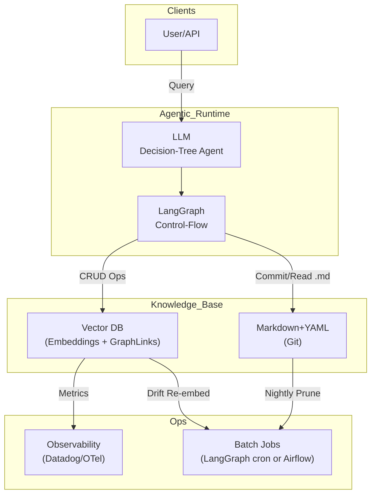
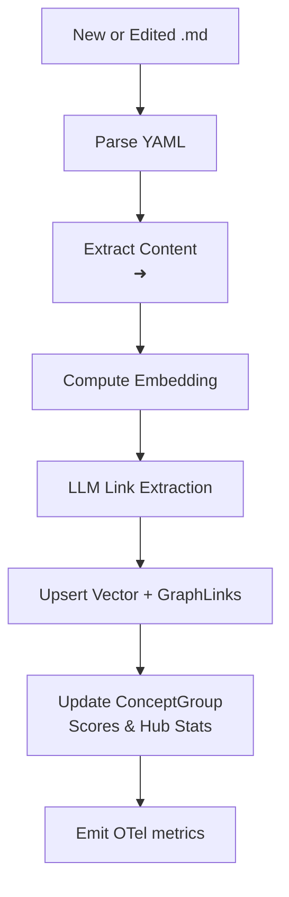
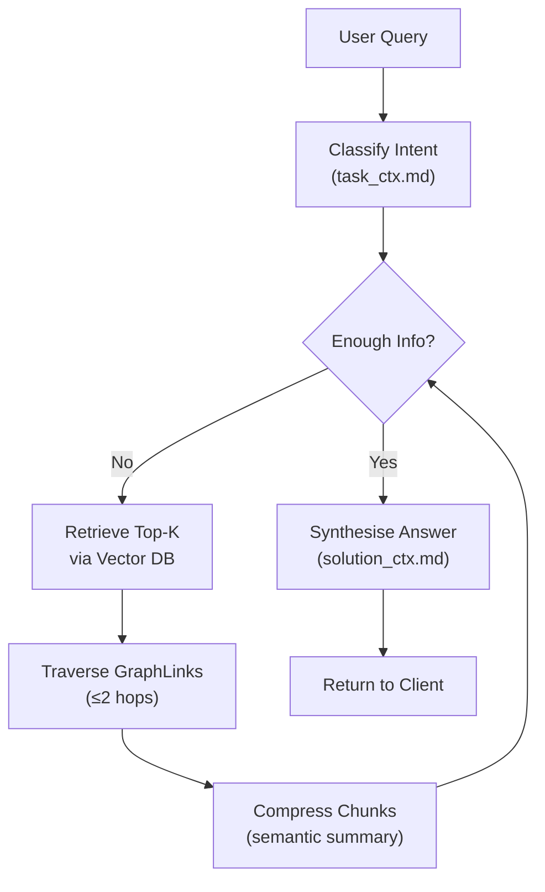
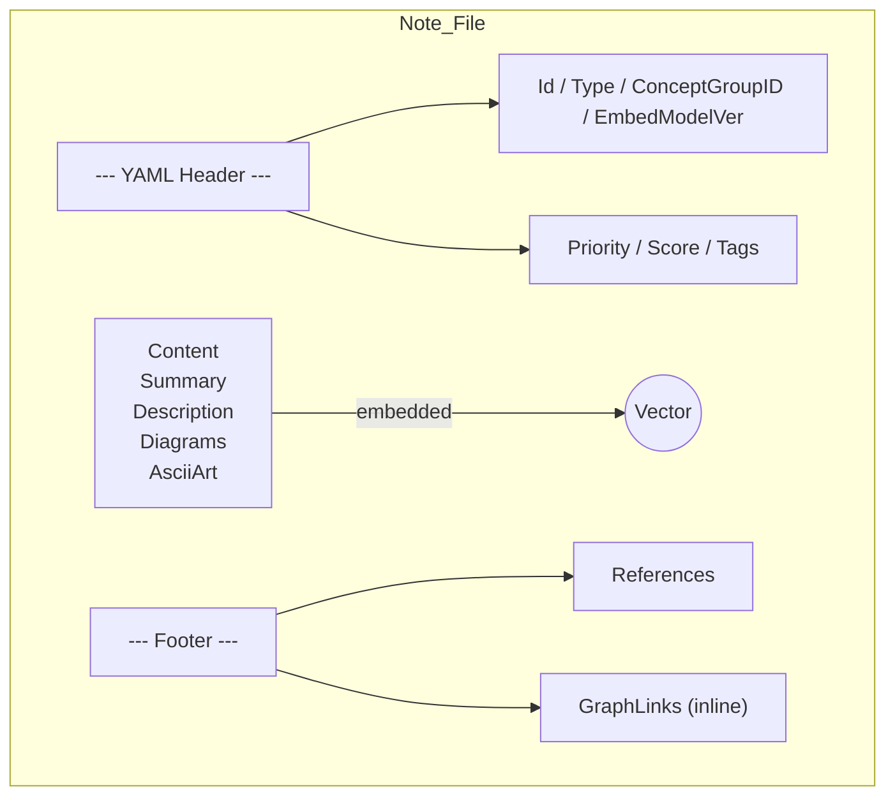

Below is a _top‑to‑bottom_ set of **five Mermaid diagrams**, each successively drilling from high‑level architecture to concrete implementation details. A short explanation precedes every diagram so you can see _why_ that level exists and how it relates to sources and best practice.

---

## Summary

Modern Graph‑RAG stacks pair a Markdown+YAML note store with vector‑search and graph metadata; they add an agentic control‑flow layer (e.g., LangGraph) and rigorous observability to keep accuracy ≈ 90 % while controlling cost. Only the _content_ portion of each note is embedded, prompts are compressed to cut tokens, and `ConceptGroupID` clusters concept/ example/ pseudo notes to limit fan‑out. The five diagrams below visualise the system—from macro services down to YAML fields—aligned with current guidance on GraphRAG architectures [Microsoft GitHub](https://microsoft.github.io/graphrag/index/architecture/?utm_source=chatgpt.com)[Google Cloud](https://cloud.google.com/architecture/gen-ai-graphrag-spanner?utm_source=chatgpt.com), LangGraph orchestration [DEV Community](https://dev.to/vitaliihonchar/pipeline-of-agents-pattern-building-maintainable-ai-workflows-with-langgraph-1e50?utm_source=chatgpt.com)[langchain.com](https://www.langchain.com/langgraph?utm_source=chatgpt.com), vector‑graph metadata filtering [Graph Database & Analytics](https://neo4j.com/blog/developer/graph-metadata-filtering-vector-search-rag/?utm_source=chatgpt.com)[GraphRAG](https://graphrag.com/reference/graphrag/metadata-filtering/?utm_source=chatgpt.com), prompt compression [Microsoft Learn](https://learn.microsoft.com/en-us/semantic-kernel/concepts/prompts/?utm_source=chatgpt.com)[PromptLayer](https://www.promptlayer.com/glossary/prompt-compression?utm_source=chatgpt.com), efficient HNSW tuning [ApX Machine Learning](https://apxml.com/courses/advanced-vector-search-llms/chapter-1-ann-algorithms/hands-on-implementing-tuning-hnsw?utm_source=chatgpt.com), drift‑aware embeddings [blog.milvus.io](https://blog.milvus.io/ai-quick-reference/how-do-embeddings-handle-drift-in-data-distributions?utm_source=chatgpt.com) and YAML front‑matter practice [GitHub Docs](https://docs.github.com/en/contributing/writing-for-github-docs/using-yaml-frontmatter?utm_source=chatgpt.com).

---

## 1  System‑Level Overview

At the coarsest granularity the platform has four domains: **Clients**, **Agentic Runtime**, **Knowledge Base**, and **Ops/Observability**. This mirrors the Microsoft GraphRAG reference stack [Microsoft GitHub](https://microsoft.github.io/graphrag/index/architecture/?utm_source=chatgpt.com) and Google Cloud’s Vertex AI design [Google Cloud](https://cloud.google.com/architecture/gen-ai-graphrag-spanner?utm_source=chatgpt.com).

---

## 2  Create/Update Data‑Flow Pipeline

This flow corresponds to the six‑step CRUD DAG; LangGraph can run it inline, or Airflow can schedule it for batch jobs [DEV Community](https://dev.to/vitaliihonchar/pipeline-of-agents-pattern-building-maintainable-ai-workflows-with-langgraph-1e50?utm_source=chatgpt.com)[ApX Machine Learning](https://apxml.com/courses/advanced-vector-search-llms/chapter-1-ann-algorithms/hands-on-implementing-tuning-hnsw?utm_source=chatgpt.com).

---

## 3  Agentic Decision‑Tree (Runtime)

Influenced by LangGraph’s “pipeline of agents” pattern [DEV Community](https://dev.to/vitaliihonchar/pipeline-of-agents-pattern-building-maintainable-ai-workflows-with-langgraph-1e50?utm_source=chatgpt.com)[langchain.com](https://www.langchain.com/langgraph?utm_source=chatgpt.com), this tree guides each user query with prompt‑compression checkpoints [PromptLayer](https://www.promptlayer.com/glossary/prompt-compression?utm_source=chatgpt.com).

---

## 4  Note‑Level Structure

Only the `Content` block is embedded; headers support retrieval filtering [GitHub Docs](https://docs.github.com/en/contributing/writing-for-github-docs/using-yaml-frontmatter?utm_source=chatgpt.com), while footer sections are ignored by the embedder.

---

## 5  ConceptGroup Hub & Related Notes

Grouping concept, example and pseudo notes under a single `ConceptGroupID` reduces retrieval fan‑out .

mermaid

Copy

`graph TD   subgraph ConceptGroupID:cgr‑20250717‑relativity     CN[Type: concept Einstein Relativity]     EX[Type: example Mercury Precession]     PS[Type: pseudo E=mc^2 Derivation]     DD[Type: deep‑dive Tensor Math]     CN -- links_to --> EX     CN -- links_to --> PS     CN -- links_to --> DD   end`

---

## Pros & Cons After Latest Tweaks

|Feature|Pros|Cons|Mitigation|
|---|---|---|---|
|**Content‑only embedding**|Lean vectors; less noise|Must maintain markers|Unit tests in converter|
|**Prompt compression**|30‑60 % token savings|Risk of info loss|Automatic _quality‑gate_ reranker|
|**ConceptGroup hub**|Focused traversal|Possible over‑broad sets|Purity audit job|
|**LangGraph instead of Airflow (runtime)**|LLM‑native, lighter ops|Slim UI|OTel export + Grafana|