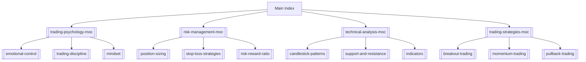

# Trading Secrets Zettelkasten

Welcome to your personal knowledge base for trading concepts, strategies, and insights, inspired by Ross Cameron's "How to Day Trade: The Plain Truth" and other trading knowledge.

## Map of Contents (MOC)
### Core MOCs
- [[trading-psychology-moc 1]] - Mental aspects of trading
- [[risk-management-moc 1]] - Managing and mitigating trading risks
- [[technical-analysis-moc 1]] - Chart patterns and technical indicators
- [[market-fundamentals-moc 1]] - Core concepts of how markets work.
- [[trading-tools-and-setup-moc 1]] - Hardware, software, and brokers.
- [[trading-strategies-moc 1]] - Different trading approaches and methods

### Book-Specific MOCs
- [[ross-cameron-how-to-day-trade]] - Main reference note
- [[book-structure-and-key-topics]] - Chapter-by-chapter breakdown

### Core Trading Concepts
- [[ross-camerons-trading-journey]] - An overview of the path from beginner to pro.
- [[momentum-day-trading-strategy-v1]] - The foundational strategy based on data.
- [[analyzing-your-own-trades]] - The process of finding your edge.
- [[trader-rehab]] - How to recover from a drawdown.
- [[pattern-day-trader-rule]] - A crucial regulation for all day traders.
- [[fleeting-notes]] - Inbox for new ideas.

## Recent Notes
- [[day-trading-myths-and-misconceptions]] - Common misunderstandings about day trading
- [[unique-approach-to-day-trading-education]] - How this book differs from others
- [[day-trading-success-rates]] - Statistics and research on day trading profitability
- [[book-structure-and-key-topics]] - Overview of chapters and main themes

## Quick Navigation

## How to Use This Zettelkasten
1. **Browse by Category**: Use the MOCs above to explore topics
2. **Search**: Use your note-taking app's search function
3. **Follow Links**: Click on `[[linked-notes]]` to explore related concepts
4. **Create New Notes**: Use the template in `templates/` for consistency

## Tags
#day-trading #trading-strategies #trading-psychology #risk-management #technical-analysis #moc
