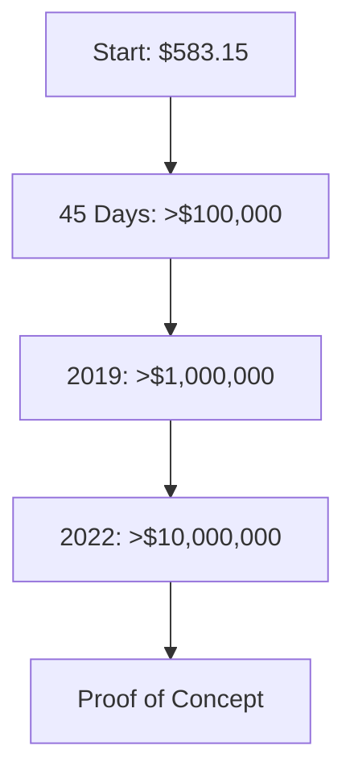

## Summary
This note details Ross Cameron's trading challenge where he turned an initial account of $583.15 into over $10 million, demonstrating the viability of his strategy even when starting from the minimum.

## Key Points
- **Starting Capital**: $583.15 in an offshore account to bypass the [[pattern-day-trader-rule]].
- **Initial Milestone**: Turned $583.15 into over $100,000 in 45 days.
- **Long-Term Growth**: Crossed $1,000,000 in 2019 and $10,000,000 in 2022.
- **Purpose**: To prove his strategy could work from scratch and address skepticism.
- **Important Caveat**: Ross emphasizes his results are not typical and were achieved after years of experience. It was not his "first rodeo."

## Related Notes
- [[ross-camerons-trading-journey]]
- [[why-successful-traders-teach]]
- [[pattern-day-trader-rule]]
- [[guardrail-01-momentum-stock-criteria]]

## Challenge Progression
