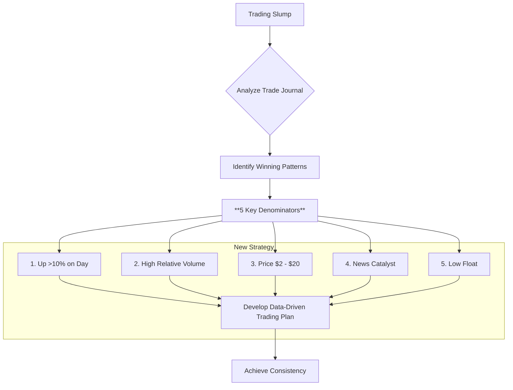

## Summary
This note describes the pivotal moment when Ross Cameron analyzed his own trading history to discover the common denominators of his winning trades, which formed the basis of his first successful trading plan.

## The 5 Common Denominators of Winning Trades
By studying his detailed trade journal, Ross identified five key characteristics present in his most profitable trades:

1.  **Price Action**: Stocks were up over 10% on the day.
2.  **Relative Volume**: Stocks had high relative volume, indicating unusual interest.
3.  **Price Range**: Stocks were priced between $2 and $10 (and under $20). He had outsized losses on stocks priced above $20.
4.  **Catalyst**: Stocks often had a recent news catalyst driving the interest.
5.  **Low Float**: Stocks had a limited number of shares available to trade (low float), making them more volatile.

## Related Notes
- [[ross-camerons-trading-journey]]
- [[momentum-day-trading-strategy-v1]]
- [[guardrail-01-momentum-stock-criteria]]
- [[trading-journal]]