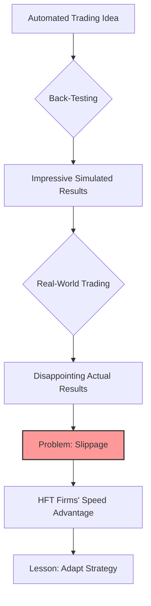

## Summary
This note covers Ross Cameron's exploration of automated trading systems, his belief that it could be the "Holy Grail" to remove emotion, and his ultimate discovery of its limitations, primarily due to slippage.

## The "Holy Grail" of Automated Trading
- **The Idea**: Create a script based on his winning criteria to trade automatically, removing emotional errors.
- **Back-Testing**: The strategy showed impressive results in back-testing, suggesting high potential profitability.
- **The Reality**: Real-world trading with the automated system failed to replicate the back-tested results.

## The Problem of Slippage
- **Slippage**: The difference between the expected price of a trade and the price at which the trade is actually executed.
- **Microsecond-Level Execution**: The market operates in microseconds, and high-frequency trading (HFT) algorithms execute trades faster than retail systems.
- **The Lesson**: Back-testing often doesn't account for the complexities of real-world execution and slippage. It's nearly impossible for a retail trader to compete with institutional HFT firms on speed. Ross realized he had to play a different game, focusing on patterns the HFTs didn't.

## Related Notes
- [[ross-camerons-trading-journey]]
- [[high-frequency-trading-hft]]

## Backtesting vs. Reality
