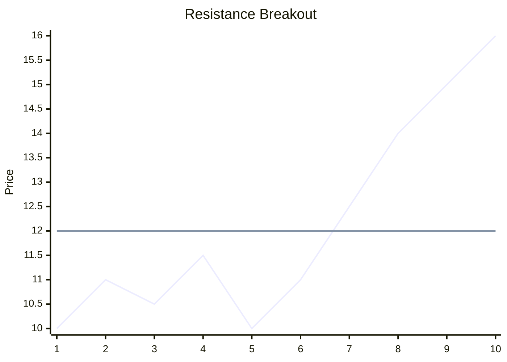

# Breakout Trading

Breakout trading is a [[day-trading-strategies]] that involves entering a trade when the price of an asset moves outside a defined [[support-and-resistance]] level with increased [[volume-analysis]]. The premise is that once a price breaks out of a consolidation range, it will continue to move in the direction of the breakout.

## Key Concepts

-   **Consolidation**: A period where price trades within a narrow range, often forming patterns like triangles, rectangles, or flags.
-   **Breakout Level**: The specific price level (support or resistance) that, once breached, signals a potential new trend.
-   **Volume Confirmation**: A strong breakout is typically accompanied by a significant increase in trading volume, indicating strong conviction behind the move. Without volume, a breakout can be a "fakeout" or false signal.

## Types of Breakouts

-   **Resistance Breakout**: Price moves above a resistance level, signaling a potential uptrend.
-   **Support Breakout**: Price moves below a support level, signaling a potential downtrend.

## Entry and Risk Management

Traders look for [[breakout-entries]] as the price crosses the key level. [[stop-loss]] orders are typically placed just inside the broken level to limit risk. This strategy is often associated with [[breakout-patterns]].

## Visual Representation (Mermaid)

## Source Reference
-   **Book**: [[ross-cameron-how-to-day-trade|Ross Cameron's How to Day Trade]]
-   **Concept**: Breakout Strategies (Chapter 6)