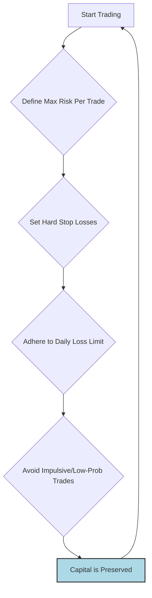

## Summary
Capital preservation is the primary rule of professional trading: **protect your trading capital at all costs**. Before thinking about making profits, a trader's first job is to manage risk to ensure they can stay in the game. Losing all your capital means your trading business is bankrupt.

## How to Preserve Capital
1.  **Strict [[position-sizing]]**: Never risk more than a small, predefined percentage of your account on a single trade (e.g., 1-2%).
2.  **Use Hard [[stop-loss-strategies]]**: A stop-loss is your ultimate safety net that prevents a small loss from becoming a catastrophic one.
3.  **Adhere to a [[daily-loss-limits]]**: If you hit your maximum loss for the day, you stop trading. This prevents a bad day from wiping out your account.
4.  **Avoid High-Risk Setups**: Stick to your proven [[trading-plan]] and avoid gambling on low-probability trades.

## The Mindset
The goal is not to avoid losses, as losses are a natural part of trading. The goal is to ensure that no single loss, or series of losses, can take you out of the market permanently. This is a key aspect of [[drawdown-management]].

## Related Notes
- [[risk-management-MOC]]
- [[treating-trading-as-a-business]]
- [[why-most-traders-fail]]

## The Capital Preservation Loop
