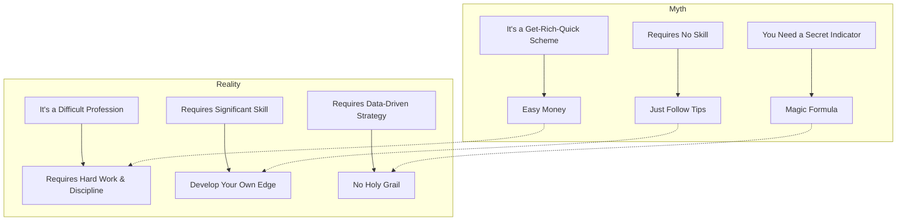

## Summary
This note addresses common myths and misconceptions about day trading that often lead to unrealistic expectations and eventual failure. Ross Cameron's book aims to dispel these from the outset.

## Common Myths vs. Reality

## Related Notes
- [[unique-approach-to-day-trading-education]]
- [[day-trading-success-rates]]
- [[why-most-traders-fail]]