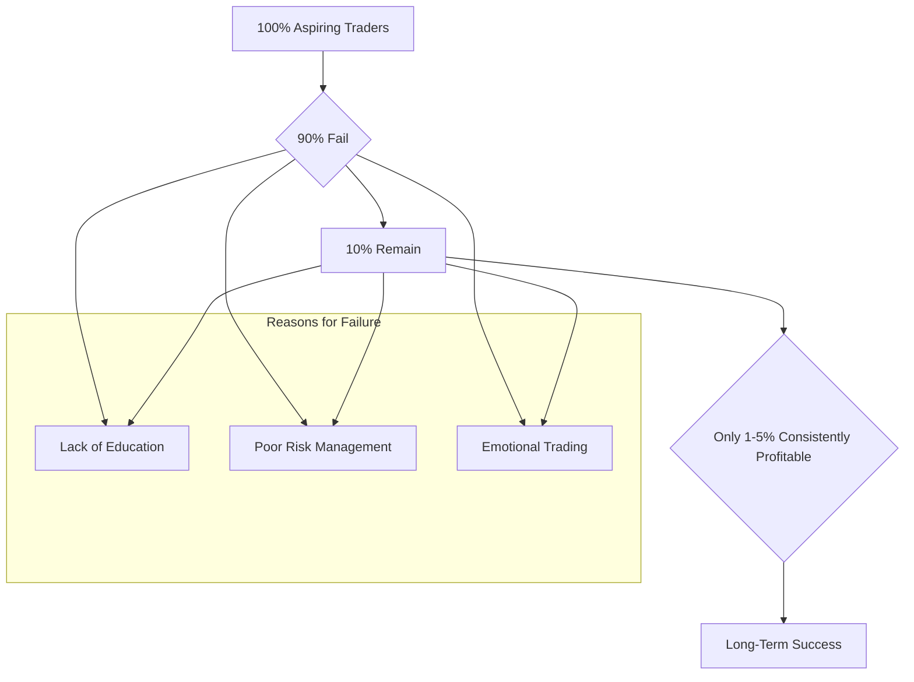

## Summary
This note discusses the often-cited statistics regarding the low success rates in day trading, emphasizing that a very small percentage of retail traders achieve consistent profitability. This highlights the challenging nature of the profession.

## The Reality of Success
- Studies often show that **90% or more of retail day traders lose money** over the long term.
- This high failure rate is not because trading is a scam (see [[day-trading-is-a-scam-myth]]), but because most aspiring traders fail to overcome a few critical hurdles:
  - **Lack of a Statistical Edge**: Trading without a proven strategy.
  - **Poor [[risk-management]]**: Failing to manage [[position-sizing]] and implement [[stop-loss-strategies]].
  - **Psychological Weakness**: Succumbing to [[fomo-in-trading]], [[revenge-trading]], and other [[cognitive-biases-in-trading]].
- Success is achieved by the small minority who learn to [[treating-trading-as-a-business|treat trading as a business]].

## The Trader's Funnel

## Related Notes
- [[why-most-traders-fail]]
- [[day-trading-myths-and-misconceptions]]
- [[unique-approach-to-day-trading-education]]