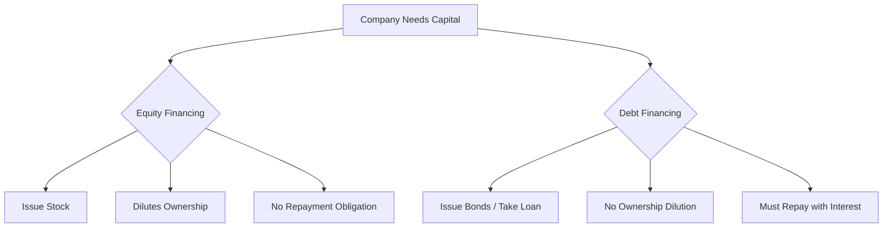

## Summary
This note explains the two primary ways companies raise capital: issuing stock (equity) or taking on loans/issuing bonds (debt).

## Key Points
- **Equity Financing**: Selling ownership stakes ([[common-vs-preferred-stock]]) to investors. This raises money without creating debt, but it dilutes the ownership of existing shareholders.
- **Debt Financing**: Borrowing money that must be paid back with interest over time. This does not dilute ownership, but it creates a financial liability for the company.

## Related Notes
- [[stock-market-basics]]
- [[risk-management-MOC]]