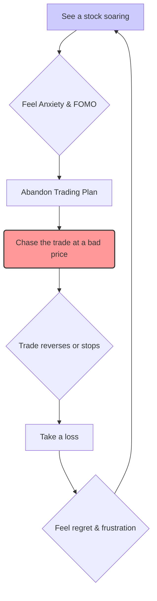

# FOMO in Trading (Fear of Missing Out)

FOMO, or the Fear of Missing Out, is a powerful emotional response characterized by the anxiety that one might miss out on a potentially profitable trading opportunity. It often leads to impulsive and irrational decisions that deviate from a sound [[trading-plan]].

## Causes of FOMO

- Watching a stock make a large move without you.
- Seeing other traders post large profits on social media.
- A desire to make back recent losses quickly.

## Consequences

- **Chasing Trades**: Entering a position too late, often at a poor price, after the initial move has already occurred.
- **Ignoring Rules**: Disregarding predefined entry, exit, and [[risk-management]] rules.
- **[[overtrading]]**: Taking too many low-probability trades out of a desire for action.

Effective [[emotional-control]] and strong [[trading-discipline]] are the primary antidotes to FOMO.

## The FOMO Cycle (Mermaid)

## Source Reference
-   **Book**: [[ross-cameron-how-to-day-trade|Ross Cameron's How to Day Trade]]
-   **Concept**: Trading Psychology (Chapter 8)