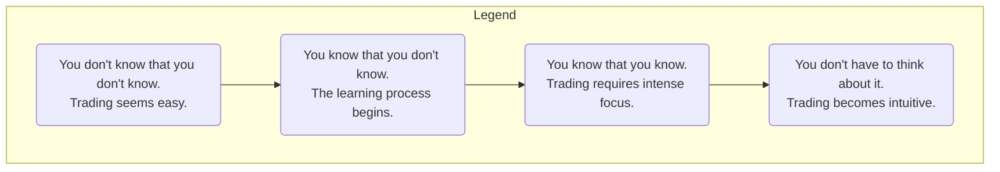

## Summary
This note describes the four stages of competence that nearly every trader goes through on their journey to profitability. Understanding these stages helps in setting realistic expectations.

## Related Notes
- [[ross-camerons-trading-journey]]
- [[trading-psychology-moc]]
- [[continuous-improvement-in-trading]]