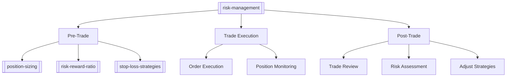

# Risk Management MOC

## Overview
This Map of Content (MOC) organizes notes related to risk management principles and practices in day trading, as discussed in Ross Cameron's book.

## Core Concepts
- [[risk-management]] - Main hub for risk management concepts
- [[position-sizing]] - Determining appropriate trade sizes
- [[stop-loss-strategies]] - Techniques for setting stop losses
- [[risk-reward-ratio]] - Understanding and applying risk/reward principles
- [[pattern-day-trader-rule]] - A key regulatory risk for small accounts.
- [[drawdown-management]] - Controlling and recovering from losses

## Key Topics
### Risk Assessment
- [[market-risk]] - Understanding market volatility
- [[liquidity-risk]] - Risks related to trade execution
- [[concentration-risk]] - Diversification in trading

### Risk Control
- [[risk-per-trade]] - Calculating maximum risk per position
- [[daily-loss-limits]] - Protecting your capital
- [[guardrail-01-momentum-stock-criteria]] - A rule-based approach to stock selection.
- [[psychology-of-fear-in-trading]] - How fear impacts risk decisions.
- [[leverage-management]] - Using margin safely

### Risk Management Frameworks

## Related MOCs
- [[trading-psychology-moc 1]]
- [[trading-strategies-moc 1]]
- [[technical-analysis-moc 1]]

## References
- [[ross-cameron-how-to-day-trade]]
- [[day-trading-success-rates]]

## Recent Updates
- 2025-06-23: Created initial Risk Management MOC
