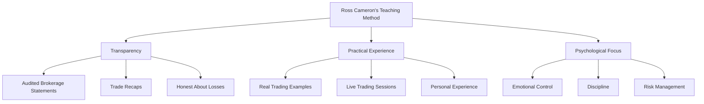

## Summary
Ross Cameron is a professional day trader and educator, best known as the founder of Warrior Trading. His journey from novice to successful trader and educator provides valuable insights into the realities of day trading.

## Trading Career

### Key Statistics
- **Trading Accuracy**: 69% (percentage of profitable trades)
- **Experience**: Over a decade of full-time trading
- **Verified Profits**: Over $10 million in audited trading profits
- **YouTube Following**: 1M+ subscribers with 10+ years of educational content

### Teaching Philosophy
- Believes in transparent, honest education about trading
- Shares both winning and losing trades
- Focuses on the psychological aspects of trading
- Emphasizes risk management and discipline

## Educational Approach

## Verification of Results
- Publishes audited brokerage statements
- Maintains transparency about trading performance
- Provides evidence of long-term success, not just short-term wins

## Why His Perspective Matters
- Started as a struggling trader and learned through experience
- Built success through discipline and continuous learning
- Focuses on sustainable trading practices rather than get-rich-quick schemes
- Understands the psychological challenges of trading

## Related Notes
- [[trading-psychology]]
- [[risk-management]]
- [[day-trading-success-rates]]
- [[unique-approach-to-day-trading-education]]

## References
- [[ross-cameron-how-to-day-trade]]
- [Warrior Trading Website](https://www.warriortrading.com/)

## Questions/Thoughts
- How does Cameron's background influence his teaching style?
- What can we learn from his journey from novice to professional trader?
