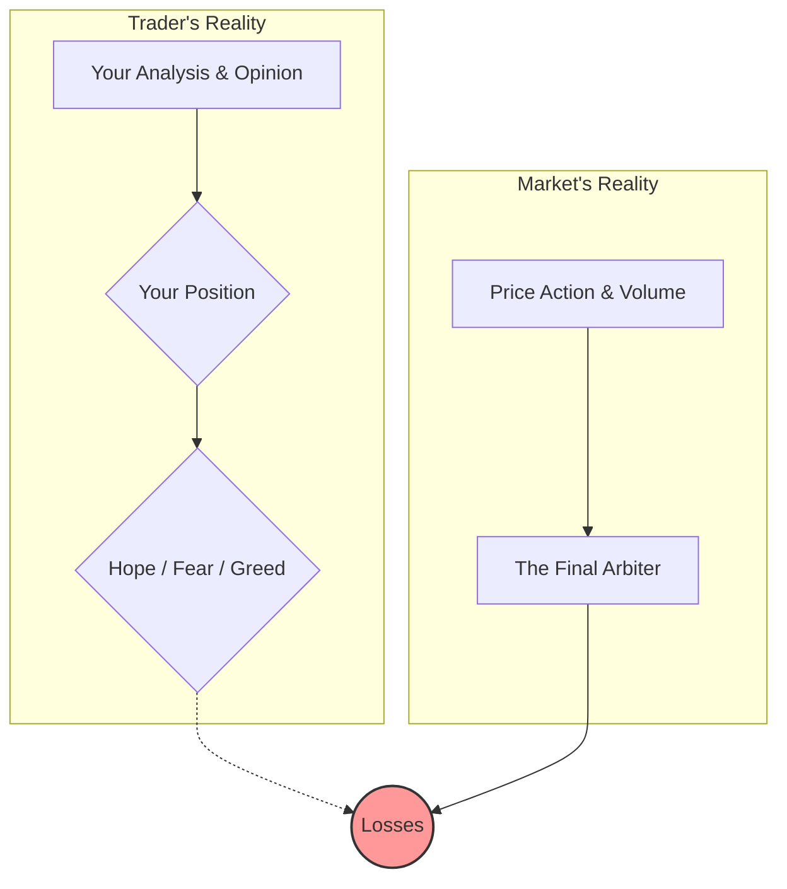

## Summary
This note covers the core trading principle that [[the-market-is-always-right]]. It is an impersonal force that does not care about a trader's analysis, opinions, or positions. Arguing with the market is a recipe for disaster.

## The Market's Indifference
The market is simply a mechanism for facilitating transactions. It reflects the collective actions of all participants, not the desires of one individual.

## Implications for Traders
- **Humility**: You must be humble enough to admit when you are wrong and exit a losing trade quickly.
- **Adaptability**: Instead of forcing your will on the market, you must adapt to what it is telling you.
- **No "Shoulds"**: Avoid thinking the market "should" do something. React to what it *is* doing. This is the foundation of [[emotional-detachment-in-trading]].

## Related Notes
- [[emotional-detachment-in-trading]]
- [[revenge-trading]]
- [[trading-psychology-moc]]