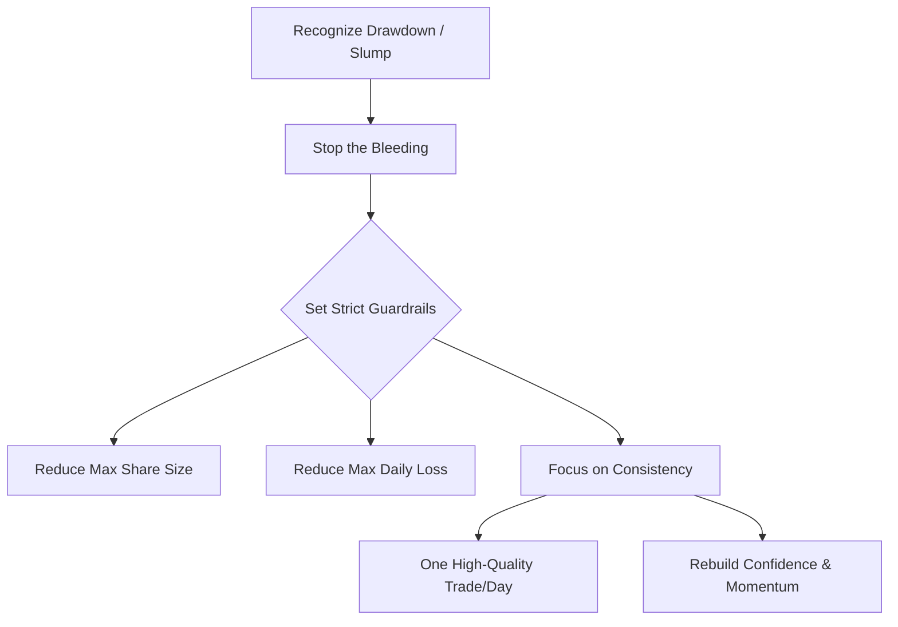

## Summary
This note defines "[[trader-rehab]]", a state of mind and a set of strict, self-imposed rules Ross Cameron uses to stop the bleeding after a big loss or a series of red days.

## The Process of Trader Rehab
The goal is not to make money, but to regain confidence and break a negative feedback loop.

1.  **Stop the Bleeding**: The first step is to recognize that the current approach isn't working and a change is needed.
2.  **Set Strict Guardrails**:
    -   **Reduce Max Share Size**: Call the broker or self-enforce a much smaller maximum [[position-sizing]] (e.g., 1/4 of the usual).
    -   **Reduce Max Daily Loss**: Set a hard, lower limit for the maximum loss allowed in one day.
3.  **Focus on Consistency**:
    -   **One Trade a Day**: For a set period (e.g., 5 days), take only one, high-quality trade per day.
    -   **Goal**: Aim for a string of small green days to rebuild confidence and momentum.

## Related Notes
- [[get-green-and-shut-it-down]]
- [[ross-camerons-trading-journey]]
- [[drawdown-management]]

## The Trader Rehab Process
