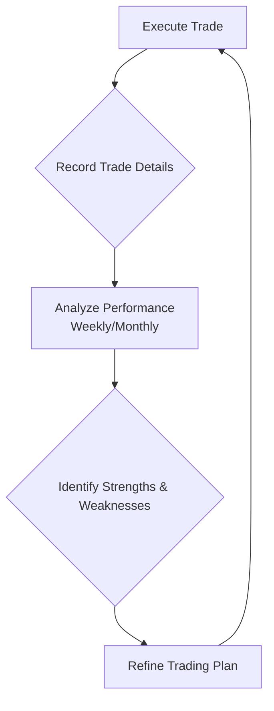

## Summary
A [[trading-journal]] is a detailed record of all trades, including the rationale, execution, and outcome. It is an indispensable tool for self-analysis, learning from mistakes, and refining one's trading strategy and psychology.

## Why Keep a Trading Journal?
- **Objective Review**: Provides an unbiased record of performance, free from emotional distortion.
- **Identify Patterns**: Helps in discovering what works and what doesn't, leading to the development of a statistical edge. See [[analyzing-your-own-trades]].
- **Psychological Insight**: Reveals emotional triggers, biases (e.g., [[confirmation-bias]], [[loss-aversion]]), and behavioral patterns.
- **Accountability**: Reinforces [[trading-discipline]] by making you accountable for every decision.
- **Continuous Improvement**: Forms the basis for [[continuous-improvement-in-trading]].

## What to Record
- **Date and Time**: Entry and exit.
- **Symbol and Price**: Entry, exit, [[stop-loss]], [[profit-target]].
- **Share Size**: Number of shares traded.
- **Strategy Used**: Which specific setup was traded?
- **Rationale**: Why did you enter this trade? What were your expectations?
- **Emotions**: How did you feel before, during, and after the trade?
- **Lessons Learned**: What could have been done better? What went well?

## The Journaling Process

## Related Notes
- [[analyzing-your-own-trades]]
- [[continuous-improvement-in-trading]]
- [[trading-psychology-moc]]
- [[trading-plan]]