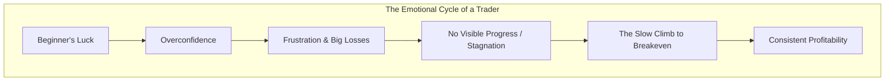

# Trading Psychology MOC

## Overview
This Map of Content (MOC) organizes notes related to trading psychology, mindset, and emotional management in day trading.

## Core Concepts
- [[trading-psychology]] - Main hub for psychological aspects of trading
- [[emotional-control]] - Managing emotions during trading
- [[trading-discipline]] - Maintaining consistency in trading approach
- [[get-green-and-shut-it-down]] - A mantra for building discipline.
- [[overcoming-fear]] - Dealing with fear and anxiety in trading
- [[handling-losses]] - Psychological strategies for dealing with losing trades

## Key Topics
### Mindset
- [[growth-mindset]] - Developing a learning-oriented approach to trading
- [[trading-journal]] - Using journaling for psychological improvement
- [[analyzing-your-own-trades]] - Using data to overcome emotional bias.
- [[the-market-is-always-right]] - A core belief for maintaining objectivity.
- [[emotional-detachment-in-trading]] - The goal of separating actions from feelings.
- [[trading-plan]] - The psychological benefits of having a plan

### Emotional Challenges
- [[fomo-in-trading]] - Fear of missing out and its impact
- [[revenge-trading]] - The dangers of emotional trading
- [[overtrading]] - Psychological causes and solutions

### Common Pitfalls
- [[why-most-traders-fail]] - The primary reasons for failure in trading.
- [[luck-vs-skill-in-trading]] - Understanding the balance between chance and expertise.
- [[day-trading-is-a-scam-myth]] - Deconstructing the psychological barrier of skepticism.

### Cognitive Biases
- [[cognitive-biases-in-trading]] - Hub for mental shortcuts that lead to errors.
- [[confirmation-bias]], [[loss-aversion]], [[recency-bias]], [[anchoring-bias]], [[hindsight-bias]]

### The Trader's Journey
- [[ross-camerons-trading-journey]] - A case study in psychological resilience.
- [[criteria-for-a-good-trading-teacher]]
- [[why-successful-traders-teach]]
- [[trader-rehab]] - A structured process for psychological recovery.

### Trader Profiles
- [[ross-camerons-trading-credentials]] - Psychological journey and teaching approach
- [[successful-trader-mindsets]] - Common psychological traits of successful traders
- [[common-trader-personalities]] - Different psychological profiles in trading

## Related MOCs
- [[risk-management-moc 1]]
- [[trading-strategies-moc 1]]
- [[market-analysis-moc]]

## References
- [[ross-cameron-how-to-day-trade]]
- [[book-structure-and-key-topics]]

## Recent Updates
- 2025-06-23: Added Trader Profiles section and Ross Cameron's credentials
- 2025-06-23: Created initial Trading Psychology MOC
